# AWS Certified Cloud Practitioner

## [01. Cloud Computing](#cloud-computing)
## [02. AWS Identity and Access Management](#iam-identity-and-access-management)
## [03. Amazon EC2](#elastic-compute-cloud-ec2)
## [04. Amazon EC2 Instance Storage](#ec2-instance-storage)
## [05. Elastic Load Balancing & Auto Scaling Group](#elb--asg)
## [06. Amazon S3](#amazon-s3)
## [07. Databases and Analytics](#databases--analytics)
## [08. Other Compute Services](#other-compute-services)
## [09. Deploying and Managing Infrastructure at Scale](#deploying-and-managing-infrastructure-at-scale)
## [10. Global Infrastructure](#global-infrastructure)
## [11. Cloud Integration](#cloud-integration)
## [12. Cloud Monitoring](#cloud-monitoring)
## [13. Amazon VPC](#vpc)
## [14. Security and Compliance](#security--compliance)
## [15. Machine Learning](#machine-learning)
## [16. Account Management, Billing and Support](#account-management-billing--support)
## [17. Advanced Identity](#advanced-identity)
## [18. Other AWS Services](#other-services)
## [19. AWS Architecting and Ecosystem](#aws-architecting--ecosystem)

---------------------------

# Cloud Computing

## How does website work
In computing, a client can be a web browser or desktop application that a person interacts 
with to make requests to computer servers. A server can be services such as Amazon Elastic 
Compute Cloud (Amazon EC2), a type of virtual server.

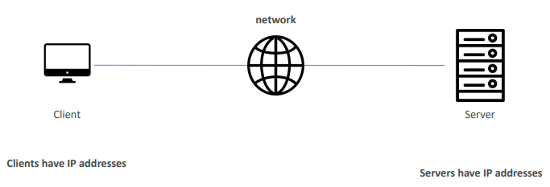

## What is a server composed of?
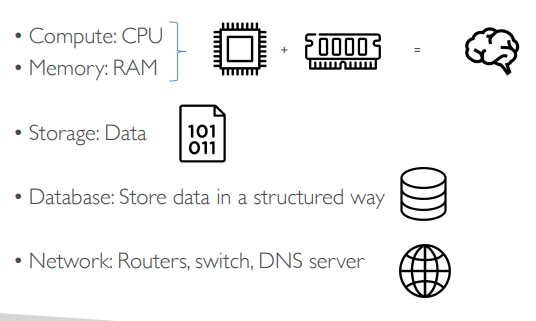

## IT Terminology
- **Network**: cables, routers and servers connected with each other
- **Router**: A networking device that forwards data packets between computer 
networks. They know where to send your packets on the internet!
- **Switch**: Takes a packet and send it to the correct server / client on your network

    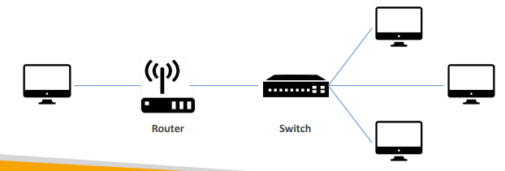

## Problems with traditional IT approach
- Pay for the rent for the data center
- Pay for power supply, cooling, maintenance
- Adding and replacing hardware takes time
- Scaling is limited
- Hire 24/7 team to monitor the infrastructure
- How to deal with disasters? (earthquake, power shutdown, fire…)

## What is Cloud Computing?
- Cloud computing is the **on-demand** delivery of compute power, database storage, 
applications, and other IT resources
- Through a cloud services platform with pay-as-you-go pricing
- You can provision exactly the right type and size of computing resources you 
need 
- You can access as many resources as you need, almost instantly
- Simple way to access servers, storage, databases and a set of application services
- Amazon Web Services owns and maintains the network-connected hardware 
required for these application services, while you provision and use what you need 
via a web application

## Deployment Models for Cloud Computing
The three cloud computning deployment models are cloud-based, on-premises, and hybrid

1. **Cloud-Based Deployment**:
    - Run all parts of the application in the cloud
    - Migrate existing applications to the cloud
    - Design and build new applications in the cloud
    - For example, a company might create an application consisting of virtual servers, databases, and networking components that are fully based in the cloud.

2. **On-Premises Deployment**:
    - Deploy resources by using virtualization and resource management tools.
    - Increase resource utilization by using application management and virtualization technologies.
    - On-premises deployment is also known as private cloud deployment.
    - For example, you might have applications that run on technology that is fully kept in your on-premises data center. Though this model is much like legacy IT infrastructure, its incorporation of application management and virtualization technologies helps to increase resource utilization.
 

3. **Hybrid Deployment**:
    - Connect cloud-based resources to on-premises infrastructure.
    - Integrate cloud-based resources with legacy IT applications.
    - For example, you have legacy applications that are better maintained on premises, or government regulations require your business to keep certain records on premises.

## Deployment Models of the Cloud
### Private Cloud
- Cloud services used by a single organization, not exposed to the public. 
- Complete control
- Security for sensitive applications
- Meet specific business needs

### Public Cloud
- Cloud resources owned and operated by a third-party cloud service 
provider delivered over the Internet.
- Six Advantages of Cloud Computing

### Hybrid Cloud
- Keep some servers on premises and extend 
some capabilities to the Cloud
- Control over sensitive assets in your private 
infrastructure
- Flexibility and cost-effectiveness of the public cloud

## The Five Characteristics of Cloud Computing
### On-demand self service
Users can provision resources and use them without human interaction from the service 
provider

### Broad network access: 
 Resources available over the network, and can be accessed by diverse client platforms

### Multi-tenancy and resource pooling: 
- Multiple customers can share the same infrastructure and applications with security and privacy
- Multiple customers are serviced from the same physical resources

### Rapid elasticity and scalability: 
- Automatically and quickly acquire and dispose resources when needed 
- Quickly and easily scale based on demand

### Measured service: 
- Usage is measured, users pay correctly for what they have used

## Six Advantages of Cloud Computing
### Trade capital expense (CAPEX) for operational expense (OPEX)
- Pay On-Demand: don’t own hardware
- Reduced Total Cost of Ownership (TCO) & Operational Expense (OPEX)
### Benefit from massive economies of scale
- Prices are reduced as AWS is more efficient due to large scale
### Stop guessing capacity
- Scale based on actual measured usage
### Increase speed and agility
### Stop spending money running and maintaining data centers
### Go global in minutes
- Leverage the AWS global infrastructure

## Problems Solved by the Cloud
- **Flexibility**: change resource types when needed
- **Cost-Effectiveness**: pay as you go, for what you use
- **Scalability**: accommodate larger loads by making hardware stronger or 
adding additional nodes
- **Elasticity**: ability to scale out and scale-in when needed
- **High-availability and fault-tolerance**: build across data centers
- **Agility**: rapidly develop, test and launch software applications

## Types of Cloud Computing
### Infrastructure as a Service (IaaS)
- Provide building blocks for cloud IT 
- Provides networking, computers, data storage space
- Highest level of flexibility
- Easy parallel with traditional on-premises IT

### Platform as a Service (PaaS)
- Removes the need for your organization to manage the underlying infrastructure
- Focus on the deployment and management of your applications

### Software as a Service (SaaS)
- Completed product that is run and managed by the service provider

    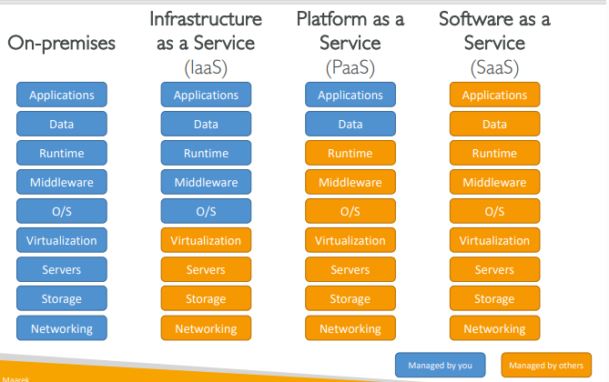

## Example of Cloud Computing Types
### Infrastructure as a Service
- Amazon EC2 (on AWS)
- GCP, Azure, Rackspace, Digital Ocean, Linode

### Platform as a Service
- Elastic Beanstalk (on AWS) 
- Heroku, Google App Engine (GCP), Windows Azure (Microsoft)

### Software as a Service
- Many AWS services (ex: Rekognition for Machine Learning) 
- Google Apps (Gmail), Dropbox, Zoom

## Pricing of the Cloud - Quick Overview
AWS has 3 pricing fundamentals, following the pay-as-you-go pricing model
- **Compute** : Pay for compute time
- **Storage** : Pay for data stored in the Cloud
- **Data transfer OUT of the Cloud** : Data transfer IN is free
- Solves the expensive issue of traditional ID

## AWS Cloud History
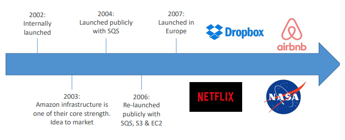

## AWS Cloud Number Facts
- In 2019, AWS had $35.02 billion in annual revenue
- AWS accounts for 47% of the market in 2019 (Microsoft is 
2nd with 22%)
- Pioneer and Leader of the AWS Cloud Market for the 9th consecutive year
- Over 1,000,000 active users

    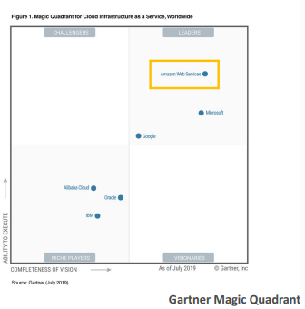

## AWS Cloud Use Cases
- AWS enables you to build sophisticated, scalable applications
- Applicable to a diverse set of industries
- Use cases include
	- Enterprise IT, Backup & Storage, Big Data analytics
	- Website hosting, Mobile & Social Apps
	- Gaming

## AWS Global Infrastructure
- AWS Regions 
- AWS Availability Zones 
- AWS Data Centers 
- AWS Edge Locations / Points of Presence

## AWS Regions
- Regions are geographically isolated areas.
- Inside each Region, we have multiple data centers that have all the compute, storage, and other services you need to run your applications.
- Each Region can be connected to each other Region through a **high speed fibre network**, controlled by AWS.
- Each region is isolated from every other region, no data goes in or out of your environment in that region without you explicitly granting permission.

- AWS has Regions all around the world 
- Names can be us-east-1, eu-west-3… 
- A region is a cluster of data centers 
- Most AWS services are region-scoped

    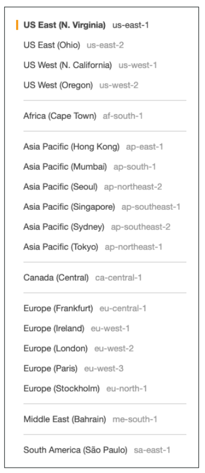

## How to choose an AWS Region?
- **Compliance with data governance and legal requirements**: data never leaves a region without 
your explicit permission
- **Proximity to customers**: reduced latency
- **Available services within a Region**: new services and new features aren’t available in every Region
- **Pricing**: pricing varies region to region and is transparent in the service pricing page

## AWS Availability Zones
- An Availability Zone is a single data center or a group of data centers within a Region.
- Each region has many availability zones (usually 3, min is 3, max is 6). Example:
	- ap-southeast-2a
	- ap-southeast-2b
	- ap-southeast-2c
- Each availability zone (AZ) is one or more discrete data centers with redundant power, 
networking, and connectivity
- They’re separate from each other, so that they’re isolated from disasters
- They’re connected with high bandwidth, ultra-low latency networking

    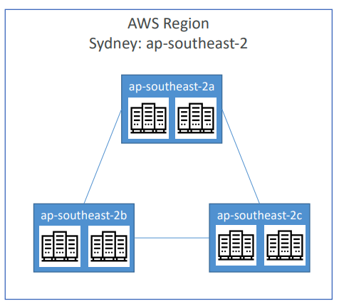

## AWS Points of Presence (Edge Locations)
- An edge location is a site that Amazon CloudFront uses to store cached copies of your content closer to your customers for faster delivery.
- Caching copies of data closer to the customers uses the concept of content delivery networks, or CDNs.
- CDNs are commonly used, and on AWS, we call our CDN Amazon CloudFront.
- **Amazon CloudFront** is a service that helps deliver data, video, applications, and APIs to customers around the world with low latency and high transfer speeds.
- Amazon CloudFront uses what are called **Edge locations**, all around the world, to help accelerate communicatio with users, no matter where they are.

- Amazon has 400+ Points of Presence (400+ Edge Locations & 10+ Regional Caches) in 90+ cities across 40+ countries
- Content is delivered to end users with lower latency

- Edge locations are separate from Regions.
- AWS Edge Locatinos run a domain name service, or DNS, known as Amazon Route 53, helping direct customers to the correct web locations with reliably low latency.

## Tour of the AWS Console
- AWS has Global Services:
 	- Identity and Access Management (IAM)
	- Route 53 (DNS service)
	- CloudFront (Content Delivery Network)
	- WAF (Web Application Firewall)
- Most AWS services are Region-scoped:
	- Amazon EC2 (Infrastructure as a Service)
	- Elastic Beanstalk (Platform as a Service)
	- Lambda (Function as a Service)
	- Rekognition (Software as a Service)

## Shared Responsiblity Model Diagram
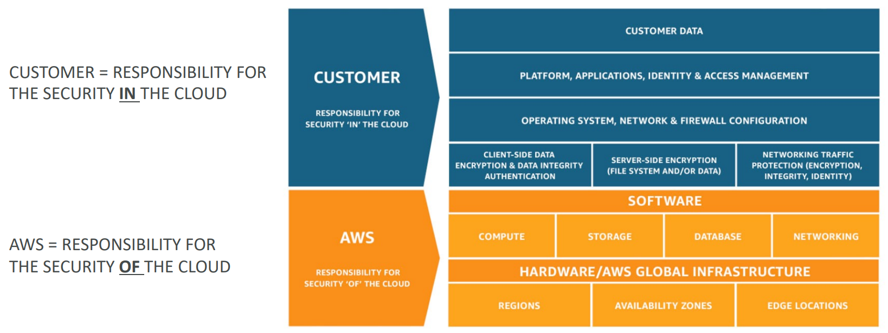

--------------------------------------------------

# IAM (Identity and Access Management)

## IAM: Users & Groups 
- **IAM:** Identity and Access Management, Global Service 
- **Root account** created by default, shouldn't be user or shared 
- **Users** are people within your organization, and can be ignored 
- **Groups** only contain users, not other groups 
- Users don't have to belong to a group, and user can belong to multiple groups 
    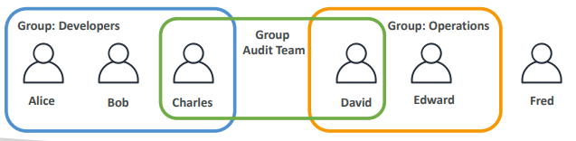

## IAM: Permissions 
- Users or Groups can be assigned JSON documents called **policies** 
- These policies define the **permissions** of the users 
- In AWS you apply the **least privilege principle**; *don't give more permissions than a user needs.* 
    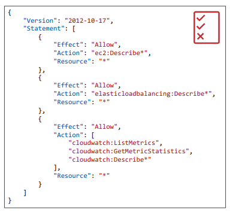

## IAM Policies Inheritance
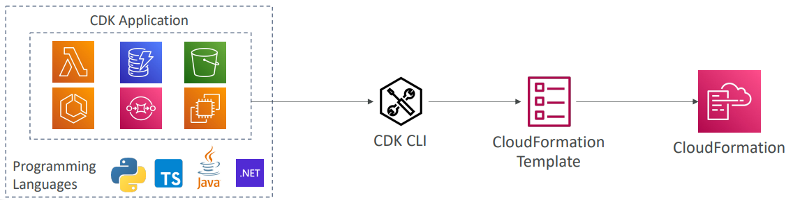

### IAM Policies Structure
- Consists of: 
    - **Version**: policy language version, always include "2012-10-17" 
    - **Id**: an identifier for the policy (optional) 
    - **Statement**: one or more individual statements (required) 
- Statement consists of 
    - **Sid**: an identifier for the statement (optional) 
    - **Effect**: whether the statement allows or denies access (Allow, Deny) 
    - **Principal**: account/user/role to which this play applied to 
    - **Action**: list of actions this policy allow or denies 
    - **Resource**: list of resources to which the actions applied to 
    - **Condition**: conditions for when this policy is in effect (optional) 

## IAM Policies Hands On 
- If the user is removed (permission), access will be denied, will have to give the permission again to the user. 
- Since, the user is given only the read-access, they will not be able to create (write) any group. 
- Get means anything that starts with Get You can also create your own policy 

## IAM: Password Policy 
- Strong passwords = higher security for your account 
- In AWS, you can setup a password policy: 
    - Set a minimum password length 
    - Require specific character types:
        - including uppercase letters
        - lowercase letters 
        - numbers
        - non-alphanumeric characters
    - Allow all IAM users to change their own passwords 
    - Require users to change their password after some time (password expiration)     
    - Prevent password re-use 
    
## Multi Factor Authentication: MFA
- Users have access to your account and can possibly change configurations or delete resources in your AWS account 
- You want to protect your Root Accounts and IAM users 
- MFA: password you know + security device you own 
    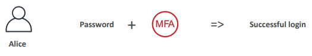
- Main benefit of MFA: If a password is stolen or hacked, the account is not compromised. 

## MFA Devices Options in AWS 
- **Virtual MFA Device**: 
    - Google Authenticator (phone only)
    - Authy (multi-device): Support for multiple tokens on a single device. 
- **Universal 2nd Factor (U2F) Security Key**: 
    - YubiKey by Yubico (3rd party): Support for multiple root and IAM users using a single security key
    
- **Hardware Key Fob MFA Device**
    - Provided by Gemalto (3rd party
    
- **Hardware Key Fob MFA Device for AWS GovCloud (US)** 
    - Provided by SurePassID (3rd party) 
    
## IAM MFA Hands On 
- Account Settings ↓ 
- Password Policy ↓ 
- Edit Click on Account Name ↓ 
- Security Credentials (No access, if not logged in via root user)
-  Assign MFA ↓ 
- Add MFA 

## How can users access AWS? 
- To **access AWS**, you have *three options*:    
    - **AWS Management Console** (protected by password + MFA) 
    - **AWS Command Line Interface (CLI)**: protected by access keys 
    - **AWS Software Developer Kit (SDK)**: for code; protected by access keys
- Access Keys are generated through the AWS Console 
- Users manage their own access keys 
- Access Keys are secret, just like a password. Don't share them. 
- Access Key ID ~= username
- Secret Access Key ~= password 

## What's the AWS CLI? 
- A tool that enables you to interact with AWS services using commands in your command-line shell. 
- `aws` is the default word in the cli
- Direct access to the public APIs of AWS Services 
- You can develop https://github.com/aws/cli 
- Alternative to using AWS Management Console 

## What's AWS SDK? 
- AWS Software Development Kit (AWS SDK) - Language-specific APIs (set of libraries) 
- Enables you to access and manage AWS services programmatically 
- Embedded with your application 
- Supports 
    - SDKs (JavaScript, Python, PHP, .NET, Ruby, Java, Go, Node.js, C++) 
    - Mobile SDKs (Android, iOS,..)
    - IoT Device SDKs (Embedded C, Arduino)
- Example: AWS CLI is built on AWS SDK for Python 
    
    
## AWS CLI Setup on Windows? 

## AWS Cloud Shell 
- In cloud shell, the default region is the region in which you are currently working. echo "test" > demo.txt 
- You can also download and upload files in AWS Cloud Shell 

## IAM Roles for Services 
- Some AWS service will need to perform actions on your behalf 
- To do so, we will assign permissions to AWS services with IAM Roles. 
- Common roles: 
    - EC2 Instance Roles 
    - Lambda Function Roles 
    - Roles for CloudFormation 
    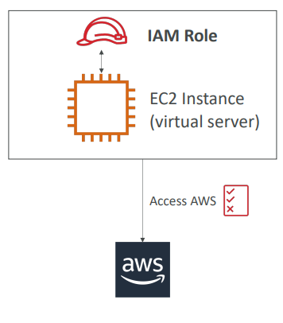

## IAM Security Tools 
- **IAM Credentials Report (Account-Level)** 
    - A report that lists all your account's users and the status of their various credentials 

- **IAM Access Advisor (User-Level)** 
    - Access advisor shows the service permissions granted to a user and when those services were last accessed. 
    - You can use this information to revise your policies.
    
## IAM Guidelines & Best Practices 
- Don't use the root except for AWS account setup 
- One physical user = One AWS user 
- Assign users to groups and assign permissions to groups 
- Create a strong password policy 
- Use and enforce the use of Multi Factor Authentication (MFA) 
- Create and use Roles for giving permissions to AWS services 
- Use Access Keys for Programmatic Access (CLI/SDK) 
- Audit permissions of your account using IAM Credentials Report & IAM Access Advisor 
- Never share IAM users & Access Keys 

## Shared Responsibility Model for IAM 
### AWS:
- Infrastructure (global network security) 
- Configuration and Vulnerability Analysis 
- Compliance Validation 

### Users: 
- Users, Groups, Roles, Policies management and monitoring. 
- Enable MFA on all accounts 
- Rotate all your keys often 
- Use IAM tools to apply appropriate permissions 
- Analyze access patterns & review permissions

--------------------------------------------------

# Elastic Compute Cloud (EC2)

## Amazon EC2
- EC2 is one of the most popular of AWS’ offering 
- EC2 = Elastic Compute Cloud = **Infrastructure as a Service**
- It mainly consists in the capability of :
	- Renting virtual machines (EC2)
	- Storing data on virtual drives (EBS)
	- Distributing load across machines (ELB)
	- Scaling the services using an auto-scaling group (ASG)
- Knowing EC2 is fundamental to understand how the Cloud works

## EC2 Sizing & Configuration Options
- **Operating System (OS)**: Linux, Windows or Mac OS 
- How much compute power & cores (CPU) 
- How much random-access memory (RAM) 
- How much storage space: 
	- Network-attached (EBS & EFS) 
	- hardware (EC2 Instance Store) 
- Network card: speed of the card, Public IP address 
- **Firewall rules**: security group 
- Bootstrap script (configure at first launch): EC2 User Data 

## EC2 User Data
- It is possible to bootstrap our instances using an EC2 User data script. 
- bootstrapping means launching commands when a machine starts
- That script is only run once at the instance first start
- EC2 user data is used to automate boot tasks such as:
	- Installing updates
	- Installing software
	- Downloading common files from the internet
	- Anything you can think of
- The EC2 User Data Script runs with the root user

## Hands-On Launching an EC2 Instance running Linux
- We’ll be launching our first virtual server using the AWS Console
- We’ll get a first high-level approach to the various parameters
- We’ll see that our web server is launched using EC2 user data
- We’ll learn how to start / stop / terminate our instance.

## EC2 Instance Types - Overview
- You can use different types of EC2 instances that are optimised for different use cases (https://aws.amazon.com/ec2/instance-types/)
- AWS has the following naming convention: (m5.2xlarge)
	- m: instance class
	- 5: generation (AWS improves them over time)
	- 2xlarge: size within the instance class
## EC2 Instance Types - General Purpose
- Great for a **diversity of workloads** such as web servers or code repositories
- Balance between: Compute, Memory and Networking
- In the course, we will be using the t2.micro which is a General Purpose EC2 instance

## EC2 Instance Types - Compute Optimized
- Great for **compute-intensive tasks** that require **high performance processors**:
	- Batch processing workloads
	- Media transcoding
	- High performance web servers
	- High performance computing (HPC)
	- Scientific modeling & machine learning
	- Dedicated gaming servers

## EC2 Instance Types - Memory Optimized
- **Fast performance** for workloads that **process large data sets in memory**
- Use cases: 
	- High performance, relational/non-relational databases
	- Distributed web scale cache stores
	- In-memory databases optimized for BI (business intelligence)
	- Applications performing real-time processing of big unstructured data

## EC2 Instance Types - Storage Optimized
- Great for **storage-intensive tasks** that require **high sequential read and write** access to large data sets on local storage
- Use cases: 
	- High frequency online transaction processing (OLTP) systems
	- Relational & NoSQL databases
	- Cache for in-memory databases (for example, Redis)
	- Data warehousing applications
	- Distributed file systems

## EC2 Instance Types
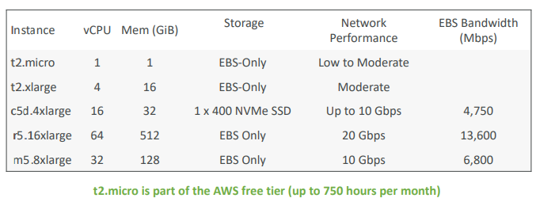

## Introduction to Security Groups
- Security Groups are the fundamentals of network security in AWS
- They control how traffic is allowed into or out of our EC2 Instances.
    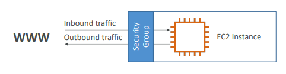
- Security groups only contain **allow** rules
- Security groups rules can reference by IP or by security group

## Security Groups Deeper Dive
- Security groups are **acting as a “firewall” on EC2 instances** 
- They regulate: 
	- Access to Ports 
	- Authorised IP ranges – IPv4 and IPv6 
	- Control of inbound network (from other to the instance) 
	- Control of outbound network (from the instance to other)

## Security Groups Diagram
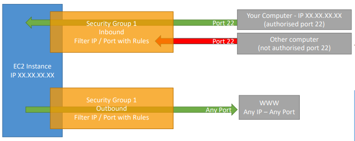

## Security Groups Good to Know
- Can be attached to multiple instances
- Locked down to a region / VPC combination
- Does live “outside” the EC2 – if traffic is blocked the EC2 instance won’t see it
- It’s good to maintain one separate security group for SSH access
- If your application is not accessible (time out), then it’s a security group issue
- If your application gives a “connection refused“ error, then it’s an application 
error or it’s not launched
- All inbound traffic is **blocked** by default
- All outbound traffic is **authorised** by default

## Referencing Other Security Groups Diagram
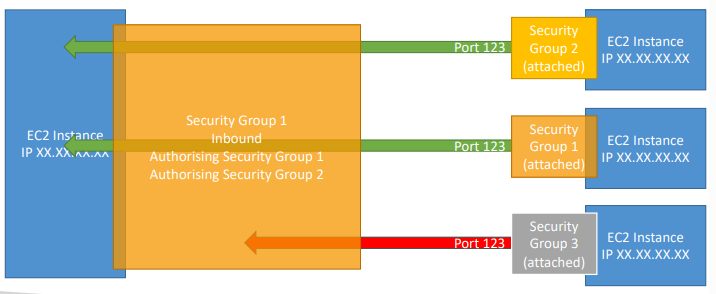

## Classic Ports to Know
- 22 = **SSH** (Secure Shell) - log into a Linux instance
- 21 = **FTP** (File Transfer Protocol) – upload files into a file share
- 22 = **SFTP** (Secure File Transfer Protocol) – upload files using SSH
- 80 = **HTTP** – access unsecured websites
- 443 = **HTTPS** – access secured websites
- 3389 = **RDP** (Remote Desktop Protocol) – log into a Windows instance

## SSH Summary Table
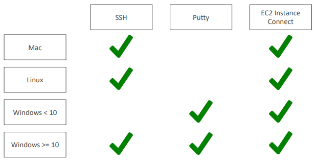

## How to SSH into your EC2 Instance (Windows)
- We’ll learn how to SSH into your EC2 instance using Windows
- SSH is one of the most important function. It allows you to control a 
remote machine, all using the command line.
    
- We will configure all the required parameters necessary for doing SSH 
on Windows using the free tool Putty.

## EC2 Instance Connect
- Connect to your EC2 instance within your browser
- No need to use your key file that was downloaded
- The “magic” is that a temporary key is uploaded onto EC2 by AWS
- Works only out-of-the-box with Amazon Linux 2
- Need to make sure the port 22 is still opened

## EC2 Instances Purchasing Options
- **On-Demand Instances** – short workload, predictable pricing, pay by second
- **Reserved (1 & 3 years)**
	- **Reserved Instances** – long workloads 
	- **Convertible Reserved Instances** – long workloads with flexible instances
- **Savings Plans (1 & 3 years)** –commitment to an amount of usage, long workload
- **Spot Instances** – short workloads, cheap, can lose instances (*less reliable*)
- **Dedicated Hosts** – book an entire physical server, control instance placement
- **Dedicated Instances** – no other customers will share your hardware
- **Capacity Reservations** – reserve capacity in a specific AZ for any duration

## EC2 On Demand
- Pay for what you use:
	- Linux or Windows - billing per second, after the first minute
	- All other operating systems - billing per hour 
- Has the highest cost but no upfront payment
- No long-term commitment
- Recommended for **short-term** and **un-interrupted workloads**, where *you can't predict how the application will behave*

## EC2 Reserved Instances
- Up to **72% discount** *compared to* On-Demand
- You reserve a specific instance attributes (Instance Type, Region, Tenancy, OS)
- Reservation Period – 1 year (+discount) or 3 years (+++discount)
- Payment Options – No Upfront (+), Partial Upfront (++), All Upfront (+++)
- Reserved Instance’s Scope – Regional or Zonal (reserve capacity in an AZ)
- Recommended for **steady-state usage applications** (think database)
- You can buy and sell in the Reserved Instance Marketplace
- **Convertible Reserved Instance**
	- Can *change* the EC2 instance type, instance family, OS, scope and tenancy
	- Up to **66% discount**

## EC2 Savings Plan
- Get a discount based on **long-term usage** (up to **72%** - same as RIs)
- Commit to a certain type of usage ($10/hour for 1 or 3 years)
- Usage beyond EC2 Savings Plans is billed at the On-Demand price
- **Locked** to a *specific instance family* & *AWS region* (e.g., M5 in us-east-1)
- **Flexible** across:
	- Instance Size (e.g., m5.xlarge, m5.2xlarge)
	- OS (e.g., Linux, Windows)
	- Tenancy (Host, Dedicated, Default)

## EC2 Spot Instances
- Can get a discount of up to **90%** compared to On-demand
- Instances that you can “lose” at any point of time if your max price is less than the current spot price
- The **MOST cost-efficient** instances in AWS
- Useful for workloads that are resilient to failure
	- Batch jobs
	- Data analysis
	- Image processing
	- Any distributed workloads
	- Workloads with a flexible start and end time
- Not suitable for critical jobs or databases

## EC2 Dedicated Hosts
- A physical server with EC2 instance capacity fully dedicated to your use
- Allows you address compliance requirements and use your existing server- bound software licenses (per-socket, per-core, pe—VM software licenses)
- Purchasing Options:
	- On-demand – pay per second for active Dedicated Host
	- Reserved - 1 or 3 years (No Upfront, Partial Upfront, All Upfront)
- The **most expensive option**
- Useful for software that have complicated licensing model (**BYOL** – Bring Your Own License)
- Or for companies that have strong regulatory or compliance needs

## EC2 Dedicated Instances
- Instances run on hardware that’s dedicated to you
- May share hardware with other instances in same account
- No control over instance placement (can move hardware after Stop / Start)

## EC2 Capacity Reservations
- Reserve On-Demand instances capacity in a specific AZ for any duration
- You always have access to EC2 capacity when you need it
- No time commitment (create/cancel anytime), no billing discounts
- Combine with Regional Reserved Instances and Savings Plans to benefit 
from billing discounts
- You’re charged at On-Demand rate whether you run instances or not
- Suitable for short-term, uninterrupted workloads that needs to be in a 
specific AZ

## Which purchasing option is right for me?
- **On demand**: coming and staying in resort whenever we like, we pay the full price
- **Reserved**: like planning ahead and if we plan to stay for a long time, we may get a good discount.
- **Savings Plans**: pay a certain amount per hour for certain period and stay in any room type (e.g., 
King, Suite, Sea View, …)
- **Spot instances**: the hotel allows people to bid for the empty rooms and the highest bidder keeps the 
rooms. You can get kicked out at any time
- **Dedicated Hosts**: We book an entire building of the resort
- **Capacity Reservations**: you book a room for a period with full price even you don't stay in

## Price Comparison Example
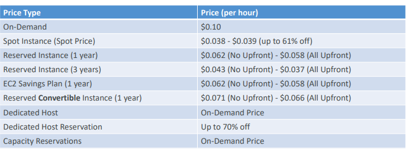

## Shared Responsibility Model for EC2
### AWS
- Infrastructure (global network security)
- Isolation on physical hosts
- Replacing faulty hardware
- Compliance validation

### User
- Security Groups rules
- Operating-system patches and updates
- Software and utilities installed on the EC2 instance
- IAM Roles assigned to EC2 & IAM user access management
- Data security on your instance

-----------------------------------------------------------

# EC2 Instance Storage

## What's an EBS Volume?
- An **EBS** (*Elastic Block Store*) **Volume** is a *network drive* you can attach to your instances while they run
- It allows your instances to *persist data*, *even after their termination*
- They can only be mounted to one instance at a time (at the CCP 
level)
- They are bound to a specific availability zone
- Analogy: Think of them as a “network USB stick” 
- Free tier: 30 GB of free EBS storage of type General Purpose (SSD) or 
Magnetic per month

## EBS Volume
- It’s a **network drive** (i.e. not a physical drive)
    - It uses the network to communicate the instance, which means there might be a bit of *latency*
    - It can be detached from an EC2 instance and attached to another one quickly

- It’s **locked** to an Availability Zone (AZ)
    - An EBS Volume in us-east-1a cannot be attached to us-east-1b
    - To move a volume across, you first need to snapshot it

- Have a provisioned capacity (size in GBs, and IOPS)
    - You get billed for all the provisioned capacity
    - You can increase the capacity of the drive over time

## EBS Volume - Example
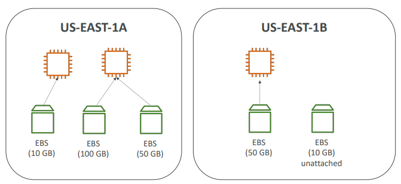

## EBS - Delete on Termination Attribute
- Controls the EBS behaviour when an EC2 instance terminates
-  By default, the root EBS volume is deleted (attribute enabled)
- By default, any other attached EBS volume is not deleted (attribute disabled)
- This can be controlled by the AWS console / AWS CLI
- Use case: preserve root volume when instance is terminated

## EBS Snapshots
- Make a backup (snapshot) of your EBS volume at a point in time
- Not necessary to detach volume to do snapshot, but recommended
- Can copy snapshots across AZ or Region
    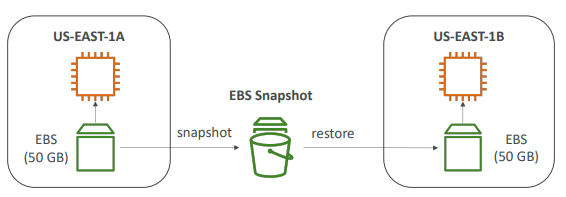

## EBS Snapshots Features
- EBS Snapshot Archive
	- Move a Snapshot to an ”archive tier” that is 75% cheaper
	- Takes within 24 to 72 hours for restoring the archive
- Recycle Bin for EBS Snapshots
	- Setup rules to retain deleted snapshots so 
you can recover them after an accidental deletion
- Specify retention (from 1 day to 1 year)
    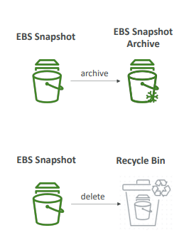

## AMI Overview
- AMI = Amazon Machine Image
- AMI are a customization of an EC2 instance
- You add your own software, configuration, operating system, monitoring…
- Faster boot / configuration time because all your software is pre-packaged
- AMI are built for a specific region (and can be copied across regions)
- You can launch EC2 instances from:
    - A public AMI: AWS provided
    - Your own AMI: you make and maintain them yourself
    - An AWS Marketplace AMI: an AMI someone else made (and potentially sells)

## AMI Process (from an EC2 Instance)
- Start an EC2 instance and customize it
- Stop the instance (for data integrity)
- Build an AMI – this will also create EBS snapshots
- Launch instances from other AMI
    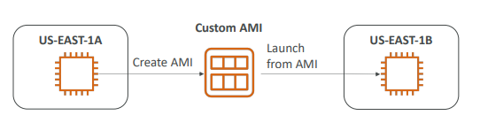

## EC2 Image Builder
- Used to automate the creation of Virtual Machines or container images
- Automate the creation, maintain, validate and test EC2 AMIs
- Can be run on a schedule (weekly, whenever packages are updated, etc…)
- Free service (only pay for the underlying resources)
    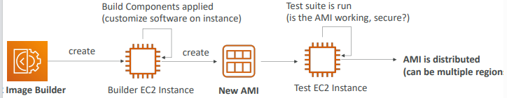

## EC2 Instance Store
- EBS volumes are network drives with good but *“limited”* performance
- If you need a high-performance hardware disk, use EC2 Instance Store
- Better I/O performance
- EC2 Instance Store lose their storage if they’re stopped (ephemeral)
- Good for buffer / cache / scratch data / temporary content 
- Risk of data loss if hardware fails
- Backups and Replication are your responsibility 

## Local EC2 Instance Store
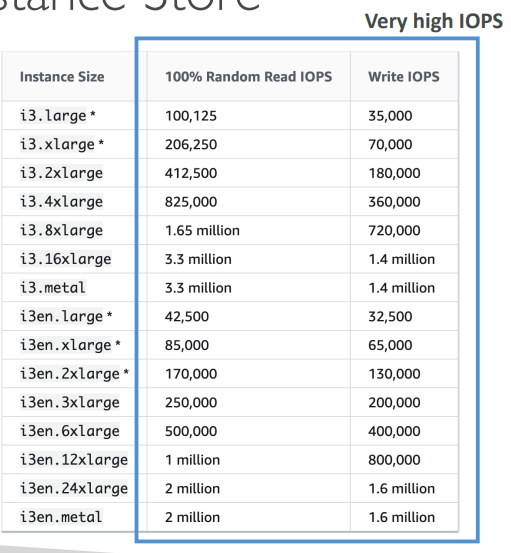

## EFS - Elastic File System
- Managed NFS (network file system) that can be mounted on 100s of EC2
- EFS works with Linux EC2 instances in multi-AZ
- Highly available, scalable, expensive (3x gp2), pay per use, no capacity planning
    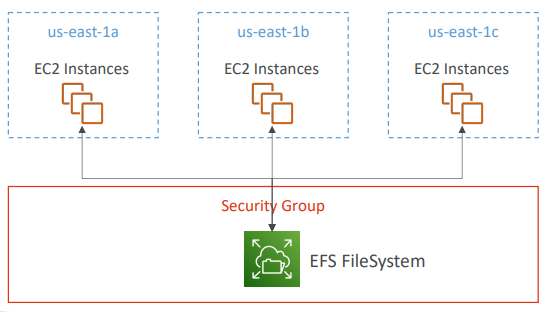

## EBS vs EFS
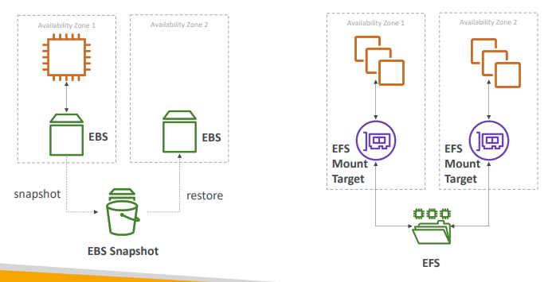

## EFS Infrequent Access (EFS-IA)
- Storage class that is cost-optimized for files not accessed every day
- Up to 92% lower cost compared to EFS Standard
- EFS will automatically move your files to EFS-IA  based on the last time they were accessed
- Enable EFS-IA with a Lifecycle Policy 
- Example: move files that are not accessed for 60 days to EFS-IA
- Transparent to the applications accessing EFS
    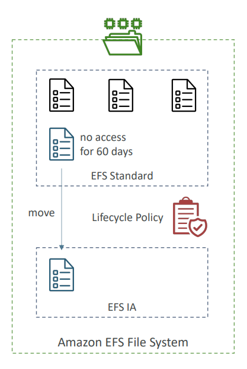

## Shared Responsibility Model for EC2 Storage
### AWS
- Infrastructure
- Replication for data for EBS volumes & EFS drives
- Replacing faulty hardware
- Ensuring their employees cannot access your data

### User
- Setting up backup / snapshot procedures
- Setting up data encryption
- Responsibility of any data on the drives
- Understanding the risk of 
using EC2 Instance Store

## Amazon FSx Overview
- Launch 3rd party high-performance file systems on AWS
- Fully managed service

## Amazon FSx for Windows File Server
- A fully managed, highly reliable, and scalable Windows native shared file system 
- Built on Windows File Server
- Supports SMB protocol & Windows NTFS
- Integrated with Microsoft Active Directory
- Can be accessed from AWS or your on-premise infrastructure
    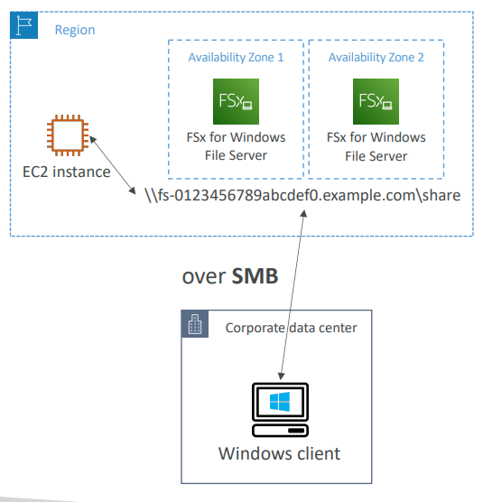

## Amazon FSx for Lustre
- A fully managed, high-performance, scalable file storage for High Performance Computing (HPC)
- The name Lustre is derived from “Linux” and “cluster”
- Machine Learning, Analytics, Video Processing, Financial Modeling, …
- Scales up to 100s GB/s, millions of IOPS, sub-ms latencies
    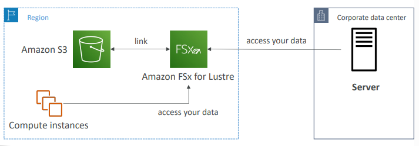

--------------------------------------------------------

# ELB & ASG
## Scalability & High Availability
- Scalability means that an application / system can handle greater loads by adapting. 
- There are two kinds of scalability:
	- Vertical Scalability
	- Horizontal Scalability (=elasticity)
- Scalability is linked but different to High Availability
- Let’s deep dive into the distinction, using a call center as an example

## Vertical Scalabaility
- Vertical Scalability means **increasing the size** *of the instances*
- For example, your application runs on a t2.micro
- Scaling that application vertically means running it on a t2.large
- Vertical scalability is very **common for non distributed systems**, such as a **database**. 
- There’s usually a limit to how much you can vertically scale (hardware limit)

## Horizontal Scalability
- Horizontal Scalability means **increasing the number** *of instances/systems* for your application.
- Horizontal scaling implies distributed systems. 
- This is very **common for web applications** /modern applications
- It’s easy to horizontally scale thanks to the cloud 
offerings such as Amazon EC2

## High Availability
- High Availability usually goes hand in hand with horizontal scaling
- High availability means **running** your application / system **in at least 2 AZs**
- The **goal** of high availability is to survive a data center loss (disaster)

## HIgh Availability & Scalability for EC2
- **Vertical Scaling**: Increase instance size (= scale up / down)
	- From: t2.nano - 0.5G of RAM, 1 vCPU
	- To: u-12tb1.metal – 12.3 TB of RAM, 448 vCPUs
- **Horizontal Scaling**: Increase number of instances (= scale out / in)
	- Auto Scaling Group
	- Load Balancer
- **High Availability**: Run instances for the same application across multi AZ
	- Auto Scaling Group multi AZ
 	- Load Balancer multi AZ

## Scalability vs Elastcticy (vs Agility)
- **Scalability**: ability to accommodate a larger load by making the hardware stronger (scale up), or by adding nodes (scale out)

- **Elasticity**: once a system is scalable, elasticity means that there will be some “*auto-scaling”* so that the system can scale based on the load. This is “cloud-friendly”: pay-per-use, match demand, optimize costs
- **Agility**: (not related to scalability - distractor) new IT resources are only a click away, which means that you reduce the time to make those resources available to your developers from weeks to just minutes.

## What is Load Balancing?
Load balancers are servers that **forward internet traffic** to **multiple servers** (EC2 Instances) downstream
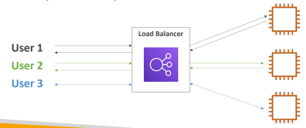

## Why use a Load Balancer?
- Spread load across multiple downstream instances 
- Expose a single point of access (DNS) to your application 
- Seamlessly handle failures of downstream instances 
- Do regular health checks to your instances 
- Provide SSL termination (HTTPS) for your websites 
- High availability across zone

## Why use an Elastic Load Balancer?
- An ELB (Elastic Load Balancer) is a managed load balancer
	- AWS guarantees that it will be working
	- AWS takes care of upgrades, maintenance, high availability
	- AWS provides only a few configuration knobs
- It costs less to setup your own load balancer but it will be a lot more effort on your end (maintenance, integrations)
-	 **4 kinds of load balancers** offered by AWS:
        - **Application Load Balancer (HTTP / HTTPS only)** – Layer 7
        - **Network Load Balancer (ultra-high performance, allows for TCP)** – Layer 4	
        - **Gateway Load Balancer** – Layer 3
        - **Classic Load Balancer (retired in 2023)** – Layer 4 & 7
            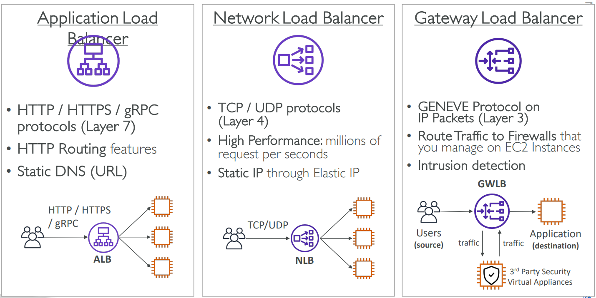

## What's an Auto Scaling Group?
- Auto scaling is **enabled** by *Amazon CloudWatch* and is available at no additional charge beyond the service fees for CloudWatch and the other AWS resources.
- In real-life, the load on your websites and application can change
- In the cloud, you can create and get rid of servers very quickly
- The **goal** of an Auto Scaling Group (ASG) is to:
- **Scale out** (*add EC2 instances*) to match an increased load
	- **Scale in** (*remove EC2 instances*) to match a decreased load
	- Ensure we have a minimum and a maximum number of machines running
	- Automatically register new instances to a load balancer
	- **Replace unhealthy instances**
- Cost Savings: only run at an optimal capacity (principle of the cloud)

## Auto Scaling Group in AWS
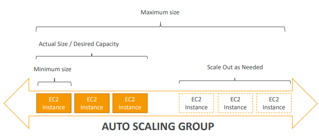

## Auto Scaling Groups with High Load Balancer
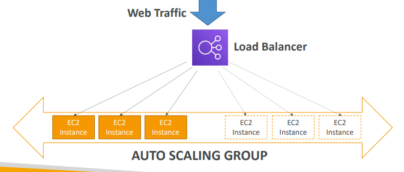

## Auto Scaling Groups - Scaling Strategies
- **Manual Scaling**: Update the size of an ASG manually
- **Dynamic Scaling**: Respond to changing demand
	- Simple / Step Scaling
		- When a CloudWatch alarm is triggered (example CPU > 70%), then add 2 units
		- When a CloudWatch alarm is triggered (example CPU < 30%), then remove 1
- **Target Tracking Scaling**
	- Example: I want the average ASG CPU to stay at around 40%
- **Scheduled Scaling**
 	- Anticipate a scaling based on known usage patterns
 	- Example: increase the min. capacity to 10 at 5 pm on Fridays

## Auto Scaling Groups - Scaling Strategies
- **Predictive Scaling**: 
    -  Uses Machine Learning to predict future traffic ahead of time
    - Automatically provisions the right number of EC2 instances in advance
- Useful when your load has predictable time-based pattern
    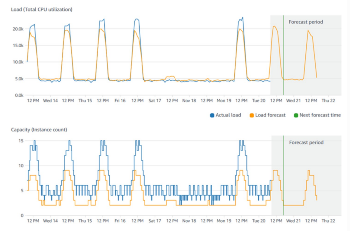

--------------------------------------------------------

# Amazon S3

## Introduction
- Amazon Simple Storage Service (Amazon S3) is **storage** for the internet. 
- You can use Amazon S3 to **store** and **retrieve** any amount of data at any time, from anywhere on the web.
- Amazon S3 is one of the main building blocks of AWS
- It’s advertised as ”*infinitely scaling*” storage 
- Many websites use Amazon S3 as a backbone
- Many AWS services use Amazon S3 as an integration as well

## Amazon S3 Use Cases
- Backup and Storage 
- Disaster Recovery 
- Archive 
- Hybrid Cloud storage 
- Application Hosting 
- Media Hosting 
- Data Lakes & Big Data Analytics 
- Software Delivery 
- Static Website

## Amazon EBS
- Amazon Elastic Block Store (Amazon EBS) is a service that provides **block-level storage volumes** that you can use with any running EC2 instances and use it like a hard drive. 

- If you stop or terminate an Amazon EC2 instance, all the data on the attached EBS volume remains available.

## Amazon S3 - Buckets
- Amazon S3 allows people to **store objects (files)** in “*buckets*” (directories)
- Buckets must have a **globally unique name** (across all regions all accounts)
- Buckets are defined at the region level 
- S3 looks like a global service but buckets are created in a region
- Naming convention
    - No uppercase, No underscore
    - 3-63 characters long
    - Not an IP
    - Must start with lowercase letter or number
    - Must NOT start with the prefix **xn--**
    - Must NOT end with the suffix **-s3alias**

## Amazon S3 - Objects
- **Objects** (files) have a Key
- The **key** is the FULL path:
    - s3://my-bucket/my_file.txt
    - s3://my-bucket/my_folder1/another_folder/my_file.txt
- The key is composed of **prefix** + **object name**
    - s3://my-bucket/my_folder1/another_folder/my_file.txt
- There’s no concept of *“directories”* within buckets
(although the UI will trick you to think otherwise)
- Just keys with very long names that contain slashes (“/”)
- Object values are the content of the body:
    - Max. Object Size is 5TB (5000GB)
    - If uploading more than 5GB, must use “multi-part upload”
- Metadata (list of text key / value pairs – system or user metadata)
- Tags (Unicode key / value pair – up to 10) – useful for security / lifecycle
- Version ID (if versioning is enabled)

## Amazon S3 - Security
- **User-Based**
    - **IAM Policies** – which API calls should be allowed for a specific user from IAM
- **Resource-Based**
    - **Bucket Policies** – bucket wide rules from the S3 console - allows cross account
    - **Object Access Control List (ACL)** – finer grain (can be disabled)
    - **Bucket Access Control List (ACL)** – less common (can be disabled)
- **Note**: an IAM principal can access an S3 object if
    - The user IAM permissions ALLOW it OR the resource policy ALLOWS it
    - AND there’s no explicit DENY
- **Encryption**: encrypt objects in Amazon S3 using encryption keys

## S3 Bucket Policies
- JSON based policies
    - Resources: buckets and objects 
    - Effect: Allow / Deny 
    - Actions: Set of API to Allow or Deny 
    - Principal: The account or user to apply the 
policy to

- Use S3 bucket for policy to: 
    - Grant public access to the bucket 
    - Force objects to be encrypted at upload 
    - Grant access to another account (Cross Account)
        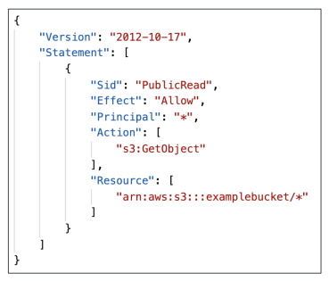

## Example: Public Access - Use Bucket Policy
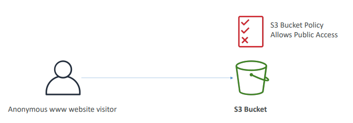

## Example: User Access to S3 - IAM Permissions
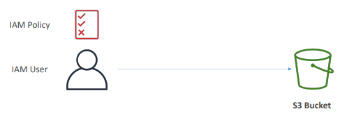

## Example: EC2 Instance Access - Use IAM Roles
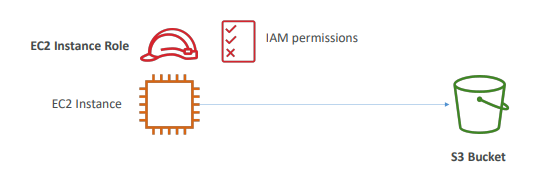

## Advanced: Cross-Account Access - Use Bucket Policy
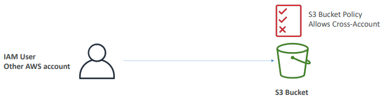

## Bucket Settings for Block Public Access
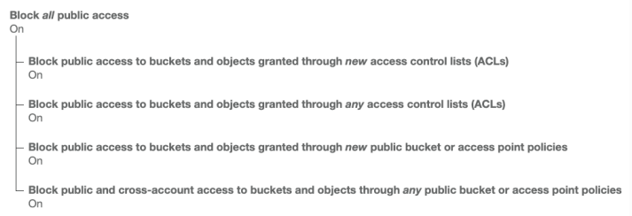
- These settings were created to prevent company data leaks
- If you know your bucket should never be public, leave these on
- Can be set at the account level

## Amazon S3 - Static Website Hosting
- S3 can host static websites and have them accessible on 
the Internet
- The website URL will be (depending on the region)
    - http://bucket-name.s3-website**-**aws-region.amazonaws.com
    - **OR** http://bucket-name.s3-website**.**aws-region.amazonaws.com
- If you get a **403 Forbidden** error, make sure the bucket policy allows public reads
    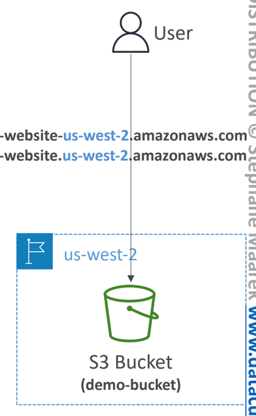

## Amazon S3 - Versioning
- You can version your files in Amazon S3
- It is enabled at the bucket level
- Same key overwrite will change the *“version”*: 1, 2, 3….
- It is best practice to version your buckets
    - Protect against unintended deletes (ability to restore a version)
    - Easy roll back to previous version 
- Notes:
    - Any file that is not versioned prior to enabling versioning will 
have version “null”
    - Suspending versioning does not delete the previous version
    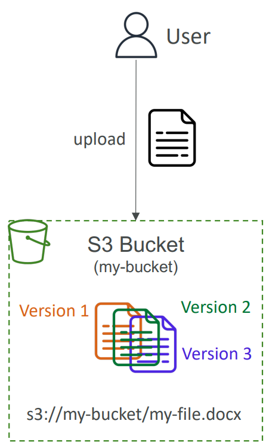

## Amazon S3 - Replication (CRR & SRR)
- **Must enable versioning** in source and destination buckets
- **CRR** : Cross Region Application
- **SRR** : Same Region Application
- Buckets can be in different AWS accounts
- Copying is asynchronous
- Must give proper IAM permissions to S3

 

- Use Cases:
    - **CRR** : Compliance, Low Latency Access, Replication Across Accounts
    - **SRR** : Low Aggregation, Live Replication between Production and Test Accounts

## S3 Storage Classes
- Amazon S3 Standard : General Purpose
- Amazon S3 Standard-Infrequesnt Access (IA)
- Amazon S3 One Zone-Infrequent Access
- Amazon S3 Glacier Instant Retrieval
- Amazon S3 Glacier Flexible Retrieval
- Amazon S3 Glacier Deep Archive
- Amazon S3 Intelligent Tiering

 

- Can move between classes manually or using S3 Lifecycle configurations

## S3 Durability and Ability
- Durability
    - High Durability (99.999999999%, 11 9's) of objects across multiple AZ
    - If you store 10,000,000 objects with Amazon S3, you can on average expect to incur a loss of a single object once every 10,000 years.
    - Same for all storage classes
- Availability
    - Measures how much readily available a service is
    - Varies depending on storage class
    - Example: S3 standard has 99.99% availability = not available 53 minuted a year.

## S3 Standard : General Purpose
- 99.99% Availability
- Used for **frequently accessed data**
- Low latency and high throughput
- Sustain 2 concurrent facility failures
- Use CasesL Big Data Analytics, Mobile & Gaming Applications, Content Distribution..

## S3 Storage Classes : Infrequent Access
- For data that is less frequently accessed, but **required rapid access when needed**
- Lower cost than S3 standard

### Amazon S3 Standard-Infrequent Access (S3 Standard-IA)
- 99.9% Availability
- Use cases; Disaster Recovery, backups

### Amazon S3 One Zone-Infrequent Access (S3 One Zone-IA)
- High durability (99.999999999%) in a single AZ; *data lost when AZ is destroyed*
- 99.5% Availability
- Use Cases: Storing secondary backup copies of on-premise data, or data you can recreate

## Amazon S3 Glacier Storage Classes
- *Low-cost* object storage meant for **archiving/backup**
- Pricing: price for storage + object retrieval cost

### Amazon S3 Glacier Instant Retrieval
- Millisecond retrieval, great for data accessed *once a quarter*
- **Minimum storage** duration of **90 days**

### Amazon S3 Glacier Flexible Retrieval (*formerly Amazon S3 Glacier*):
- Expedited (1 to 5 minutes), Standard (3 to 5 hours), Bulk (5 to 12 hours) – free
- **Minimum storage** duration of **90 days**

### Amazon S3 Glacier Deep Archive** – *for long term storage*:
- Standard (12 hours), Bulk (48 hours)
- M**inimum storage** duration of **180 days**

## S3 Intelligent - Tiering
- Small monthly monitoring and auto-tiering fee
- Moves objects automatically between Access Tiers based on usage
- There are no retrieval charges in S3 Intelligent-Tiering

 

- *Frequent Access tier (automatic):* default tier
- *Infrequent Access tier (automatic):* objects not accessed for 30 days
- *Archive Instant Access tier (automatic):* objects not accessed for 90 days
- *Archive Access tier (optional):* configurable from 90 days to 700+ days
- *Deep Archive Access tier (optional):* config. from 180 days to 700+ days

### S3 Storage Classes Comparison
|  | Standard | Intelligent-Tiering | Standard-IA | One Zone-IA | Glacier Instant Retrieval | Glacier Flexible Retrieval | Glacier Deep Archive |
| - | -------- | ------------------- | ----------- | ------- | -------------------------- | ------------- | ----------------- |
| Durability | 99.999999999% == (11 9's) |
| Availability | 99.9% | 99.9% | 99.9% | 99.5% | 99.9% | 99.9% | 99.9% | 
| Availability SLA | 99.9% | 99% | 99% | 99% | 99% | 99.9% | 99.9% | 
| Availability Zones | >=3 | >=3 | >=3 | 1 | >=3 | >=3 | >=3 |
| Min. Storage Duration Charge | None | None | 30 Days | 30 Days | 90 Days | 90 Days | 180 Days |
| Min. Billable Object Size | None | None | 128 Kb | 128 Kb | 128 Kb | 40 Kb | 40 Kb |
| Retrieval Fee | None | None | Per GB retrieved | Per GB retrieved | Per GB retrieved | Per GB retrieved | Per GB retrieved |

### S3 Storage Classes - Price Comparision (Example: us-east-1)
|  | Standard | Intelligent-Tiering | Standard-IA | One Zone-IA | Glacier Instant Retrieval | Glacier Flexible Retrieval | Glacier Deep Archive |
| - | -------- | ------------------- | ----------- | ------- | -------------------------- | ------------- | ----------------- |
| Storage Cost (per GB per month) | $0.023 | $0.0025 - $0.023 | %0.0125 | $0.01 | $0.04 | $0.0036 | $0.00099 |
| Retrieval Cost (per 100 request) | **GET:** $0.0004, **POST:** $0.005 | **GET:** $0.0004, **POST:** $0.005 | **GET:** $0.001, **POST:** $0.01 | **GET:** $0.001, **POST:** $0.01 | **GET:** $0.01, **POST:** $0.02 | **GET:** $0.004, **POST:** $0.03, **Expideted:** $10, **Standard:** %0.05, **Bulk:** Free | **GET:** $0.004, **POST:** $0.05, **Standard:** %0.10, **Bulk:** $0.025 |
| Retrieval Time | Instantaneous | Instantaneous | Instantaneous | Instantaneous | Instantaneous | **Expedited** (1-5 mins), **Standard** (3-5 hours), **Bulk** (5-12 hours) | **Standard** (12 hours), **Bulk** (48 hours) |
| Monitoring Cost (per 1000 objects) | | $0.025 | | | | | |

## S3 Encryption
By default ther Server-Side Encryption is always ON.
    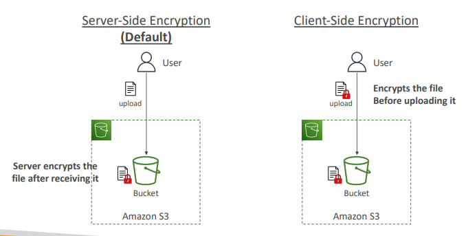

## IAM Access Analyzer for S3
- Ensures that only intended people have access to your S3 buckets
- Example: publicly accessible bucket, bucket shared with other AWS account
- Evaluates S3 Bucket Policies, S3 ACLs, S3 Access Point Policies

## Shared Responsibility Model for S3
### AWS 
- Infrastructure (global security, durability, availability, sustain concurrent loss of data in two facilities)
- Configuration and vulnerability analysis
- Compliance validation

### User
- S3 Versioning
- S3 Bucket Policies
- S3 Replication Setup
- Logging and Monitoring
- S3 Storage Classes
- Data Encryption at rest and in transit

## AWS Snow Family Overview
- The AWS Snow Family is a service that helps customers who need to run operations in austere, non-data center environments, and in locations where there's no consistent network connectivity. 

- You can use these devices to locally and cost-effectively access the storage and compute power of the AWS Cloud in places where an internet connection might not be an option.
- Highly-secure, portable devices to **collect and process data at the edge**, and **migrate data into and out of AWS**
    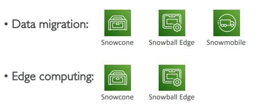

## Data Migrations with AWS Snow Family
### Challenges
- Limited connectivity
- Limited bandwidth
- High network cost
- Shared bandwidth (can't maximize the line)
- Connection stability
    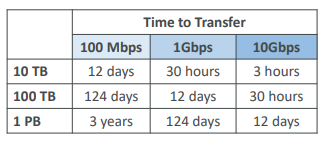

AWS Snow Family: offline devices to perform data migrations: If it takes more than a week to transfer over the network, use Snowball devices!

## Diagrams
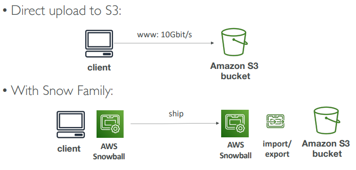

## Snowball Edge (for data transfers)
- Physical data transport solution: move TBs or PBs of data in or out of AWS
- Alternative to moving data over the network (and paying network 
fees)
- Pay per data transfer job • Provide block storage and Amazon S3 compatible object storage
- **Snowball Edge Storage Optimized**
    - *80 TB of HDD capacity* for block volume and S3 compatible object storage
- **Snowball Edge Compute Optimized**
    - *42 TB of HDD or 28TB NVMe capacity* for block volume and S3 compatible object storage
- Use cases: large data cloud migrations, DC decommission, disaster recovery

## AWS Snowcone & Snowcone SSD
- Small, portable computing, anywhere, rugged & 
secure, withstands harsh environments
- Light (4.5 pounds, 2.1 kg) 
- Device used for edge computing, storage, and data transfer
- **Snowcone** : **8 TB** of *HDD Storage*
- **Snowcone SSD** : **14 TB** of *SSD Storage*
- Use Snowcone where Snowball does not fit (space constrained environment)
- Must provide your own battery / cables
- Can be sent back to AWS offline, or connect it to  internet and use AWS DataSync to send data

## AWS Snowmobile
- Transfer exabytes of data (1 EB = 1,000 PB = 1,000,000 TBs)
- Each Snowmobile has **100 PB of capacity** (use multiple in parallel)
- High security: temperature controlled, GPS, 24/7 video surveillance
- Better than Snowball if you transfer more than 10 PB

## AWS Snow Family for Data Migrations
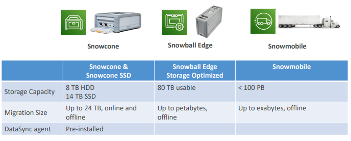

## Snow Family - Usage Process
1. Request Snowball devices from the AWS console for delivery
2. Install the snowball client / AWS OpsHub on your servers
3. Connect the snowball to your servers and copy files using the client
4. Ship back the device when you’re done (goes to the right AWS facility)
5. Data will be loaded into an S3 bucket
6. Snowball is completely wiped

### What is Edge Computing?
- Process data while it’s being created on an edge location
    - A truck on the road, a ship on the sea, a mining station underground... 
- These locations may have 
    - Limited / no internet access
    - Limited / no easy access to computing power
- We setup a **Snowball Edge**/**Snowcone** device to do edge computing
- Use cases of Edge Computing:
    - Preprocess data
    - Machine learning at the edge
    - Transcoding media streams
- Eventually (if need be) we can ship back the device to AWS (for transferring data for example)

## Snow Family - Edge Computing
- **Snowcone & Snowcone SSD (smaller)**
    - 2 CPUs, 4 GB of memory, wired or wireless access
    - USB-C power using a cord or the optional battery
- **Snowball Edge – Compute Optimized**
    - 104 vCPUs, 416 GiB of RAM
    - Optional GPU (useful for video processing or machine learning)
    - 28TB NVMe or 42TB HDD usable storage
    - Storage Clustering available (up to 16 nodes)
- **Snowball Edge – Storage Optimized**
    - Up to 40 vCPUs, 80 GiB of RAM, 80 TB storage
- All: Can run EC2 Instances & AWS Lambda functions (using AWS IoT Greengrass)
- Long-term deployment options: 1 and 3 years discounted pricing

## AWS OpsHub
- Historically, to use Snow Family devices, you 
needed a CLI (Command Line Interface tool)
- Today, you can use AWS OpsHub (*a software you install on your computer/laptop*) to **manage your Snow Family Device**
    - Unlocking and configuring single or clustered devices
    - Transferring files
    - Launching and managing instances running on Snow Family Devices
    - Monitor device metrics (storage capacity, active 
instances on your device)
    - Launch compatible AWS services on your devices (ex: Amazon EC2 instances, AWS DataSync, Network File System (NFS)

## Snowball Edge Pricing
- You pay for **device usage** and dat**a transfer** out of AWS
- Data transfer IN to Amazon S3 is $0.00 per GB
- **On-Demand**
    - Includes a one-time service fee per job, which includes:
        - **10 days** of usage for **Snowball Edge Storage Optimized 80TB**
        - **15 days** of usage for **Snowball Edge Storage Optimized 210TB**
    - Shipping days are NOT counted towards the included 10 or 15 days
    - Pay per day for any additional days
- **Committed Upfront**
    - Pay in advance for monthly, 1-year, and 3-years of usage (**Edge Computing**)
    - Up to 62% discounted pricing

## Storage Gateway Overview
AWS Storage Gateway is a service that **connects** an *on-premises software appliance with cloud-based storage* to provide seamless and secure integration between your on-premises IT environment and the AWS storage infrastructure in the AWS Cloud.

### Hybrid Cloud for Storage
- AWS is pushing for "hybrid cloud"
    - Part of your infrastructure is on-premises
    - Part of your infrastructure is on the cloud 
- This can be due to 
    - Long cloud migrations
    - Security requirements
    - Compliance requirements
    - IT strategy
- S3 is a proprietary storage technology (unlike EFS/NFS), so how do you expose the S3 data on-premise? 
- AWS Storage Gateway

## AWS Storage Cloud Native Options
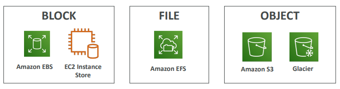

### AWS Storage Gateway
- Bridge between on-premise data and cloud data in S3
- Hybrid storage service to allow on-premises to seamlessly use the AWS Cloud 
- Use cases: disaster recovery, backup & 
restore, tiered storage
- Types of Storage Gateway:
    - File Gateway 
    - Volume Gateway
    - Tape Gateway
- No need to know the types at the exam
    

## Summary
- **Buckets vs Objects**: global unique name, tied to a region
- **S3 Security**: IAM policy, S3 Bucket Policy (public access), S3 Encryption
- **S3 Websites**: host a static website on Amazon S3
- **S3 Versioning**: multiple versions for files, prevent accidental deletes
- **S3 Replication**: same-region or cross-region, must enable versioning
- **S3 Storage Classes**: Standard IA, IZ-IA, Intelligent, Glacier (Instant, Flexible, Deep)
- **Snow Family**: import data onto S3 through a physical device, edge computing
- **OpsHub**: desktop application to manage Snow Family devices
- **Storage Gateway**: hybrid solution to extend on-premises storage to S3

--------------------------------------------------------

# Databases & Analytics
## Databases Introduction
- Storing data on disk (EFS, EBS, EC2 Instance Store, S3) can have its limits 
- Sometimes, you want to store data in a database…
- You can **structure** the data
- You build **indexes** to efficiently **query/search** through the data
- You define **relationships** between your **datasets**
- Databases are **optimized for a purpose** and come with different features, shapes and constraint

## Relational Databases
- Looks just like Excel spreadsheets, with links between them!
- Can use the SQL language to perform queries / lookups
    

## NoSQL Databases
- NoSQL = non-SQL = non relational databases
- NoSQL databases are purpose built for specific data models and have flexible schemas for building modern applications.
- Benefits:
    - Flexibility: easy to evolve data model
    - Scalability: designed to scale-out by using distributed clusters
    - High-performance: optimized for a specific data model
    -  Highly functional: types optimized for the data model
- Examples: Key-value, document, graph, in-memory, search databases

## NoSQL Data Example: JSON
- JSON = JavaScript Object Notation
- JSON is a common form of data that fits into a NoSQL model
- Data can be nested
- Fields can change over time
- Support for new types: arrays, etc…
    

## Databases & Shared Responsibility on AWS
- AWS offers us to **manage** different databases
- **Benefits** include:
    - Quick Provisioning, High Availability, Vertical and Horizontal Scaling
    - Automated Backup & Restore, Operations, Upgrades
    - Operating System Patching is handled by AWS
    - Monitoring, alerting
- Note: many databases technologies could be run on EC2, but you must handle yourself the resiliency, backup, patching, high availability, fault tolerance, scaling… 

## AWS RDS Overview
- RDS stands for **Relational** Database Service
- It’s a managed DB service for DB. It uses SQL as a query language. 
- It allows you to create databases in the cloud that are managed by AWS
    - Postgres
    - MySQL
    - MariaDB
    - Oracle
    - Microsoft SQL Server
    - Aurora (AWS Proprietary database)

## Advantage over using RDS versus deploying DB on EC2
- RDS is a managed service:
    - Automated provisioning, OS patching
    - Continuous backups and restore to specific timestamp (Point in Time Restore)!
    - Monitoring dashboards
    - Read replicas for improved read performance
    - Multi AZ setup for DR (Disaster Recovery)
    - Maintenance windows for upgrades
    - Scaling capability (vertical and horizontal)
    - Storage backed by EBS (gp2 or io1)
- BUT you can’t SSH into your instances

### RDS Solution Architecture

### Amazon Aurora
- Aurora is a proprietary technology from AWS (not open sourced)
- **PostgreSQL and MySQL** are both supported as Aurora DB 
- Aurora is “AWS cloud optimized” and claims 5x performance improvement over MySQL on RDS, over 3x the performance of Postgres on RDS
- Aurora storage automatically grows in increments of 10GB, up to 128 TB 
- Aurora costs more than RDS (20% more) – but is more efficient
- Not in the free tier
    

### Amazon Aurora Serverless
- Automated database instantiation and auto-scaling based on actual usage
- PostgreSQL and MySQL are both supported as Aurora Serverless DB 
- No capacity planning needed 
- Least management overhead 
- Pay per second, can be more cost effective
- Use cases: good for infrequent, intermittent or unpredictable workloads…
    

## RDS Deployments: Read Replicas, Multi A-Z
- **Read Replicas:**
    - Scale the read workload of your DB
    - Can create up to 15 Read Replicas
    - Data is only written to the main DB
    

- **Multi A-Z:**
    - Failover in case of AZ outage (high availability)
    - Data is only read/written to the main database
    - Can only have I other AZ as failover.
    

## RDS Deployments: Multi-Region
- **Multi-Region (Read Replicas)**
    - **Disaster Recovery** in case of region issue
    - **Local Performance** for global reads 
    - Replication cost
    

## Amazon ElastiCache Overview
- The same way RDS is to get managed Relational Databases…
- ElastiCache is to get managed Redis or Memcached
- Caches are **in-memory databases** with high performance, low latency
- Helps **reduce load off databases for read intensive workloads**
- AWS takes care of OS maintenance / patching, optimizations, setup, configuration, monitoring, failure recovery and backups.

## ElastiCache Solution Architecture - Cache

## DynamoDB
- Fully Managed Highly available with replication across 3 AZ
- **NoSQL database - not a relational database** 
- Scales to massive workloads, distributed “serverless” database
- Millions of requests per seconds, trillions of row, 100s of TB of storage
- Fast and consistent in performance 
- **Single-digit millisecond latency – low latency retrieval**
- Integrated with IAM for security, authorization and administration
- Low cost and auto scaling capabilities
- Standard & Infrequent Access (IA) Table Class

## DynamoDB - Type of Data
- DynamoDB is a key/value database
    

## DynamoDB Accelerator - DAX
- Fully Managed **in-memory cache** for 
DynamoDB
- **10x performance improvement** – single- digit millisecond latency to microseconds latency – when accessing your DynamoDB tables
- Secure, highly scalable & highly available
- Difference with ElastiCache at the CCP 
level: **DAX is only used for and is 
integrated with DynamoDB**, while ElastiCache can be used for other databases
    

 
## DynamoDB Global Tables
- Make a DynamoDB table accessible with low latency in multiple-regions
- Active-Active replication (read/write to any AWS Region)
    

## Redshift Overview
- Redshift is based on PostgreSQL, but it’s not used for OLTP
- It’s OLAP – online analytical processing (analytics and data warehousing)
- Load data once every hour, not every second
- 10x better performance than other data warehouses, scale to PBs of data
- Columnar storage of data (instead of row based)
- Massively Parallel Query Execution (MPP), highly available
- Pay as you go based on the instances provisioned
- Has a SQL interface for performing the queries
- BI tools such as AWS Quicksight or Tableau integrate with it

## Redshift Serverless
- Automatically provisions and scales data warehouse underlying capacity
- Run analytics workloads without managing data warehouse infrastructure
- Pay only for what you use (save costs)
- Use cases: Reporting, dashboarding applications, real-time analytics…
    

## Amazon EMR
- EMR stands for “Elastic MapReduce”
- EMR helps creating Hadoop clusters (Big Data) to analyze and process vast amount of data
- The clusters can be made of hundreds of EC2 instances
- Also supports Apache Spark, HBase, Presto, Flink…
- EMR takes care of all the provisioning and configuration
- Auto-scaling and integrated with Spot instances
- Use cases: data processing, machine learning, web indexing, big data…

## Amazon Athena
- Serverless query service to analyze data stored in Amazon S3
- Uses standard SQL language to query the files
Supports CSV, JSON, ORC, Avro, and Parquet (built on Presto)
- Pricing: $5.00 per TB of data scanned
- Use compressed or columnar data for cost-savings (less scan)
- Use cases: Business intelligence / analytics / reporting, analyze & 
query VPC Flow Logs, ELB Logs, CloudTrail trails, etc... 
- Exam Tip: analyze data in S3 using serverless SQL, use Athena
    

## Amazon QuickSight
- Serverless machine learning-powered business intelligence service to create interactive dashboards
- Fast, automatically scalable, embeddable, with per-session pricing
- Use cases:
    - Business analytics
    - Building visualizations
    - Perform ad-hoc analysis
    - Get business insights using data
- Integrated with RDS, Aurora, Athena, Redshift, S3..
    

## DocumentDB Overview
- Aurora is an “AWS-implementation” of PostgreSQL / MySQL …
- DocumentDB is the same for MongoDB (which is a NoSQL database)
- MongoDB is used to store, query, and index JSON data
- Similar “deployment concepts” as Aurora
- Fully Managed, highly available with replication across 3 AZ
- DocumentDB storage automatically grows in increments of 10GB, up to 64 TB. 
- Automatically scales to workloads with millions of requests per seconds

## Amazon Neptune
- Fully managed graph database 
- A popular graph dataset would be a social network
    - Users have friends 
    - Posts have comments 
    - Comments have likes from users 
    - Users share and like posts… 
- Highly available across 3 AZ, with up to 15 read replicas 
- Build and run applications working with highly connected 
datasets – optimized for these complex and hard queries
- Can store up to billions of relations and query the graph with milliseconds latency
- Highly available with replications across multiple AZs 
- Great for knowledge graphs (Wikipedia), fraud detection, 
recommendation engines, social networking
    

## Amazon QLDB 
- QLDB stands for ”Quantum Ledger Database”
- A ledger is a book recording financial transactions
- Fully Managed, Serverless, High available, Replication across 3 AZ
- Used to review history of all the changes made to your application data over time 
- Immutable system: no entry can be removed or modified, cryptographically verifiable
    
- 2-3x better performance than common ledger blockchain frameworks, manipulate data using SQL
- Difference with Amazon Managed Blockchain: no decentralization component, in accordance with financial regulation rules

## Amazon Managed Blockchain 
- Blockchain makes it possible to build applications where multiple parties can execute transactions without the need for a trusted, central authority.
- Amazon Managed Blockchain is a managed service to:
- Join public blockchain networks 
- Or create your own scalable private network
- Compatible with the frameworks Hyperledger Fabric & Ethereum

## AWS Glue Overview
- Managed extract, transform, and load (ETL) service
- Useful to prepare and transform data for analytics
- Fully serverless service
    

## DMS - Database Migration Service
- Quickly and securely migrate databases 
to AWS, resilient, self healing
- The source database remains available 
during the migration
- Supports:
    - Homogeneous migrations: ex Oracle to Oracle
    - Heterogeneous migrations: ex Microsoft SQL Server to Aurora
    

--------------------------------------------------------

# Other Compute Services

## What is Docker?
- Docker is a software development platform to deploy apps
- Apps are packaged in containers that can be run on any OS
- Apps run the same, regardless of where they’re run 
    - Any machine
    - No compatibility issues
    - Predictable behavior
    - Less work
    - Easier to maintain and deploy
    - Works with any language, any OS, any technology
- Scale containers up and down very quickly (seconds)

## Docker on an OS

## Where Docker Images are stored?
- Docker images are stored in Docker Repositories
- Public: Docker Hub https://hub.docker.com/ 
    - Find base images for many technologies or OS:
    - Ubuntu 
    - MySQL 
    - NodeJS, Java…
- Private: Amazon ECR (Elastic Container Registry)

## Docker versus Virtual Machines
- Docker is ”sort of” a virtualization technology, but not exactly
- Resources are shared with the host => many containers on one server
    

## ECS
- ECS = Elastic Container Service
- Launch Docker containers on 
AWS
- You must provision & maintain 
the infrastructure (the EC2 
instances)
- AWS takes care of starting / 
stopping containers
- Has integrations with the 
Application Load Balancer
    

## Fargate
- Launch Docker containers on 
AWS
- You do not provision the infrastructure (no EC2 
instances to manage) – simpler!
- Serverless offering 
- AWS just runs containers for you based on the CPU / RAM 
you need.
    

## ECR
- Elastic Container Registry 
- Private Docker Registry on AWS
- This is where you store your Docker images so they can 
be run by ECS or Fargate
    

## What's serverless?
- Serverless is a new paradigm in which the developers don’t have to manage servers anymore… 
- They just deploy code
- They just deploy… functions !
- Initially... Serverless == FaaS (Function as a Service)
- Serverless was pioneered by AWS Lambda but now also includes anything that’s managed: “databases, messaging, storage, etc.”
- Serverless does not mean there are no servers…
it means you just don’t manage / provision / see them

## Why AWS Lambda?

### Benefits of AWS Lambda
- Easy Pricing:
- Pay per request and compute time
- Free tier of 1,000,000 AWS Lambda requests and 400,000 GBs of compute time
- Integrated with the whole AWS suite of services
- Event-Driven: functions get invoked by AWS when needed
- Integrated with many programming languages
- Easy monitoring through AWS CloudWatch
- Easy to get more resources per functions (up to 10GB of RAM!)
- Increasing RAM will also improve CPU and network!

### AWS Lambda Language Support
- Node.js (JavaScript) 
- Python 
- Java (Java 8 compatible) 
- C# (.NET Core) 
- Golang 
- C# / Powershell 
- Ruby 
- Custom Runtime API (community supported, example Rust) 
- Lambda Container Image 
    - The container image must implement the Lambda Runtime API 
    - ECS / Fargate is preferred for running arbitrary Docker images

## Example: Serverless Thumbnail Creation

### Example: Serverless CRON Job

### AWS Lambda Pricing : Example
- You can find overall pricing information here: https://aws.amazon.com/lambda/pricing/
- Pay per calls:
    - First 1,000,000 requests are free 
    - $0.20 per 1 million requests thereafter ($0.0000002 per request)
- Pay per duration: (in increment of 1 ms)
    - 400,000 GB-seconds of compute time per month for FREE
    - == 400,000 seconds if function is 1GB RAM 
    - == 3,200,000 seconds if function is 128 MB RAM • 
    - After that $1.00 for 600,000 GB-seconds
- It is usually very cheap to run AWS Lambda so it’s very popula

## Amazon API Gateway
- Example: building a serverless API
    
- Fully managed service for developers to easily create, publish, maintain, 
monitor, and secure APIs
- Serverless and scalable
- Supports RESTful APIs and WebSocket APIs
- Support for security, user authentication, API throttling, API keys, monitoring... 

## AWS Batch
- Fully managed batch processing at any scale
- Efficiently run 100,000s of computing batch jobs on AWS
- A “batch” job is a job with a start and an end (opposed to continuous)
- Batch will dynamically launch EC2 instances or Spot Instances
- AWS Batch provisions the right amount of compute / memory
- You submit or schedule batch jobs and AWS Batch does the rest!
- Batch jobs are defined as Docker images and run on ECS
- Helpful for cost optimizations and focusing less on the infrastructure

## AWS Batcch - Simplified Example

## Batch vs Lambda

## Amazon Lightsail
- Virtual servers, storage, databases, and networking 
- Low & predictable pricing
- Simpler alternative to using EC2, RDS, ELB, EBS, Route 53…
- Great for people with little cloud experience!
- Can setup notifications and monitoring of your Lightsail resources
- Use cases:
    - Simple web applications (has templates for LAMP, Nginx, MEAN, Node.js…)
    - Websites (templates for WordPress, Magento, Plesk, Joomla)
    - Dev / Test environment 
- Has high availability but no auto-scaling, limited AWS integrations

--------------------------------------------------------

# Deploying and Managing Infrastructure at Scale

## What is CloudFormation?
- AWS CloudFormation is an infrastructure as code **(IaC)** tool that allows you to define a wide variety of AWS resources in a declarative way using JSON or YAML text-based documents called CloudFormation **templates**.

- Amazon CloudFront is a fast content delivery network **(CDN)** service that securely **delivers data**, **videos**, **applications**, and **APIs** to customers globally with **low latency**, high transfer speeds, all within a developer-friendly environment

- It is a content delivery network (CDN) service that helps deliver content to users more quickly and securely.

- It does this by *caching content at edge locations* around the world, so that users can access it from the nearest location.

- This can significantly improve the performance of your website or application, especially for users who are located far away from your origin server.

- CloudFront can also help to *protect your content from security threats*, such as *DDoS attacks*.

- CloudFront is a **pay-as-you-go** service, so you only pay for the bandwidth that you use.

- CloudFormation is a declarative way of outlining your AWS Infrastructure, for any resources (most of them are supported)
- For example, within a CloudFormation template, you say:
    - I want a security group
    - I want two EC2 instances using this security group
    - I want an S3 bucket
    - I want a load balancer (ELB) in front of these machines
- Then CloudFormation **creates** those for you, in the right order, with the exact configuration that you specify.

### Benefits of AWS CloudFormation
- **Infrastructure as Code**:
    - No resources are manually created, which is excellent for control
    - Changes to the infrastructure are reviewed through code

- **Cost**:
    - Each resources within the stack is tagged with an identifier so you can easily see how much a stack costs you
    - You can estimate the costs of your resources using the CloudFormation template
    - Savings strategy: In Dev, you could automation deletion of templates at 5 PM and recreated at 8 AM, safely.

- **Productivity**:
    - Ability to destroy and re-create an infrastructure on the cloud on the fly
    - Automated generation of Diagram for your templates!
    - Declarative programming (no need to figure out ordering and orchestration)

- **Don’t re-invent the wheel**:
    - Leverage existing templates on the web!
    - Leverage the documentation

- **Supports (almost) all AWS resources**:
    - Everything we’ll see in this course is supported
    - You can use “custom resources” for resources that are not supported

## CloudFormation Stack Designer
- Example: WordPress CloudFormation Stack
- We can see all the resources
- We can see the relations between the components
    

## AWS Cloud Development Kit (CDK)
- Define your cloud infrastructure using a familiar language:
    - JavaScript/TypeScript, Python, Java, and .NET
- The code is **“compiled”** into a CloudFormation template (JSON YAML)
- You can therefore deploy infrastructure and application runtime code together
    - Great for Lambda functions
    - Great for Docker containers in ECS / EKS
- **Infrastructure as a Code**
    

## CDK Example

## Typical Architecture: Web App 3-Tier

## Developer Problems on AWS
- Managing infrastructure
- Deploying Code
- Configuring all the databases, load balancers, etc
- Scaling concerns
- Most web apps have the same architecture (ELB + ASG)
- All the developers want is for their code to run!
- Possibly, consistently across different applications and environments

## AWS Elastic Beanstalk Overview
- AWS Elastic Beanstalk is an easy-to-use service for **deploying** and **scaling web applications** and services *developed with Java, .NET, PHP, Node.js, Python, Ruby, Go, and Docker* on familiar *servers such as Apache, Nginx, Passenger, and Internet Information Services (IIS).*

- You can simply upload your code, and AWS Elastic Beanstalk **automatically handles the deployment,** from **capacity provisioning**, **load balancing**, and **auto scaling** to application **health monitoring**. 

- At the same time, you retain full control over the AWS resources powering your application and can access the underlying resources at any time.

- Elastic Beanstalk is a developer centric view of deploying an application on AWS
- It uses all the component’s we’ve seen before: EC2, ASG, ELB, RDS, etc… 
- But it’s all in one view that’s easy to make sense of!
- We still have full control over the configuration
- **Beanstalk = Platform as a Service (PaaS)**
- Beanstalk is free but you pay for the underlying instances

## Elastic Beanstalk
- **Managed service** 
    - Instance configuration / OS is handled by Beanstalk - Deployment strategy is configurable but performed by Elastic Beanstalk 
    - Capacity provisioning 
    - Load balancing & auto-scaling 
    - Application health-monitoring & responsiveness 
- Just the application code is the responsibility of the developer 
- Three architecture models: 
    - Single Instance deployment: good for dev 
    - LB + ASG: great for production or pre-production web applications 
    - ASG only: great for non-web apps in production (workers, etc..)

- Support for many platforms:
    - Go
    - Java SE
    - Java with Tomcat
    - .NET on Windows Server with IIS
    - Node.js
    - PHP
    - Python
    - Ruby
    - Packer Builder
    - Single Container Docker
    - Multi-Container Docker
    - Preconfigured Docker

- If not supported, you can write your custom platform (advanced)

## Elastic Beanstalk - Health Monitoring

## AWS CodeDeploy
- AWS CodeDeploy is a service that **automates code deployments to any instance**, including *EC2 instances* and *instances running on premises*. 
- CodeDeploy makes it easier for you to *rapidly release new features*, helps you *avoid downtime during application deployment*, and handles the complexity of updating your
applications. 
- You can **use CodeDeploy to automate software deployments**, eliminating the need for error-prone manual operations. 
- The service scales with your infrastructure so you can easily deploy to one instance or thousands.

- We want to deploy our application automatically
- Works with **EC2 Instances**
- Works with **On-Premises Servers**
- **Hybrid Service**
- Severs/Instances **must be provisioned** and **configured** ahead of time with the CodeDeploy/Agent
    

## AWS CodeCommit
- Before pushing the application code to servers, it needs to be stored 
somewhere
- Developers usually store code in a **repository**, using the Git technology
- A famous public offering is GitHub, AWS’ competing product is CodeCommit

- CodeCommit:
    - Source-control service that hosts Git-based repositories
    - Makes it easy to **collaborate** with others on code
    - The code changes are **automatically versioned** 
- Benefits: 
    - **Fully managed**
    - Scalable & highly available
    - Private, Secured, Integrated with AWS

## AWS CodeBuild
- AWS CodeBuild is a **fully managed** build service that **compiles source code**, **runs tests**, and **produces software packages** that are ready to deploy. 
- With CodeBuild, you don’t need to provision, manage, and scale your own build servers. 

- CodeBuild *scales continuously* and *processes multiple builds concurrently*, so your builds are not left waiting in a queue. You can get started quickly by using prepackaged build environments, or you can create custom build environments that use your own build tools.

- Code building service in the cloud (name is obvious)
    

- Benefits:
    - Fully managed, **serverless**
    - Continuously scalable & highly available
    - Secure
    - Pay-as-you-go pricing – only pay for the build time

## AWS CodePipeline
- AWS CodePipeline is a **fully managed continuous delivery service** that helps you **automate your release pipelines** for fast and reliable application and infrastructure updates. 

- CodePipeline **automates the build, test**, and **deploy phases** of your release process every time there is a code change, based on the release model you define. This enables you to rapidly and reliably deliver features and updates. 

- You can easily *integrate CodePipeline with third-party services* such as GitHub or with your own custom plugin. 
- With AWS CodePipeline, you only pay for what you use. There are **no upfront fees or long-term commitments.**

- Orchestrate the different steps to have the code automatically pushed to production
    - Code => Build => Test => Provision => Deploy
    - Basis for CICD (**Continuous Integration & Continuous Delivery**)
    
- Benefits:
    - Fully managed, *compatible with CodeCommit, CodeBuild, CodeDeploy, Elastic Beanstalk, 
CloudFormation, GitHub, 3rd-party services (GitHub…)* & custom plugins…
    - Fast delivery & rapid updates
        

## AWS CodeArtifact
- AWS CodeArtifact is a **fully managed artifact repository** service that makes it easy for organizations of any size to **securely store, publish,** and **share software packages used** in their software development process. 

- CodeArtifact can be configured to *automatically fetch software packages* and *dependencies from public artifact repositories* so developers have access to the latest versions. 

- CodeArtifact works with commonly used package managers and build tools like **Maven**, **Gradle, npm, yarn, twine, pip**, and **NuGet** making it easy to integrate into existing development workflows.

- Software packages depend on each other to be built (also called code dependencies), and new ones are created
- Storing and retrieving these **dependencies** is called **artifact management**
- Traditionally you need to setup your own artifact management system
- CodeArtifact is a *secure*, *scalable, and cost-effective artifact management for 
software development*
- Developers and CodeBuild can then retrieve dependencies straight from 
CodeArtifact

## AWS CodeStar
- AWS CodeStart enables you to **quickly develop, build, and deploy applications on AWS**. 
- AWS CodeStar provides a unified user interface, enabling you to easily manage your software development activities in one place. 

- With AWS CodeStar, you can *set up your entire continuous delivery toolchain* in minutes,
allowing you to *start releasing code faster*. 

- AWS CodeStar makes it easy for your whole team to work together securely, allowing you to easily manage access and add owners, contributors, and viewers to your projects. 

- Each AWS CodeStar project *comes with a project management dashboard*, including an *integrated issue tracking* capability powered by **Atlassian JIRA Software**. 

- With the AWS CodeStar project dashboard, you can easily **track progress** across your entire software development process, from your backlog of work items to teams’ recent code deployments. 
- Can edit the code ”in-the-cloud” using AWS Cloud9
    

## AWS Cloud9
- AWS Cloud9 is a **cloud-based integrated development environment (IDE)** that lets you write, run, and debug your code with just a browser. 

- It includes a *code editor, debugger, and terminal*. Cloud9 comes prepackaged with essential tools for popular programming languages, including JavaScript, Python, PHP,
and more, so you *don’t need to install files or configure your development machine* to start new projects.

- Since your *Cloud9 IDE is cloud-based*, you can work on your projects from your office, home, or anywhere using an internet-connected machine. 

- Cloud9 also provides a *seamless experience for developing serverless applications* enabling you to easily define resources, debug, and switch between local and
remote execution of serverless applications. 

- With Cloud9, you can *quickly share your development environment with your team*, enabling you to **pair program** and track each other's inputs in real time.

- AWS Cloud9 is a cloud IDE (Integrated Development Environment) for writing, running 
and debugging code
    

## AWS Systems Manager (SSM)
- Helps you **manage your EC2 and On-Premises systems** at scale
- Another Hybrid AWS service
- Get **operational insights** about the *state of your infrastructure* using the provided unified user interface
- Suite of 10+ products
- Most important features are:
    - Patching automation for enhanced compliance
    - Run commands across an entire fleet of servers 
    - Store parameter configuration with the SSM Parameter Store
• Works for Linux, Windows, MacOS, and Raspberry Pi OS (Raspbian)

### How System Manager Works?
- We need to install the SSM agent onto the systems we 
control
- Installed by *default on Amazon Linux AMI* & some *Ubuntu AMI*
- If an instance can’t be controlled with SSM, it’s probably an issue with the SSM agent!
- Thanks to the SSM agent, we can run commands, patch & configure our server
    

#### Systems Manager -- SM Session Manager
- Allows you to start a secure shell on your EC2 and on-premises servers
- No SSH access, bastion hosts, or SSH keys needed
- No port 22 needed (better security)
- Supports Linux, macOS, and Windows
- Send session log data to S3 or CloudWatch Logs

## Systems Manager Parameter Store
- Secure storage for configuration and secrets
- API Keys, passwords, configurations…
• Serverless, scalable, durable, easy SDK
• Control access permissions using IAM
• Version tracking & encryption (optional)
    

## AWS OpsWorks
- AWS OpsWorks is a **configuration management service** that *provides managed instances* of **Chef** and **Puppet**. 

- Chef and Puppet are automation platforms that allow you to use code to automate the configurations of your servers. 

- OpsWorks lets you *use Chef and Puppet to automate* how servers are configured, deployed, and managed across your Amazon EC2 instances or on-premises compute environments.

- **Chef** & **Puppet** help you *perform server configuration automatically*, or repetitive actions
- They work great with EC2 & On-Premises VM
- **AWS OpsWorks = Managed Chef & Puppet**
- It’s an *alternative to AWS SSM*
- Only provision standard AWS resources:
    - EC2 Instances, Databases, Load Balancers, EBS volumes…
- In the exam: Chef or Puppet needed --> AWS OpsWorks

### OpsWorks Architecture

---------------

# Global Infrastructure
##  Why make a global application?
- A global application is an application deployed in multiple geographies
- On AWS: this could be Regions and/or Edge Locations
- **Decreased Latency**
    - Latency is the time it takes for a network packet to reach a server
    - It takes time for a packet from Asia to reach the US
    - *Deploy your applications closer to your users* to **decrease latency**, better experience
- **Disaster Recovery (DR)**
    - If an AWS region goes down (earthquake, storms, power shutdown, politics)…
    - You can fail-over to another region and have your application still working
    - A DR plan is important to **increase the availability** (*high availability*) of your application 
- **Attack protection:** distributed global infrastructure is harder to attack

## Global AWS Infrastructure
- **Regions:** For deploying applications and infrastructure
- **Availability Zones:** Made of multiple data centers
- **Edge Locations (Points of Presence):** for content delivery as close as possible to users

### Global Applications in AWS
#### Global DNS 👉 Route 53
- Great to **route users** to the **closest deployment with least latency**
- Great for **disaster recovery strategies**

#### Global Content Delivery Network (CDN) 👉 CloudFront
- **Replicate** part of your application to AWS Edge Locations : **decrease latency**
- **Cache common requests** – improved user experience and decreased latency

#### S3 Transfer Acceleration
- Accelerate global uploads & downloads into Amazon S3

#### AWS Global Accelerator
- Improve global application availability and performance using the AWS global network

## Amazon Route 53 Overview
- Route53 is a **Managed DNS** (Domain Name System)

- It is designed to give developers and businesses an extremely reliable and cost-effective way to **route end users to web/mobile applications** by *translating human readable names, such as www.example.com, into the numeric IP addresses, such as 192.0.2.1*, that computers use to connect to each other. 

- Amazon Route 53 is fully compliant with IPv6 as well.
- You can register new domain names directly in Route 53
- Amazon Route 53 can be used to **configure DNS health checks** to **route traffic to healthy endpoints** or to *independently monitor the health of your application and its endpoints.*

- DNS is a collection of rules and records which helps clients understand how to reach a server through URLs. 
- In AWS, the most common records are:
    - www.google.com => 12.34.56.78 == A record (IPv4)
    - www.google.com => 2001:0db8:85a3:0000:0000:8a2e:0370:7334 == AAAA IPv6
    - search.google.com => www.google.com == CNAME: hostname to hostname
    - example.com => AWS resource == Alias (ex: ELB, CloudFront, S3, RDS, etc…)

## Route 53 - Diagram for a Record

### Route 53 Routing Policies
Need to know them at a high-level for the Cloud Practitioner Exam

## Route 53 Routing Policies

## Amazon CloudFront
- A CDN is a network that helps to deliver edge content to users based on their 
geographic location
- Content Delivery Network (CDN)
- Improves read performance, content is cached at the edge
- Improves users experience
- **216** Point of Presence globally (**edge locations**)
- DDoS protection (because worldwide), integration with Shield, AWS Web Application Firewall

#### CloudFront - Origins
**S3 bucket**
- For distributing files and caching them at the edge
- Enhanced security with CloudFront Origin Access Control (OAC)
- OAC is replacing Origin Access Identity (OAI)
- CloudFront can be used as an ingress (to upload files to S3)

**Custom Origin (HTTP)**
- Application Load Balancer
- EC2 instance
- S3 website (must first enable the bucket as a static S3 website)
- Any HTTP backend you want

### CloudFront at a high level

### CloudFront - S3 as an Origin

### CloudFront vs S3 Cross Region Replication
**CloudFront**:
- Global Edge network
- Files are cached for a TTL (maybe a day)
- *Great for static content* that must be available everywhere

**S3 Cross Region Replication**:
- Must be setup for each region you want replication to happen
- Files are updated in near real-time
- Read only
- *Great for dynamic content* that needs to be available at low-latency in few regions

### Example: How Amazon Route 53 and Amazon CloudFront deliver content
Suppose that AnyCompany’s application is running on several Amazon EC2 instances. These 
instances are in an Auto Scaling group that attaches to an Application Load Balancer:
1. A customer requests data from the application by going to AnyCompany’s website.
2. Amazon Route 53 uses DNS resolution to identify AnyCompany.com’s corresponding IP address, 192.0.2.0. This information is sent back to the customer.
3. The customer’s request is sent to the nearest edge location through Amazon CloudFront.
4. Amazon CloudFront connects to the Application Load Balancer, which sends the incoming packet to an Amazon EC2 instance.
    

## S3 Transfer Acceleration
Increase transfer speed by transferring file to an AWS edge location which will forward the data to the S3 bucket in the target region.

## AWS Global Accelerator
- **Improve global application availability** and **performance** using the AWS global network
- Leverage the AWS internal network to optimize the route to your application (60% improvement)
- 2 Anycast IP are created for your application and traffic is sent through Edge Locations
- The Edge locations send the traffic to your application
    
    

## AWS Global Accelerator vs CloudFront
- They both use the AWS global network and its edge locations around the world
- Both services integrate with AWS Shield for DDoS protection.
- **CloudFront – Content Delivery Network**
    - Improves performance for your *cacheable content (such as images and videos)* 
    - Content is served at the edge

- **Global Accelerator**
    - **No caching**, proxying packets at the edge to applications running in one or more AWS Regions.
    - Improves performance for a wide range of applications over TCP or UDP 
    - Good for HTTP use cases that requires *static IP addresses* 
    - Good for HTTP use cases that *requires deterministic, fast regional failover*

## AWS Outposts
- **Hybrid Cloud**: businesses that keep an **on-premises infrastructure** alongside a cloud infrastructure
- Therefore, two ways of dealing with IT systems: 
    - One for the AWS cloud (using the AWS console, CLI, and AWS APIs)
    - One for their on-premises infrastructure 
- AWS Outposts are “server racks” that offers the same AWS infrastructure, services, APIs & tools to build your own applications on-premises just as in the cloud
- AWS will setup and manage “Outposts Racks” within your on-premises infrastructure and you can start leveraging AWS services on-premises
- You are responsible for the Outposts Rack physical security
    

### Benefits
- Low-latency access to on-premises systems
- Local data processing
- Data residency
- Easier migration from on-premises to the cloud
- Fully managed service
- Some services that work on Outposts

## AWS WaveLength
- WaveLength Zones are **infrastructure deployments** embedded within the *telecommunications providers*’ datacenters at the edge of the 5G networks
- Brings AWS services to the edge of the 5G networks
- Example: EC2, EBS, VPC…
- Ultra-low latency applications through 5G networks
- *Traffic doesn’t leave the Communication Service Provider’s (CSP) network*
- High-bandwidth and secure connection to the parent AWS Region
- No additional charges or service agreements
- Use cases: Smart Cities, ML-assisted diagnostics, Connected Vehicles, Interactive Live Video Streams, AR/VR, Real-time Gaming, …
    

## AWS Local Zones
- Places AWS compute, storage, database, and other selected AWS *services closer to end users* to **run latency-sensitive applications**
- *Extend your VPC to more locations* – “Extension of an AWS Region”
- Compatible with EC2, RDS, ECS, EBS, ElastiCache, Direct Connect … 
- Example:
    - AWS Region: N. Virginia (us-east-1)
    - AWS Local Zones: Boston, Chicago, Dallas, Houston, Miami, …
    

## Global Applications Architecture

-------------------------------------

# Cloud Integration
## Introduction
- When we start deploying multiple applications, they will inevitably need to communicate with one another
- There are two patterns of application communication

    

- Synchronous between applications can be problematic if there are sudden spikes of traffic
- What if you need to suddenly encode 1000 videos but usually it’s 10?
- In that case, it’s better to decouple your applications: 
    - using **SQS**: queue model
    - using **SNS**: pub/sub model
    - using **Kinesis**: real-time data streaming model
- These services can scale independently from our application

## Amazon SQS - Simple Queue Service

- Oldest AWS offering (over 10 years old)
- Fully managed service (~**serverless**), use to decouple applications
- Scales from 1 message per second to 10,000s per second
- Default retention of messages: 4 days, maximum of 14 days
- No limit to how many messages can be in the queue
- Messages are deleted after they’re read by consumers
- Low latency (<10 ms on publish and receive)
- Consumers share the work to read messages & scale horizontally
- Using SQS, you can send, store, and receive messages between software components at any volume, without losing messages or requiring other services to be available.

### SQS to decouple between application tiers

### Amazon SQS - FIFO Queue
Messages are produced in the order by the consumer

## Amazon Kinesis
- For the exam: Kinesis = real-time big data streaming
- Managed service to collect, process, and analyze real-time streaming data at any scale
- Too detailed for the Cloud Practitioner exam but good to know:
    - **Kinesis Data Streams**: low latency streaming to ingest data at scale from hundreds of thousands of sources
    - **Kinesis Data Firehose**: load streams into S3, Redshift, ElasticSearch, etc…
    - **Kinesis Data Analytics**: perform real-time analytics on streams using SQL
    - **Kinesis Video Streams**: monitor real-time video streams for analytics or ML

## Kinsesis (High Level Overview)

## Amazon SNS
- Amazon SNS is a highly available, durable, secure, fully managed **pub/sub** messaging service that enables you to decouple microservices, distributed systems, and serverless applications. 

- Amazon SNS provides topics for high-throughput, push-based, **many-to-many messaging**. Using Amazon SNS topics, your publisher systems can fan out messages to a large number of subscriber endpoints for parallel processing, including Amazon SQS queues, AWS Lambda functions, and HTTP/S webhooks. 

- Additionally, SNS can be used to fan out **notifications** to end users using mobile push, SMS, and email

What if you want to send one message to many receivers?

- The “event publishers” only sends message to one SNS topic
- As many “event subscribers” as we want to listen to the SNS topic notifications
- Each subscriber to the topic will get all the messages
- Up to 12,500,000 subscriptions per topic, 100,000 topics limit

    

## Amazon MQ
- SQS, SNS are “cloud-native” services: proprietary protocols from AWS
- Traditional applications running from on-premises may use open protocols such as: MQTT, AMQP, STOMP, Openwire, WSS
- When migrating to the cloud, instead of re-engineering the application to use SQS and SNS, we can use Amazon MQ 
- Amazon MQ is a **managed message broker service** for *RabbitMQ* and *ActiveMQ*
- Amazon MQ doesn’t “scale” as much as SQS / SNS
- Amazon MQ runs on servers, can run in Multi-AZ with failover
- Amazon MQ has both queue feature (~SQS) and topic features (~SNS)

-------------------------------

# Cloud Monitoring
## Amazon CloudWatch
- Amazon CloudWatch is a web service that enables you to **monitor** and manage various metrics and configure alarm actions based on data from those metrics.
- CloudWatch uses **metrics** to represent the data points for your resources. 
- AWS services send metrics to CloudWatch. 
- CloudWatch then uses these metrics to create graphs automatically that show how **performance** has changed over time.

## Amazon CloudWatch Metrics
- CloudWatch is a monitory and management service built for developers, system operators, sre and it managers.
- CloudWatch provides metrics for every services in AWS
- Metric is a variable to monitor (CPUUtilization, NetworkIn…)
- Metrics have timestamps
- Can create CloudWatch dashboards of metrics

### Example

## Important Metrics
- **EC2 instances:** CPU Utilization, Status Checks, Network (not RAM)
    - Default metrics every 5 minutes
    - Option for Detailed Monitoring ($$$): metrics every 1 minute
- **EBS volumes:** Disk Read/Writes
- **S3 buckets:** BucketSizeBytes, NumberOfObjects, AllRequests
- **Billing:** Total Estimated Charge (only in us-east-1)
- **Service Limits:** how much you’ve been using a service API
- **Custom metrics:** push your own metrics

## Amazon CloudWatch Alarms
- Alarms are used to trigger notifications for any metric
- Alarms actions…
    - **Auto Scaling:** increase or decrease EC2 instances “desired” count
    - **EC2 Actions:** stop, terminate, reboot or recover an EC2 instance
    - **SNS notifications:** send a notification into an SNS topic

- Various options (sampling, %, max, min, etc…)
- Can choose the period on which to evaluate an alarm
- Example: create a billing alarm on the CloudWatch Billing metric
- Alarm States: OK. INSUFFICIENT_DATA, ALARM

### Amazon CloudWatch Logs
- CloudWatch Logs can collect log from:
    - **Elastic Beanstalk**: collection of logs from application
    - **ECS**: collection from containers
    - **AWS Lambda**: collection from function logs
    - CloudTrail based on filter
    - CloudWatch log agents: on EC2 machines or on-premises servers
    - **Route53**: Log DNS queries
- Enables real-time monitoring of logs
- Adjustable CloudWatch Logs retention

### CloudWatch Logs for EC2
- By default, no logs from your EC2 instance will go to CloudWatch
- You need to run a CloudWatch agent on EC2 to push the log files you want
- Make sure IAM permissions are correct
- The CloudWatch log agent can be setup on-premises too.

    

### CloudWatch Dashboard
- The CloudWatch dashboard feature enables you to access all the metrics for your resources 
from a single location. This enables you to collect metrics and logs from all your AWS 
resources applications, and services that run on AWS and on-premises servers.

- Use a CloudWatch dashboard to monitor the CPU utilization of an Amazon EC2 instance, the 
total number of requests made to an Amazon S3 bucket, and more.

    

## Amazon EventBridge (*formerly CloudWatch Events*)
- Amazon EventBridge  is a **serverless** event bus that makes it easier to **build event-driven applications at scale** using events generated from your applications, integrated **Software-as-a-Service (SaaS)** applications, and AWS services. 

- EventBridge delivers a stream of real-time data from event sources such as Zendesk or Shopify to targets like AWS Lambda and other SaaS applications.

- Schedule Cron Jobs (Scheduled Scripts)
    
- Event Pattern: Event rules to react to a service doing something
    
- Trigger Lambda functions, send SQS/SNS messages.

### Amazon EventBridge Rules

### Amazon EventBridge

- Schema Registry: model event schema
- You can archive events (all/filter) sent to an event bus (indefinitely or set period)
- Ability to replay archived events

## AWS CloudTrail
- AWS CloudTrail is a web service that **records AWS API calls** for your account and **delivers log files** to you. 

- The **recorded information** includes the **identity** of the API caller, the **time** of the API call, the **source IP address** of the API caller, the **request parameters**, and the **response elements** returned by the AWS service.
- Provides governance, compliance and audit for your AWS Account

- CloudTrail is enabled by **default**!
- Get an history of events / API calls made within your AWS Account by:
    - Console
    - SDK
    - CLI
    - AWS Services
- Can put logs from CloudTrail into CloudWatch Logs or S3
- A trail can be applied to All Regions (default) or a single Region.
- If a resource is deleted in AWS, investigate CloudTrail first!

- You can think of CloudTrail as a "trail" of breadcrumbs (*or a log of actions*) that someone has left behind them.
- With CloudTrail, you can **view a complete history of user activity** and **API calls** of your applications and resources.
- Events are typically updated in CloudTrail within 15 minutes after an API call.
- CloudTrail can **save** those **logs** indefinitely in **secure S3 buckets**.

### CloudTrail Insights
Within CloudTrail, you can also enable CloudTrail Insights. This optional feature allows CloudTrail to automatically **detect unusual API activities** in your AWS account.

### CloudTrail Diagram

## AWS X-Ray
- AWS X-Ray helps developers **analyze** and **debug** distributed applications in production or under development, such as those built using a microservices architecture.

- With X-Ray, you can understand how your application and its underlying services are performing so you can identify and troubleshoot the root cause of performance issues and errors.

- Debugging in Production, the good old way:
    - Test locally
    - Add log statements everywhere
    - Re-deploy in production
- Log formats differ across applications and log analysis is hard. 
- Debugging: one big monolith “easy”, distributed services “hard”
- No common views of your entire architecture
- Enter… AWS X-Ray!

### AWS X-Ray: Visual analysis of our applications

### AWS X-Ray Advantages
- Troubleshooting performance (bottlenecks) 
- Understand dependencies in a microservice architecture 
- Pinpoint service issues 
- Review request behavior 
- Find errors and exceptions 
- Are we meeting time SLA? 
- Where I am throttled? 
- Identify users that are impacted

## Amazon CodeGuru
- Amazon CodeGuru is a developer tool that provides **intelligent recommendations to improve code quality** and **identify** an application’s most *expensive lines of code*. 

- Integrate CodeGuru into your existing software development workflow to **automate code reviews** during application development and continuously monitor application's performance in production and provide recommendations and visual clues on how to improve code quality, application performance, and reduce overall cost.

- An ML-powered service for automated code reviews and application performance recommendations 
- Provides two functionalities
    - **CodeGuru Reviewer**: automated code reviews for static code analysis (development)
    - **CodeGuru Profiler**: visibility/recommendations about application performance during runtime (production)

    

### Amazon CodeGuru Reviewer
- Identify critical issues, security vulnerabilities, and hard-to-find bugs
- Example: common coding best practices, resource leaks, security detection, input validation
- Uses Machine Learning and automated reasoning
- Hard-learned lessons across millions of code reviews on 1000s of open-source and Amazon repositories
- Supports Java and Python
- Integrates with GitHub, Bitbucket, and AWS CodeCommit

### Amazon CodeGuru Profiler
- Helps understand the **runtime behavior** of your application
- Example: identify if your application is consuming excessive CPU capacity on a logging routine
- Features:
    - Identify and remove code inefficiencies
    - Improve application performance (e.g., reduce CPU utilization)
    - Decrease compute costs
    - Provides heap summary (identify which objects using up memory)
    - Anomaly Detection
- Support applications running on AWS or on- premise
- Minimal overhead on application

## AWS Health Dashboard - Service History
- Shows all regions, all services health
- Shows historical information for each day
- Has an RSS feed you can subscribe to
- Previously called AWS Service Health Dashboard

### AWS Health Dashboard -  Your Account
- Previously called AWS Personal Health Dashboard (PHD)
- AWS Account Health Dashboard provides **alerts** and **remediation guidance** when AWS is experiencing events that may impact you.

- While the Service Health Dashboard displays the general status of AWS services, Account Health Dashboard gives you a personalized view into the **performance** and **availability** of the **AWS services** underlying your AWS resources.

- The dashboard displays relevant and timely information to help you manage events in progress and provides proactive notification to help you plan for scheduled activities. 

- Can aggregate data from an entire AWS Organization

- Global service
- Shows how AWS outages directly impact you & your AWS resources.
- Alert, remediation, proactive, scheduled activites

-----------------

# VPC 

## IP Addresses in AWS
- IPv4 – Internet Protocol version 4 (4.3 Billion Addresses)
    - Public IPv4 – can be used on the Internet
    - EC2 instance gets a new a public IP address every time you stop then start it (default)
    - Private IPv4 – can be used on private networks (LAN) such as internal AWS networking (e.g., 192.168.1.1)
    - Private IPv4 is fixed for EC2 Instances even if you start/stop them
- Elastic IP – allows you to attach a fixed public IPv4 address to EC2 instance
    - Note: has ongoing cost if not attached to EC2 instance or if the EC2 instance is stopped

- IPv6 – Internet Protocol version 6 (3.4 × 10!" Addresses)
    - Every IP address is public (no private range)
    - Example: 2001:db8:3333:4444:cccc:dddd:eeee:ffff

## VPC & Subnets Primer
- A networking service that you can use to establish boundaries around your AWS resources is **AWS VPC**
- **Virtual Private Cloud (VPC)**: **private network** to deploy your resources (regional resource)

 

- Subnets (a section of VPC) allow you to partition your network inside your VPC (Availability Zone resource)
- A **public subnet** is a subnet that is *accessible* from the internet
- A **private subnet** is a subnet that is *not accessible* from the internet
- To define access to the internet and between subnets, we use Route Tables.
    
    
## VPC Diagram

## Internet Gateway & NAT Gateways
- An **Internet Gateway** is a *connection between a VPC and the internet.*
- Nothing goes in or out without *explicit permission*.
- You have a gateway on the VPC that only permits traffic in or out of the VPC.
- Without an internet gateway (*door of a coffee shop*), no one can access the resources within your VPC.

- Public Subnets have a route to the internet gateway.
- **NAT Gateways** (*AWS-managed*) & **NAT Instances** (*self-managed*) allow your instances in your Private Subnets to access the internet while remaining private

## Virtual Private Gateway
- To access private resources in a VPC, you can use a virtual private gateway, which is like a private doorway. 
- It allows you to create a VPN connection between a private network, like  your on-premises data centre and internal corporate network to your VPC

### Working of Virtual Private Gateway works
You can think of the internet as the road between your home and the coffee shop. 
Suppose that you are traveling on this road with a bodyguard to protect you. You are still using the same road as other customers, but with an extra layer of protection.

The bodyguard is like a virtual private network (VPN) connection that encrypts (or protects) your internet traffic from all the other requests around it.
The virtual private gateway is the component that allows protected internet traffic to enter  into the VPC. Even though your connection to the coffee shop has extra protection, traffic  jams are possible because you’re using the same road as other customers. 

Although VPN connections are private and they are encrypted, but they still use a regular internet connection that has bandwidth that is being shared by many people using the internet.

### AWS Direct Connect (DX)
- You want the **lowest amount of latency possible with the highest amount of security possible**. 
- With AWS, you can achieve that using what is called **AWS Direct Connect**.
- **AWS Direct Connect** is a service that enables you to establish a **dedicated private connection between your data centre and a VPC.**

 

*Example:* This private hallway provides the same type of dedicated connection as AWS Direct Connect. Residents are able to get into the coffee shop without needing to use the public road shared with other customers.

The private connection that AWS Direct Connect provides helps you to reduce network costs 
and increase the amount of bandwidth that can travel through your network.

 

- Establish a **physical connection** between *on-premises and AWS*
- The connection is **private**, **secure** and **fast**
- Goes over a **private network**
- Takes at least a month to establish
    

### Understanding Subnets (Coffee Shop Example)
- In the coffee shop, you can think of the counter area as a VPC. The counter area divides into two separate areas for the cashier’s workstation and the barista’s workstation. In a 
VPC, **subnets are separate areas that are used to group together resources**

- A subnet is a section of a VPC in which you can group resources based on security or 
operational needs. Subnets can be **public** or **private**.

- The only technical reason to use subnets in a VPC is to *control access to the gateways*. 
- The *public subnets have access to the internet gateway*; the *private subnets do not*. 

- Public subnets contain resources that need to be accessible by the public, such as an online store’s website

- Private subnets contain resources that should be accessible only through 
your private network, such as a database that contains customers’ personal information 
and order histories.

## Network Traffic in a VPC
### NACL (Network ACL)
- Packets are messages from the internet, and every packet that crosses the subnet 
boundaries gets checked against something called a network access control list (NACL) 
- A firewall which controls traffic FROM and TO **subnet**
- Can have **ALLOW** *(inbound traffic)* and **DENY** *(outbound traffic)* rules
- Are *attached* at the **Subnet Level**
- Rules ONLY *include IP addresses*
- (Airport Security Example; in and out)
    
- Each AWS account includes a default network ACL. 
    

### Security Groups
- The VPC component that checks packet permissions for an Amazon EC2 instance is 
a **security group**.
    
- A firewall that controls traffic TO and FROM an ENI/EC2 Instance
- Can have only **ALLOW** rules
- Rules include IP addresses and other security 
groups

 

- Every EC2 instance, when it's launched, automatically comes with a security group. 
- And by default, the security group **does not allow any traffic into the instance** at all (i.e. a security group *denies all inbound traffic* and *allows all outbound traffic*). 
- **All ports are blocked**; all IP 
addresses sending packets are blocked. That's very secure, but perhaps not very useful
- Security groups perform stateful packet filtering. They remember previous decisions made 
for incoming packets.
    

 

*Example:* You can think of the guests as packets and the door attendant as 
a security group. As guests arrive, the door attendant checks a list to ensure they can enter the building. 

However, the door attendant does not check the list again when guests are exiting the building. With security groups, you allow specific traffic in and by default, all traffic is allowed out

## Network ACLs vs Security Groups
| **Security Group** | **Network ACL** |
| ------------------- | ----------------- |
| Operates at the **instance** level | Operates at the **subnet** level |
| Supports **ALLOW** rules only | Supports **ALLOW** and **DENY** rules |
| **Stateful**: Return traffic is automatically allowed, regardless of any rules | **Stateless**: Return traffic must be explicitly allowed by rules |
| We evaluate all rules before deciding whether to allow traffic | We process rules in number order when deciding whether to allow traffic |
| Applies to an instance only if someone specifies the security group when launching the instance, or associates the security group with the instance later on | Automatically applies to all instances in the subnets it's associated with (therefore, you don't have to rely on users to specify the security group) |

The **key difference** between a security group and a network ACL is the **security group is stateful**, meaning it has some kind of a memory when it comes to who to allow in or out, and the **network ACL is stateless**, which remembers nothing and checks every single packet that crosses its border regardless of any circumstances.

## VPC Flow Logs
- *Capture information* about *IP traffic* going *into your interfaces*:
	- VPC Flow Logs
	- Subnet Flow Logs
	- Elastic Network Interface Flow Logs
- Helps to monitor & troubleshoot connectivity issues. Example: 
	- Subnets to internet
	- Subnets to subnets
	- Internet to subnets
- Captures network information from AWS managed interfaces too: Elastic Load Balancers, ElastiCache, RDS, Aurora, etc… 
- VPC Flow logs data can go to **S3**, **CloudWatch Logs**, and **Kinesis Data Firehose**

## VPC Peering
- *Connect two VPC*, **privately** using AWS’ network
- Make them behave as if they were in the same network
- Must not have overlapping CIDR (IP address range)
- VPC Peering connection is NOT transitive (must be established for each VPC that need to communicate with one another)
    

## VPC Endpoints
- Endpoints allow you to *connect to AWS Services* using a *private network* instead of the public www network
- This gives you **enhanced security** and **lower latency** to access AWS services
- VPC Endpoint Gateway: S3 & DynamoDB
- VPC Endpoint Interface: the rest
    

## AWS PrivateLink (VPC Endpoint Services)
- AWS PrivateLink makes it easy to connect services across different accounts and VPCs to significantly simplify the network architecture.
- Most secure & scalable way to *expose a service to 1000s of VPCs*
- Does not require VPC peering, internet gateway, NAT, route tables…
- Requires a network load balancer (Service VPC) and ENI (Customer VPC)
    

## Site to Site VPN & Direct Connect
### Site to Site VPN
- **Connect an on-premises VPN to AWS**
- The connection is *automatically* **encrypted**
- Goes over the **public internet**

## Site-to-Site VPN
- **On-premises**: must use a *Customer Gateway (CGW)*
- **AWS**: must use a *Virtual Private Gateway (VGW)*
    

## AWS Client VPN
- Connect from your computer using **OpenVPN** to your private network in AWS and on-premises
- Allow you to *connect to your EC2 instances over a private IP* (just as if you were in the private VPC network)
- Goes over **public Internet**
    

## Network Topologies can become complicated

## Transit Gateway
- AWS Transit Gateway is a service that enables customers to connect their Amazon Virtual Private Clouds (VPCs) and their on-premises networks to a single gateway.
- For having transitive peering between thousands of VPC and on-premises, hub-and-spoke (star) connection
- One single Gateway to provide this functionality
- Works with Direct Connect Gateway, VPN connections
    

----------------------------

# Security & Compliance
## AWS Shared Responsibility Model
- **AWS Responsibility** - **Security of the Cloud**
	- Protecting infrastructure (hardware, software, facilities, and networking) that runs all the AWS services
	- Managed services like S3, DynamoDB, RDS, etc.

- **Customer Responsibility** - **Security in the Cloud**
	- For EC2 instance, customer is responsible for management of the guest OS (including security patches and updates), firewall & network configuration, IAM 
	- Encrypting application data 
    - Shared controls:
        - Patch Management, Configuration Management, Awareness & Training

## Example, for RDS
### AWS responsibility:
- Manage the underlying EC2 instance, disable SSH access
- Automated DB patching
- Automated OS patching
- Audit the underlying instance and disks & guarantee it functions

### Your responsibility:
- Check the ports / IP / security group inbound rules in DB’s SG
- In-database user creation and permissions
- Creating a database with or without public access
- Ensure parameter groups or DB is configured to only allow SSL connections
- Database encryption setting

## Example, for S3
### AWS responsibility: 
- Guarantee you get unlimited storage 
- Guarantee you get encryption 
- Ensure separation of the data between different customers 
- Ensure AWS employees can’t access your data 

### Your responsibility: 
- Bucket configuration 
- Bucket policy / public setting 
- IAM user and roles 
- Enabling encryption

## Shared Responsibility Model Diagram

 

## DDoS Prevention on AWS
- **AWS Shield Standard**: protects against DDOS attack for your website and applications, for all customers at no additional costs
- **AWS Shield Advanced**: 24/7 premium DDoS protection
- **AWS WAF**: Filter specific requests based on rules
- **CloudFront and Route 53**: 
	- Availability protection using global edge network
	- Combined with AWS Shield, provides attack mitigation at the edge
- Be ready to scale – leverage AWS Auto Scaling

## Sample Reference Architecture for DDoS Protection

## AWS Shield
### AWS Shield Standard:
- **Free** service that is activated for every AWS customer
- Provides *protection from attacks such as SYN/UDP Floods*, Reflection attacks and other *layer 3/layer 4 attacks*

### AWS Shield Advanced: 
- Optional **DDoS mitigation service** (*$3,000 per month per organization*) 
- *Protect against more sophisticated attack on Amazon EC2*, Elastic Load Balancing (ELB), Amazon CloudFront, AWS Global Accelerator, and Route 53
- **24/7** access to AWS DDoS response team (DRP)
- Protect against higher fees during usage spikes due to DDoS

### AWS WAF - Web Application Firewall
- **Protects** your web applications *from* **common web exploits** (Layer 7)
- **Layer 7 is HTTP** (vs Layer 4 is TCP)
- Deploy on **Application Load Balancer**, **API Gateway**, **CloudFront**
- Define Web ACL (Web Access Control List):
	- Rules can include **IP addresses**, HTTP headers, HTTP body, or URI strings
	- Protects from common attack - **SQL injection** and **Cross-Site Scripting (XSS)**
	- Size constraints, **geo-match (block countries)**
	- **Rate-based rules** (to count occurrences of events) – for **DDoS protection**

## AWS Network Firewall
- Protect your entire Amazon VPC
- From Layer 3 to Layer 7 protection 
- Any direction, you can inspect
	- VPC to VPC traffic
	- Outbound to internet
	- Inbound from internet
	- To / from Direct Connect & Site-to-Site VPN
    

## AWS Firewall Manager
- **Manage security rules in all accounts of an AWS Organization**
- Security Policy: common set of security rules
    - VPC Security Groups for EC2, Application Load Balancer, etc.
    - WAF Rules
    - AWS Shield Advanced
    - AWS Network Firewall
- Rules are applied to new resources as they are created (good for compliance) across all and future accounts in your Organization

## Penetration Testing on AWS Cloud
- AWS customers are welcome to carry out security assessments or penetration tests against their AWS infrastructure **without prior approval (no authorization) for 8 services**:
	- Amazon EC2 instances, NAT Gateways, and Elastic Load Balancers
	- Amazon RDS
	- Amazon CloudFront
	- Amazon Aurora
	- Amazon API Gateways
	- AWS Lambda and Lambda Edge functions
	- Amazon Lightsail resources
	- Amazon Elastic Beanstalk environments
- List can increase over time (you won’t be tested on that at the exam)

## Penetration Testing on your AWS Cloud
- **Prohibited Activities** ❌
	- DNS zone walking via Amazon Route 53 Hosted Zones
	- Denial of Service (DoS), Distributed Denial of Service (DDoS), Simulated DoS, Simulated DDoS
	- Port flooding
	- Protocol flooding
	- Request flooding (login request flooding, API request flooding)
- For any other simulated events, contact aws-security-simulated-event@amazon.com
- Read more: https://aws.amazon.com/security/penetration-testing/

## Data at Rest vs Data in Transit
- **At rest**: data stored or archived on a device
	- On a hard disk, on a RDS instance, in S3 Glacier Deep Archive, etc.
- **In transit (in motion)**: data being moved from one location to another
	- Transfer from on-premises to AWS, EC2 to DynamoDB, etc.
	- Means data transferred on the network
- We want to encrypt data in both states to protect it!
- For this we leverage encryption keys
    

## AWS KMS (Key Management Service)
- Anytime you hear **“encryption”** for an AWS service, it’s most likely KMS
- KMS = **AWS manages the encryption keys for us**
- **Encryption Opt-in**:
	- EBS volumes: encrypt volumes
	- S3 buckets: Server-side encryption of objects
	- Redshift database: encryption of data
	- RDS database: encryption of data
	- EFS drives: encryption of data
- Encryption Automatically enabled: 
	- CloudTrail Logs
	- S3 Glacier
	- Storage Gateway

## CloudHSM
- KMS => **AWS manages the software for encryption**
- CloudHSM => AWS provisions encryption **hardware**
- Dedicated Hardware (HSM = Hardware Security Module)
- You manage your own encryption keys entirely (not AWS)
- HSM device is tamper resistant, FIPS 140-2 Level 3 compliance

## CloudHSM Diagram

## Types of KMS Keys
- **Customer Managed Key**:
	- Create, manage and used by the customer, can enable or disable
	- Possibility of rotation policy (new key generated every year, old key preserved)
	- Possibility to bring-your-own-key
- **AWS Managed Key**:
	- Created, managed and used on the customer’s behalf by AWS
	- Used by AWS services (aws/s3, aws/ebs, aws/redshift)
- **AWS Owned Key**:
	- Collection of CMKs that an AWS service owns and manages to use in multiple accounts
	- AWS can use those to protect resources in your account (*but you can’t view the keys*)
- **CloudHSM Keys (custom keystore)**: 
	- Keys generated from your own CloudHSM hardware device
	- Cryptographic operations are performed within the CloudHSM cluster

## AWS Certificate Manager (ACM)
- Let’s you easily provision, manage, and deploy **SSL/TLS Certificates**
- Used to provide in-flight encryption for websites (HTTPS)
- Supports both public and private TLS certificates
- Free of charge for public TLS certificates
- Automatic TLS certificate renewal
- Integrations with (load TLS certificates on)
	- Elastic Load Balancers
	- CloudFront Distributions
	- APIs on API Gateway
    

## AWS Secrets Manager
- Newer service, meant for **storing secrets**
- Capability to force rotation of secrets every X days
- **Automate generation of secrets on rotation** (*uses Lambda*)
- Integration with **Amazon RDS** (**MySQL**, **PostgreSQL**, **Aurora**)
- Secrets are *encrypted* using **KMS**
- Mostly meant for *RDS integration*

## AWS Artifact (not really a service)
- Portal that *provides customers with on-demand access to AWS compliance documentation and AWS agreements*

- **Artifact Reports** - Allows you to *download AWS security* and *compliance documents* from *third-party auditors*, like AWS ISO certifications, Payment  Card Industry (PCI), and System and Organization Control (SOC) reports

- **Artifact Agreements** - Allows you to *review, accept, and track* the *status of AWS agreements* such as the Business Associate Addendum (BAA) or the Health Insurance Portability and Accountability Act (HIPAA) for an individual account or in your organization
- Can be used to support internal audit or compliance

## Amazon GuardDuty
- Intelligent **threat detection service** continously monitors for malicious of unauthorized behavior to protect your AWS Account 
- Uses Machine Learning algorithms, anomaly detection, 3rd party data
- One click to enable (30 days trial), no need to install software
- Input data includes:
	- **CloudTrail Events Logs** – unusual API calls, unauthorized deployments
	    - **CloudTrail Management Events** – create VPC subnet, create trail, …
	    - **CloudTrail S3 Data Events** – get object, list objects, delete object, …
	- **VPC Flow Logs** – unusual internal traffic, unusual IP address
	- **DNS Logs** – compromised EC2 instances sending encoded data within DNS queries
	- **Optional Features** – EKS Audit Logs, RDS & Aurora, EBS, Lambda, S3 Data Events…
- Can setup **EventBridge** rules to be notified in case of findings
- EventBridge rules can target AWS Lambda or SNS
- *Can protect against CryptoCurrency attacks (has a dedicated “finding” for it)*
    

## Amazon Inspector
- **Automated Security Assessments** 
- **For EC2 instances** 
	- Leveraging the **AWS System Manager (SSM) agent**
	- Analyze against **unintended network accessibility**
	- Analyze the **running OS** against **known vulnerabilities**
- **For Container Images push to Amazon ECR**
	- Assessment of Container Images as they are pushed
- **For Lambda Functions**
	- Identifies software vulnerabilities in function code and package dependencies
	- Assessment of functions as they are deployed
- Reporting & integration with AWS Security Hub
- Send findings to Amazon Event Bridge
    

### What does Amazon Inspector evaluate?
- **Remember**: ONLY for EC2 instances, Container Images & Lambda functions
- Continuous scanning of the infrastructure, only when needed
- Package vulnerabilities (EC2, ECR & Lambda) – database of CVE
- Network reachability (EC2)
- A risk score is associated with all vulnerabilities for prioritization

## AWS Config
- Helps with **auditing and recording compliance of your AWS resources**
- Helps **record configurations and changes over time**
- Possibility of storing the configuration data into S3 (analyzed by Athena)
- Questions that can be solved by AWS Config: 
	- Is there unrestricted SSH access to my security groups?
	- Do my buckets have any public access?
	- How has my ALB configuration changed over time?
- You can receive alerts (SNS notifications) for any changes
- AWS Config is a **per-region service**
- Can be aggregated across regions and accounts

### AWS Config Resource
- View compliance of a resource over time
- View configuration of a resource over time
- View CloudTrail API calls if enabled to know who made these changes..

## Amazon Macie
- Amazon Macie is a **fully managed** **data security** and **data privacy service** that **uses machine learning** and **pattern matching** to **discover** and **protect your sensitive data** in AWS.
- Macie helps identify and alert you to **sensitive data**, such as personally identifiable information (PII)
    

## AWS Security Hub
- **Central security tool** to manage security **across several AWS accounts** and **automate security checks**
- Integrated **dashboards** showing current security and **compliance status** to quickly take actions
- Automatically **aggregates alerts** in predefined or personal findings formats from various AWS services & AWS partner tools: 
	- Config
	- GuardDuty
	- Inspector
	- Macie
	- IAM Access Analyzer
	- AWS Systems Manager
	- AWS Firewall Manager
	- AWS Health
	- AWS Partner Network Solutions
- Must first enable the AWS Config Service
    

## Amazon Detective
- GuardDuty, Macie, and Security Hub are used to identify potential security issues, or findings
- Sometimes security findings require deeper analysis to isolate the **root cause** and take action – it’s a complex process
- Amazon Detective **analyzes**, **investigates**, and quickly **identifies** **the root cause of security issues** or suspicious activities (*using ML and graphs*)
- **Automatically collects and processes events** from VPC Flow Logs, CloudTrail, GuardDuty and create a unified view
- Produces visualizations with details and context to get to the root cause

## AWS Abuse
- **Report suspected AWS resources used for abusive or illegal purposes**
-  Abusive & prohibited behaviors are: 
	- **Spam** – receving undesired emails from AWS-owned IP address, websites & forums spammed by AWS resources
	- **Port scanning** – sending packets to your ports to discover the unsecured ones
	- **DoS or DDoS attacks** – AWS-owned IP addresses attempting to overwhlem or crash your servers/softwares
	- **Intrusion attempts** – logging in on your resources
	- **Hosting objectionable or copyrighted content** – distributing illegal or copyrighted content without consent
	- **Distributing malware** – AWS resources distributing softwares to harm computers or machines

## Root User Privileges
- Root user = Account Owner (created when the account is created)
- Has complete access to all AWS services and resources
- **Lock away your AWS account root user access keys**!
- Do not use the root account for everyday tasks, even administrative tasks
- *Actions that can be performed ONLY by the root user*:
	- **Change account settings** (account name, email address, root user password, root user access keys)
	- View certain tax invoices
	- **Close your AWS account**
	- Restore IAM user permissions
	- **Change or cancel your AWS Support plan**
	- **Register as a seller in the Reserved Instance Marketplace**
	- Configure an Amazon S3 bucket to enable MFA
	- Edit or delete an Amazon S3 bucket policy that includes an invalid VPC ID or VPC endpoint ID
	- Sign up for GovCloud

## IAM Access Analyzer
- Find out which resources are shared externally
	- S3 Buckets
	- IAM Roles
	- KMS Keys
	- Lambda Functions and Layers
	- SQS queues
	- Secrets Manager Secrets
- Define Zone of Trust = AWS Account or AWS Organization
- Access outside zone of trusts => findings
    

----------------------------

# Machine Learning 
## Amazon Rekognition 
- Find **objects, people, text, scenes** in **images and videos** using ML 
- **Facial analysis** and **facial rekognition** to do user verification, people counting 
- Create a database of “*familiar faces”* or compare against celebrities 
- Use cases:   
    - Labeling   
    - Content Moderation   
    - Text Detection   
    - Face Detection and Analysis (gender, age range, emotions…)   
    - Face Search and Verification   
    - Celebrity Recognition   
    - Pathing (ex: for sports game analysis)

## Amazon Transcribe 
- Automatically *convert* **Speech-to-Text** 
- Uses a **deep learning process** called **automatic speech recognition** (ASR) to convert speech to text quickly and accurately 
- Automatically remove Personally Identifiable Information (PII) using Redaction 
- Supports Automatic Language Identification for multi-lingual audio 
- Use cases:   
    - transcribe customer service calls   
    - automate closed captioning and subtitling   
    - generate metadata for media assets to create a fully searchable archive 
    
## Amazon Polly 
- Turn **Text-to-Speech** (*lifelike*) using deep learning 
- Allowing you to create applications that talk 

## Amazon Translate 
- Natural and accurate **Language Translation** 
- Amazon Translate allows you to **localize content** - such as websites and applications - for **international users**, and to easily translate large volumes of text efficiently. 

    

## Amazon Lex: (*same technology that powers Alexa*) 
- **A**utomatic **S**peech **R**ecognition (ASR) to *convert* **Speech-to-Text** 
- **N**atural **L**anguage **U**nderstanding (NLU) to recognize the intent of text, callers 
- Helps build chatbots, call center bots 

### Amazon Connect: 
- It is a **C**ontact **C**enter as a **S**ervice (CCaaS) solution that offers easy, self-service configuration and enables dynamic, personal, and natural customer engagement at any scale.
- Receive calls, create contact flows, cloud-based **virtual contact center** 
- Can integrate with other CRM systems or AWS - No upfront payments, 80% cheaper than traditional contact center solutions 

### Flow of Small Contact Center
A phone call to schedule an appointment that is made into a number that is defined by Amazon Connect. So, they call Amazon Connect.

Lex is streaming all the informatio from this call and understand the intent of the phone call.

Therefore, it'll invoke the right lambda function  
Lambda Function: *Hey, someone scheduled a meeting tomorrow at 3:00 PM.*
 
Okay, I'll go into my CRM and schedule the meeting by writing some code.
    

Amazon Lex and Amazon Connect often goes hand-in-hand.

## Amazon Comprehend 
- For **Natural Language Processing – NLP** 
- Fully managed and **serverless** service 
- Uses machine learning to find insights about the content of documents and relationships in text   
    - Language of the text   
    - Extracts key phrases, places, people, brands, or events   
    - Understands how positive or negative the text is   
    - Analyzes text using tokenization and parts of speech   
    - Automatically organizes a collection of text files by topic 
- Sample use cases:   
    - Analyze customer interactions (emails) to find what leads to a positive or negative experience   
    - Create and groups articles by topics that Comprehend will uncover 

## Amazon SageMaker 
- Fully managed service for developers / data scientists to **build ML models** 
- Typically, difficult to do all the processes in one place + provision servers 
- **Machine learning process** (simplified): predicting your exam score 

    

## Amazon Forecast 
- Fully managed service that uses ML to **deliver highly accurate forecasts** 
- Example: predict the future sales of a raincoat 
- 50% more accurate than looking at the data itself 
- Reduce forecasting time from months to hours 
- Use cases: Product Demand Planning, Financial Planning, Resource Planning, … 

    

## Amazon Kendra 
- Fully managed **document search service** powered by Machine Learning 
- **Extract answers from within a document** (text, pdf, HTML, PowerPoint, MS Word, FAQs…) 
- Natural language search capabilities 
- Learn from user interactions/feedback to promote preferred results (*Incremental Learning*) 
- Ability to manually fine-tune search results (importance of data, freshness, custom, …) 

    

## Amazon Personalize 
- Fully managed ML-service to **build apps** with real-time **personalized recommendations** 
- Example: personalized product recommendations/re-ranking, customized direct marketing   
    - Example: User bought gardening tools, provide recommendations on the next one to buy 
- Same technology used by Amazon.com 
- Integrates into existing websites, applications, SMS, email marketing systems, … 
- Implement in days, not months (you don’t need to build, train, and deploy ML solutions) 
- Use cases: retail stores, media and entertainment… 

    

## Amazon Textract 
- Automatically **extracts text, handwriting, and data** from any **scanned documents using AI** and **ML** 
    
- **Extract data from forms and tables** - Read and process any type of document (PDFs, images, …) 
- Use cases:   
    - Financial Services (e.g., invoices, financial reports)   
    - Healthcare (e.g., medical records, insurance claims)   
    - Public Sector (e.g., tax forms, ID documents, passports)

## Summary
- **Rekognition** : face detection, labeling, celebrity recognition
- **Transcribe**: audio to text (ex: subtitles)
- **Polly**: text to audio
- **Translate**: translations
- **Lex**: build conversational vots -- chatbots
- **Connect**: cloud contact center
- **Comprehend**: natural language processing
- **SageMaker**: machine learning for every developer and data scientist
- **Forecast**: build highly accurate forecasts
- **Kendra**: ML-powered search engine
- **Personalize**: real-time peronalized recommendations 

----------------------------

# Account Management, Billing & Support
## AWS Organizations 
- Global service 
- Allows to manage multiple AWS accounts 
- The main account is the master account 
- Cost Benefits:   
	- Consolidated Billing across all accounts - single payment method  
    - Pricing benefits from aggregated usage (volume discount for EC2, S3…)   
- Pooling of Reserved EC2 instances for optimal savings - API is available to automate AWS account creation 
- Restrict account privileges using Service Control Policies (SCP) 

## Multi Account Strategies 
- Create accounts per department, per cost center, per dev / test / prod, based on regulatory restrictions (using SCP), for better resource isolation (ex: VPC), to have separate per-account service limits, isolated account for logging 
- Multi Account vs One Account Multi VPC 
- Use tagging standards for billing purposes 
- Enable CloudTrail on all accounts, send logs to central S3 account 
- Send CloudWatch Logs to central logging account 

### Organizational Units (OU) - Examples

### AWS Organization

### Service Control Polcies (SCP)
- Whitelist or blacklist IAM actions
- Applied at the OU or Account level
- Does not apply to the Master Account
- SCP is applied to all the Users and Roles of the Account, including Root user
- The SCP does not affect service-linked roles
- Service-linked roles enable other AWS services to integrate with AWS Organizations 
and can't be restricted by SCPs.
- SCP must have an explicit Allow (does not allow anything by default)
- Use cases:
    - Restrict access to certain services (for example: can’t use EMR)
    - Enforce PCI compliance by explicitly disabling services

### SCP Hierarcy

### SCP Eaxmples: Blacklist and Whitelist Strategies

## AWS Organizations Consolidated Billing
- When enabled, provides you with:
    - Combined Usage – combine the usage across all AWS accounts in the AWS Organization to share the volume pricing, Reserved Instances and Savings Plans discounts
    - One Bill – get one bill for all AWS Accounts in the AWS Organization
- The management account can turn off Reserved Instances discount sharing for any 
account in the AWS Organization, including itself

    

## AWS Control Tower Overview
### AWS Control Tower
- Easy way to set up and govern a secure and compliant multi-account AWS environment based on best practices
- Benefits:
    - Automate the set up of your environment in a few clicks
    -Automate ongoing policy management using guardrails 
    - Detect policy violations and remediate them
    - Monitor compliance through an interactive dashboard
- AWS Control Tower runs on top of AWS Organizations:
    - It automatically sets up AWS Organizations to organize accounts and implement SCPs (Service Control Policies)

## AWS Resource Access Manager (AWS RAM)
- Share AWS resources that you own with other AWS accounts
- Share with any account or within your Organization
- Avoid resource duplication!
- Supported resources include Aurora, VPC Subnets, Transit Gateway, Route 53, EC2 
Dedicated Hosts, License Manager Configurations…

    

## AWS Service Catalog - Overview
- Users that are new to AWS have too many options, and may create stacks that are not compliant / in line with the rest of the organization
- Some users just want a quick **self-service portal** to launch a set of **authorized products** pre-defined **by admins**
- Includes: virtual machines, databases, storage options, etc… 
- Enter AWS Service Catalog!

### Service Catalog Diagram

## Pricing Models of the Cloud
- AWS has 4 pricing models:
- **Pay as you go**: pay for what you use, remain agile, responsive, meet scale demands
- **Save when you reserve**: minimize risks, predictably manage budgets, comply with long-terms requirements
    - Reservations are available for EC2 Reserved Instances, DynamoDB Reserved Capacity, ElastiCache Reserved Nodes, RDS Reserved Instance, Redshift Reserved Nodes
- **Pay less by using more**: volume-based discounts
- **Pay less as AWS grows**

### Free Services & Free Tier in AWS
- IAM
- VPC
- Consolidated Billing
- Elastic Beanstalk - *you do pay for the resources created*
- CloudFormation - *you do pay for the resources created*
- Auto Scaling Groups - *you do pay for the resources created*
- Free Tier
    - EC2 t2.micro instance for a year
    - S3, EBS, ELB, AWS Data Transfer

### Compute Pricing – EC2
- Only charged for what you use 
- Number of instances 
- Instance configuration: 
    - Physical capacity 
    - Region 
    - OS and software 
    - Instance type 
    - Instance size 
- ELB running time and amount of data processed 
- Detailed monitoring

### Compute Pricing - EC2
- **On-Demand Instances**: 
    - Minimum of 60s 
    - Pay per second (Linux/Windows) or per hour (other)
- **Reserved Instances**: 
    - Up to 75% discount compared to On-demand on hourly rate
    - 1- or 3-years commitment
    - All upfront, partial upfront, no upfront
- **Spot Instances**: 
    - Up to 90% discount compared to On-demand on hourly rate
    - Bid for unused capacity
- Dedicated Host: 
    - On-demand 
    - Reservation for 1 year or 3 years commitment 
- Savings plans as an alternative to save on sustained usage

### Compute Pricing – Lambda & ECS
- **Lambda**: 
    - Pay per call 
    - Pay per duration 
- **ECS**: 
    - EC2 Launch Type Model: No additional fees, you pay for AWS resources stored and created in your application
- **Fargate**:
    - Fargate Launch Type Model: Pay for vCPU and memory resources allocated to your applications in your containers

### Storage Pricing – S3
- **Storage Class**: S3 Standard, S3 Infrequent Access, S3 One-Zone IA, S3 Intelligent Tiering, S3 Glacier and S3 Glacier Deep Archive
- Number and size of objects: Price can be tiered (based on volume)
- Number and type of requests
- Data transfer OUT of the S3 region
- S3 Transfer Acceleration
- Lifecycle transitions
- Similar service: EFS (pay per use, has infrequent access &lifecycle rules)

### Storage Pricing - EBS
- Volume type (based on performance) 
- Storage volume in GB per month provisionned 
- IOPS: 
    - General Purpose SSD: Included 
    - Provisioned IOPS SSD: Provisionned amount in IOPS 
    - Magnetic: Number of requests 
- Snapshots: 
    - Added data cost per GB per month 
- Data transfer: 
    - Outbound data transfer are tiered for volume discounts 
    - Inbound is free

### Database Pricing - RDS
- Per hour billing
- Database characteristics: 
    - Engine
    - Size
    - Memory class
- Purchase type:
    - On-demand
    - Reserved instances (1 or 3 years) with required up-front
- Backup Storage: There is no additional charge for backup storage up to 100% of your total database storage for a region. 
- Additional storage (per GB per month) 
- Number of input and output requests per month 
- Deployment type (storage and I/O are variable): 
    - Single AZ 
    - Multiple AZs 
- Data transfer: 
    - Outbound data transfer are tiered for volume discounts 
    - Inbound is free

### Content Delivery – CloudFront
- Pricing is different across different geographic regions 
- Aggregated for each edge location, then applied to your bill 
- Data Transfer OUT (volume discount) 
- Number of HTTP/HTTPS request

### Networking Costs in AWS per GB - Simplified
- Use Private IP instead of Public IP for good savings and 
better network performance
- Use same AZ for maximum savings (at the cost of high availability)
    

## Savings Plan Overview
- Commit a certain $ amount per hour for 1 or 3 years 
- Easiest way to setup long-term commitments on AWS 
- **EC2 Savings Plan** 
    - Up to *72% discount* compared to On-Demand 
    - *Commit to usage of individual instance families in a region (e.g. C5 or M5)* 
    - Regardless of AZ, size (m5.xl to m5.4xl), OS (Linux/Windows) or tenancy 
    - All upfront, partial upfront, no upfront 
- Compute Savings Plan 
    - Up to *66% discount* compared to On-Demand 
    - Regardless of *Family*, *Region*, size, OS, tenancy, *compute options* 
    - Compute Options: EC2, Fargate, Lambda 
- Machine Learning Savings Plan: SageMaker… 
    - Setup from the AWS Cost Explorer console 
    - Estimate pricing at https://aws.amazon.com/savingsplans/pricing/

## Compute Optimizer Overview
### AWS Compute Optimizer
- **Reduce costs** and **improve performance** by recommending optimal AWS resources for your workloads
- Helps you choose optimal configurations and right-size your workloads (over/under provisioned)
- Uses Machine Learning to analyze your **resources’ configurations** and their **utilization CloudWatch metrics**
- Supported resources 
    - EC2 instances 
    - EC2 Auto Scaling Groups 
    - EBS volumes 
    - Lambda functions 
- Lower your costs by up to 25% 
- Recommendations can be exported to S3
    

## Billing & Costing Tools Overview
- **Estimating costs in the cloud**: 
    - Pricing Calculator 
- **Tracking costs in the cloud**: 
    - Billing Dashboard
    - Cost Allocation Tags 
    - Cost and Usage Reports 
    - Cost Explorer 
- **Monitoring against costs plans**: 
    - Billing Alarms 
    - Budgets

## AWS Pricing Concepts
1. **Pay for what you use**: For each service, you pay for exactly the amount of resources that you actually use, without 
requiring long-term contracts or complex licensing.

2. **Pay less when you reserve**: ome services offer reservation options that provide a significant discount compared to On-Demand Instance pricing

3. **Pay less with volume-based discounts when you use more** Some services offer tiered pricing, so the per-unit cost is incrementally lower with increased 
usage.

### AWS Pricing Calculator
- The AWS Pricing Calculator lets you explore AWS services and create an estimate for the 
cost of your use cases on AWS.
- Available at https://calculator.aws/ 
- Estimate the cost for your solution architecture

### AWS Billing Dashboard

## AWS Free Tier
The AWS Free Tier enables you to begin using certain services without having to worry 
about incurring costs for the specified period.

Three types of offers are available:
    - **Always Free** :
        - These offers do not expire and are available to all AWS customers.

    - **12 months Free** :
        - These offers are free for 12 months following your initial-sign-up date to AWS (12 Months Free category)

    - **Trials** :
        - Short-term free trial offers start from the date you activate a particular service. The length of each trial might vary by number of days or the amount of usage in the service.

### AWS Free Tier Dashboard

### Cost Allocation Tags
- Use **cost allocation tags** to track your AWS costs on a detailed level
- **AWS generated tags**
    - Automatically applied to the resource you create
    - Starts with Prefix **aws**: (e.g. *aws: createdBy*)
- **User-defined tags**
    - Defined by the user
    - Starts with Prefix **user**: 

### Tagging and Resource Groups
- **Tags** are used for organizing resources:
    - EC2 instances, images, load balancers, security groups…
    - RDS, VPC resources, Route 53, IAM users, etc…
    - Resources created by CloudFormation are all tagged the same way
- Free naming, common tags are: Name, Environment, Team … 
- Tags can be used to create **Resource Groups**
    - Create, maintain, and view a collection of resources that share common tags
    - Manage these tags using the Tag Editor

### Cost and Usage Reports
- Dive deeper into your AWS costs and usage
- The **AWS Cost & Usage Report** contains the most comprehensive set of AWS cost and usage data available, including additional metadata 
about AWS services, pricing, and reservations (e.g., Amazon EC2 Reserved Instances (RIs)).
- The AWS Cost & Usage Report lists AWS usage for each service category used by an account and its IAM users in hourly or daily line 
items, as well as any tags that you have activated for cost allocation 
purposes.
- Can be integrated with Athena, Redshift or QuickSight

    

### Cost Explorer
- Visualize, understand, and manage your AWS costs and usage over time
- Create custom reports that analyze cost and usage data. 
- Analyze your data at a high level: total costs and usage across all accounts 
- Or Monthly, hourly, resource level granularity
- Choose an optimal **Savings Plan** (to lower prices on your bill)
- *Forecast usage up to 12 months based on previous usage*

### Cost Explorer - Monthly Cost by AWS Service

### Cost Explorer - Hourly & Resource Level

### Cost Explorer – Savings Plan Alternative to Reserved Instances

### Cost Explorer – Forecast Usage

### Billing Alarms in CloudWatch
- **Billing data metric is stored in CloudWatch us-east-1**
- Billing data are for overall worldwide AWS costs
- It’s for actual cost, not for projected costs
- Intended a simple alarm (not as powerful as AWS Budgets)

### AWS Budgets
- Create budget and **send alarms when costs exceeds the budget**
- 4 types of budgets: Usage, Cost, Reservation, Savings Plans
- For Reserved Instances (RI)
    - Track utilization
    - Supports EC2, ElastiCache, RDS, Redshift
- Up to 5 SNS notifications per budget
- Can filter by: Service, Linked Account, Tag, Purchase Option, Instance Type, Region, Availability Zone, API Operation, etc… 
- Same options as AWS Cost Explorer!
- 2 budgets are free, then $0.02/day/budget

## AWS Cost Anomaly Detection
- Continuously monitor your cost and usage using ML to detect unusual spends
- It learns your unique, historic spend patterns to detect one-time cost spike and/or continuous cost increases (you don’t need to define thresholds)
- Monitor AWS services, member accounts, cost allocation tags, or cost categories
- Sends you the anomaly detection report with root-cause analysis
- Get notified with individual alerts or daily/weekly summary (using SNS)

    

## AWS Service Quotas
- Notify you when you’re close to a service quota value threshold
- Create CloudWatch Alarms on the Service Quotas console
- Example: Lambda concurrent executions
- Request a quota increase from AWS Service Quotas or shutdown resources before limit is reached

## AWS Trusted Advisor
- AWS Trusted Advisor is an automated web service that inspects your AWS environment and provides **real-time recommendations** in accordance with AWS best practices.

- Trusted Advisor compares its findings to AWS best practices in five categories:
    - Cost Optimization
    - Performance
    - Security
    - Fault Tolerance
    - Service Limits

- No need to install anything – high level 
AWS account assessment

### AWS Trusted Advisor Dashboard
When you access the Trusted Advisor dashboard on the AWS Management Console, you can 
review completed checks for cost optimization, performance, security, fault tolerance, and service limits.

For each category:
- The green check indicates the number of items for which it detected **no problems.**
- The orange triangle represents the number of recommended **investigations.**
- The red circle represents the number of recommended **actions**.
    

### Trusted Advisor - Support Plans

## AWS Support Plans Pricing
Basic Support: Free

### AWS Basic Support Plan
- **Customer Service & Communities** - 24x7 access to customer service, documentation, whitepapers, and support forums.

- **AWS Trusted Advisor** - Access to the 7 core Trusted Advisor checks and guidance to provision your resources following best practices to increase performance and improve security.

- **AWS Personal Health Dashboard** - A personalized view of the health 
of AWS services, and alerts when your resources are impacted

## AWS Developer Support Plans
- All Basic Support Plan + 
- Business hours email access to Cloud Support Associates 
- Unlimited cases / 1 primary contact 
- Case severity / response times:
    - **General guidance**: < 24 business hours 
    - **System impaired**: < 12 business hou

### AWS Business Support Plan (24/7)
- Intended to be used if you have production workloads
- Trusted Advisor – Full set of checks + API access
- 24x7 phone, email, and chat access to Cloud Support Engineers
- Unlimited cases / unlimited contacts
- Access to Infrastructure Event Management for additional fee.
- Case severity / response times:
    - **General guidance**: < 24 business hours
    - **System impaired**: < 12 business hours
    - **Production system impaired**: < 4 hours
    - **Production system down**: < 1 hour

### AWS Enterprise On-Ramp Support Plan (24/7)
- Intended to be used if you have production or business critical workloads
- All of Business Support Plan + 
- Access to a pool of Technical Account Managers (TAM)
- Concierge Support Team (for billing and account best practices)
- Infrastructure Event Management, Well-Architected & Operations Reviews
- Case severity / response times:
    - …
    - **Production system impaired**: < 4 hours
    - **Production system down**: < 1 hour
    - **Business-critical system down**: < 30 minutes

### AWS Enterprise Support Plan (24/7)
- Intended to be used if you have mission critical workloads
- All of Business Support Plan + 
- Access to a designated Technical Account Manager (TAM)
- Concierge Support Team (for billing and account best practices)
- Infrastructure Event Management,Well-Architected & Operations Reviews
- Case severity / response times:
    - …
    - **Production system impaired**: < 4 hours
    - **Production system down**: < 1 hour
    - **Business-critical system down**: < 15 minute

## Quiz: Account Managemnt, Billing & Support

## Quiz: Pricing

----------------------------

# Advanced Identityy

## AWS STS (Security Token Service)
- Enables you to **create temporary, limited-privileges credentials** to access your AWS resources
- **Short-term credentials**: you configure expiration period
- Use cases
    - **Identity federation**: manage user identities in  external systems, and provide them with STS tokens to access AWS resources
    - **IAM Roles for cross/same account access**
    - **IAM Roles for Amazon EC2**: provide temporary credentials for EC2 instances to access AWS resources

        

## Amazon Cognito (*simplified*)
- **Identity** for your **Web** and **Mobile applications users** (potentially millions)
- Instead of creating them an IAM user, you create a user in Cognito

    

## What is Microsoft Active Directory (AD)?
- Found on any Windows Server with AD Domain Services
- **Database of objects**: User Accounts, Computers, Printers, File Shares, Security Groups
- Centralized security management, create account, 
assign permissions

    

## AWS Directory Services
- **AWS Managed Microsoft AD**
    - Create your own AD in AWS, manage users locally, supports MFA
    - Establish “trust” connections with your on- premise AD

- **AD Connector**
    - Directory Gateway (proxy) to redirect to on-premise AD, supports MFA
    - Users are managed on the on-premise AD

- **Simple AD**
    - AD-compatible managed directory on AWS
    - Cannot be joined with on-premise AD

        

## AWS IAM Identity Center (*successor to AWS SSO*)
- One login (Single Sign-On) for all your 
    - **AWS accounts in AWS Organizations**
    - Business cloud applications (e.g., Salesforce, Box, Microsoft 365, …)
    - SAML2.0-enabled applications
    - EC2 Windows Instances

- Identity providers
    - Built-in identity store in IAM Identity Center
    - 3rd party: Active Directory (AD), OneLogin, Okta…

### AWS IAM Identity Center - Login Flow

## Summary
- **IAM**:
    - Identity and Access Management inside your AWS account
    - For users that you trust and belong to your company
- **Organizations**: Manage multiple accounts
- **Security Token Service (STS)**: temporary, limited-privileges credentials to access AWS resources
- **Cognito**: create a database of users for your mobile & web applications
- **Directory Services**: integrate Microsoft Active Directory in AWS
- **IAM Identity Center**: one login for multiple AWS accounts & applications.

-----------------------------

# Other Services
## WorkSpaces Overview
- Managed Desktop as a Service (DaaS) solution to easily provision Windows or Linux desktops 
- Great to eliminate management of on-premise VDI (Virtual Desktop Infrastructure)
- Fast and quickly scalable to thousands of users
- Secured data – integrates with KMS
- Pay-as-you-go service with monthly or hourly rates

    

### Amazon WorkSpaces - Multiple Regions

## AppStream 2.0 Overview
- Desktop Application Streaming Service
- Deliver to any computer, without acquiring, provisioning infrastructure
- The application is delivered from within a web browser

### Amazon AppStream 2.0 vs WorkSpaces
#### Workspaces
- Fully managed VDI and desktop available
- The users connect to the VDI and open native or WAM applications 
- Workspaces are on-demand or always on

#### AppStream 2.0
- Stream a desktop application to web browsers (no need to connect to a VDI)
- Works with any device (that has a web browser)
- Allow to configure an instance type per application type (CPU, RAM, GPU

## IoT Core Overview
### AWS IoT Core
- IoT stands for “Internet of Things” – the network of internet-connected devices that are able to collect and transfer data

- AWS IoT Core allows you to easily connect IoT devices to the AWS Cloud • Serverless, secure & scalable to billions of devices and trillions of messages
- Your applications can communicate with your devices even when they aren’t connected
- Integrates with a lot of AWS services (Lambda, S3, SageMaker, etc.)
- Build IoT applications that gather, process, 
analyze, and act on data

    

## Elastic Transcoder Overview
### Amazon Elastic Transcoder
- Elastic Transcoder is used to convert media files stored in S3 into media files in the formats required by consumer playback devices (phones etc..)
- Benefits:
    - Easy to use
    - Highly scalable – can handle large volumes of media files and large file sizes
    - Cost effective – duration-based pricing model
    - Fully managed & secure, pay for what you use

        

## AppSync
### AWS AppSync
- Store and sync data across mobile and web apps in real-time
- Makes use of GraphQL (mobile technology from Facebook)
- Client Code can be generated automatically
- Integrations with DynamoDB / Lambda
- Real-time subscriptions
- Offline data synchronization (replaces Cognito Sync)
- Fine Grained Security
- AWS Amplify can leverage AWS AppSync in the background!

## Amplify
### AWS Amplify
- A set of tools and services that helps you develop and deploy scalable full stack web and mobile applications 
- Authentication, Storage, API (REST, GraphQL), CI/CD, PubSub, Analytics, AI/ML Predictions, Monitoring, Source Code from AWS, GitHub, etc…

    

## Device Farm Overview
### AWS Device Farm
- Fully-managed service that tests your web and mobile apps against desktop browsers, real mobile devices, and tablets
- Run tests concurrently on multiple devices (speed up execution)
- Ability to configure device settings (GPS, language Wi-Fi, Bluetooth, …)

    

## AWS Backup Overview
### AWS Backup
- Fully-managed service to centrally manage and automate backups across AWS services
- On-demand and scheduled backups
- Supports PITR (Point-in-time Recovery)
- Retention Periods, Lifecycle Management, Backup Policies, …
- Cross-Region Backup
- Cross-Account Backup (using AWS Organizations)

    

## Diaster Recover Strategies

### Typical DR Setup for Cloud Deployments

## AWS Elastic Disaster Recover (DRS)
- Used to be named “CloudEndure Disaster Recovery”
- Quickly and easily recover your physical, virtual, and cloud-based servers into AWS
- Example: protect your most critical databases (including Oracle, MySQL, and SQL Server), enterprise apps (SAP), protect your data from ransomware attacks, …
- Continuous block-level replication for your servers

    

## AWS DataSync
- Move large amount of data from on-premises to AWS
- Can synchronize to: Amazon S3 (any storage classes – including Glacier), Amazon EFS, Amazon FSx for Windows 
- Replication tasks can be scheduled hourly, daily, weekly
- The replication tasks are incremental after the first full load

    

## Application Discovery Service & Application Migration Service
### AWS Application Discover Service
- Plan migration projects by gathering information about on-premises data centers
- Server utilization data and dependency mapping are important for migrations
- Agentless Discovery (AWS Agentless Discovery Connector)
- VM inventory, configuration, and performance history such as CPU, memory, and disk usage
- Agent-based Discovery (AWS Application Discovery Agent)
- System configuration, system performance, running processes, and details of the network connections between systems
- Resulting data can be viewed within AWS Migration Hub

### AWS Application Migration Service (MGN)
- The “AWS evolution” of CloudEndure Migration, replacing AWS Server Migration Service (SMS)
- Lift-and-shift (rehost) solution which simplify migrating applications to AWS
- Converts your physical, virtual, and cloud-based servers to run natively on AWS
- Supports wide range of platforms, Operating Systems, and databases
- Minimal downtime, reduced costs

    

## AWS Migration Evaluator
- Helps you build a data-driven business case for migration to AWS
- Provides a clear baseline of what your organization is running today
- Install Agentless Collector to conduct broad-based discovery
- Take a snapshot of on-premises foot-print, server dependepncies, …
- Analyze current state, define target state, then develop migration plan

    

## AWS Migration Hub
- Central location to collect servers and applications inventory data for the assessment, planning, and tracking of migrations to AWS
- Helps accelerate your migration to AWS, automate lift-and-shift
- AWS Migration Hub Orchestrator – provides pre-built templates to save time and effort migrating enterprise apps (e.g., SAP, Microsoft SQL Server…)
- Supports migrations status updates from Application Migration Service (MGN)

    

## AWS Fault Injection Simulator (FIS)
- A fully managed service for running fault injection experiments on AWS workloads
- Based on Chaos Engineering – stressing an application by creating disruptive events (e.g., sudden increase in CPU or memory), observing how the system responds, and 
implementing improvements
- Helps you uncover hidden bugs and performance bottlenecks
- Supports the following AWS services: EC2, ECS, EKS, RDS…
- Use pre-built templates that generate the desired disruptions

    

## Step Functions
### AWS Step Functions
- Build serverless visual workflow to orchestrate your Lambda functions
- Features: sequence, parallel, conditions, timeouts, error handling, …
- Can integrate with EC2, ECS, On-premises 
servers, API Gateway, SQS queues, etc
…
- Possibility of implementing human approval feature 
- Use cases: order fulfillment, data processing, 
web applications, any workflow

    

## Ground Station
### AWS Ground Station
- Fully managed service that lets you control satellite communications, process data, and scale your satellite operations
- Provides a global network of satellite ground stations near AWS regions
- Allows you to download satellite data to your AWS VPC within seconds
- Send satellite data to S3 or EC2 instance
- Use cases: weather forecasting, surface 
imaging, communications, video broadcasts

    

## AWS Pinpoint
- Scalable 2-way (outbound/inbound) marketing communications service
- Supports email, SMS, push, voice, and in-app messaging
- Ability to segment and personalize messages with the  right content to customers
- Possibility to receive replies
- Scales to billions of messages per day
- Use cases: run campaigns by sending marketing, bulk, 
transactional SMS messages
- Versus Amazon SNS or Amazon SES
- In SNS & SES you managed each message's audience,  content, and delivery schedule
- In Amazon Pinpoint, you create message templates, 
delivery schedules, highly-targeted segments, and full campaigns

    

## Quiz: Othe Services
--------------------------------

# AWS Architecting & Ecosystem

## Well Architected Framework General Guiding Principles
- Stop guessing your capacity needs 
- Test systems at production scale 
- Automate to make architectural experimentation easier 
- Allow for evolutionary architectures 
- Design based on changing requirements 
- Drive architectures using data 
- Improve through game days 
- Simulate applications for flash sale day

## AWS Cloud Best Practices - Design Principles
- **Scalability**: vertical & horizontal 
- **Disposable Resources**: servers should be disposable & easily configured
- **Automation**: Serverless, Infrastructure as a Service, Auto Scaling…
- **Loose Coupling**: 
    - Monolith are applications that do more and more over time, become bigger
    - Break it down into smaller, loosely coupled components
    - A change or a failure in one component should not cascade to other components
- **Services, not Servers**:
    - Don’t use just EC2
    - Use managed services, databases, serverless, etc !

## Well Architected Framework 6 Pillars
1. Operational Excellence
2. Security
3. Reliability
4. Performance Efficiency
5. Cost Optimization
6. Sustainability

## Pillar 1: Operational Excellence
- Includes the **ability to run and monitor systems** to deliver business value and to continually improve **supporting processes and procedures**
- Design Principles
    - **Perform operations as code** - Infrastructure as code 
    - **Annotate documentation** - Automate the creation of annotated documentation after every build
    - **Make frequent, small, reversible changes** - So that in case of any failure, you can reverse it
    - **Refine operations procedures frequently** - And ensure that team members are familiar with it
    - **Anticipate failure** 
    - **Learn from all operational failures**

### Operational Excellence AWS Services

## Pillar 2: Security
- Includes the ability to **protect information**, systems, and assets while delivering business value through risk assessments and mitigation strategies
- Design Principles
    - **Implement a strong identity foundation** - Centralize privilege management and reduce (or even eliminate) reliance on long-term credentials - Principle of least privilege - IAM
    
    - **Enable traceability** - Integrate logs and metrics with systems to automatically respond and take action
    - **Apply security at all layers** - Like edge network, VPC, subnet, load balancer, every instance, operating system, and application
    - **Automate security best practices** 
    - **Protect data in transit and at rest** - Encryption, tokenization, and access control
    - **Keep people away from data** - Reduce or eliminate the need for direct access or manual processing of data
    - **Prepare for security events** - Run incident response simulations and use tools with automation to increase your speed for detection, investigation, and recovery
- **Shared Responsibility Model**

### Security AWS Services

## Pillar 3: Reliability
- Ability of a system to **recover** from infrastructure or service disruptions, dynamically acquire computing resources to meet demand, and mitigate disruptions such as misconfigurations or transient network issues
- Design Principles
    - **Test recovery procedures** - Use automation to simulate different failures or to recreate scenarios that led to failures before
    - **Automatically recover from failure** - Anticipate and remediate failures before they occur
    - **Scale horizontally to increase aggregate system availability** - Distribute requests across multiple, smaller resources to ensure that they don't share a common point of failure
    - **Stop guessing capacity** - Maintain the optimal level to satisfy demand without over or under provisioning - Use Auto Scaling
    - **Manage change in automation** - Use automation to make changes to infrastructure

### Reliability AWS Services

## Pillar 4: Performance Efficiency
- Includes the ability to **use computing resources efficiently** to meet system requirements, and to maintain that efficiency as demand changes and technologies evolve
- Design Principles
    - **Democratize advanced technologies** - Advance technologies become services and hence you can focus more on product development
    - **Go global in minutes** - Easy deployment in multiple regions
    - **Use serverless architectures** - Avoid burden of managing servers
    - **Experiment more often** - Easy to carry out comparative testing
    - **Mechanical sympathy** - Be aware of all AWS services

### Performance Efficiency AWS Services

## Pillar 5: Cost Optimization
- Includes the ability to run systems to deliver business value at the **lowest price point**
- Design Principles
    - **Adopt a consumption mode** - Pay only for what you use
    - **Measure overall efficiency** - Use CloudWatch
    - **Stop spending money on data center operations** - AWS does the infrastructure part and enables customer to focus on organization projects
    - **Analyze and attribute expenditure** - Accurate identification of system usage and costs, helps measure return on investment (ROI) - Make sure to use tags
    - **Use managed and application level services to reduce cost of ownership** - As managed services operate at cloud scale, they can offer a lower cost per transaction or service

### Cost Optimization AWS Services

## Pillar 6: Sustainability
- The sustainability pillar focuses on **minimizing the environmental impacts** of running cloud workloads. 
- Design Principles
    - **Understand your impact** – establish performance indicators, evaluate improvements
    - **Establish sustainability goals** – Set long-term goals for each workload, model return on investment (ROI)
    - **Maximize utilization** – Right size each workload to maximize the energy efficiency of the underlying hardware and minimize idle resources.
    - **Anticipate and adopt new, more efficient hardware and software offerings** – and design for flexibility to adopt new technologies over time.
    - **Use managed services** – Shared services reduce the amount of infrastructure; Managed services help automate sustainability best practices as moving infrequent accessed data to cold storage and adjusting compute capacity.
    - **Reduce the downstream impact of your cloud workloads** – Reduce the amount of energy or resources required to use your services and reduce the need for your customers to upgrade their devices

### Sustainability AWS Services
- EC2 Auto Scaling, Serverless Offering (Lambda, Fargate)
- Cost Explorer, AWS Graviton 2, EC2 T instances, @Spot Instances
- EFS-IA, Amazon S3 Glacier, EBS Cold HDD volumes
- S3 Lifecycle Configurations, S3 Intelligent Tiering
- Amazon Data Lifecycle Manager
- Read Local, Write Global: RDS Read Replicas, Aurora Global DB, DynamoDB Global Table, CloudFront

    

## AWS Well-Architected Tool
- Free tool to review your architectures against the 6 pillars Well-Architected Framework and adopt architectural best practices
- How does it work?
    - Select your workload and answer questions
    - Review your answers against the 6 pillars
    - Obtain advice: get videos and documentations, generate a report, see the results in a dashboard

## AWS Cloud Adoption Framework (CAF)
- Helps you build and then execute a comprehensive plan for your digital transformation through innovative use of AWS
- Created by AWS Professionals by taking advantage of AWS Best Practices and lessons learned from 1000s of customers
- AWS CAF identifies specific organizational capabilities that underpin successful cloud transformations
- AWS CAF groups its capabilities in six perspectives: 
Business, People, Governance, Platform, Security, and Operations

## CAF Perspectives and Foundational Capabilities Business Capabilities
- **Business Perspective** helps ensure that your cloud investments accelerate your digital transformation ambitions and business outcomes. 

- **People Perspective** serves as a bridge between technology and business, accelerating the cloud journey to help organizations more rapidly evolve to a culture of continuous growth, learning, and where change becomes business-as-normal, with focus on culture, organizational structure, leadership, and workforce. 

- **Governance Perspective** helps you orchestrate your cloud initiatives while maximizing organizational benefits and minimizing transformation-related risks.

| Business | People | Governance |
| -------- | ------ | ---------- |
| Strategy Management | Culture Evolution | Program and Project Management |
| Portfolio Management | Transformational Leadership | Benefits Management |
| Innovation Management | Cloud Fluency | Risk Management |
| Product Management | Workforce Transformation | Cloud Financial Management |
| Strategic Partnership | Change Acceleration | Application Portfolio Management |
| Business Insight | Organization Design | Data Governance |
| Data Science | Organizational Alignment | Data Curation |

## CAF Perspectives and Foundational Capabilities Technical Capabilities

- **Platform Perspective** helps you build an enterprise-grade, scalable, hybrid cloud platform; modernize existing workloads; and implement new cloud-native solutions. 

- **Security Perspective** helps you achieve the confidentiality, integrity, and availability of your data and cloud workloads. 

- **Operations Perspective** helps ensure that your cloud services are delivered at a level that meets the needs of your business. 

| Platform | Security | Operations |
| -------- | -------- | ---------- |
| Platform Architecture | Security Governance | Observability |
| Data Architecture | Security Assurance | Event Management (AIOps) |
| Platform Engineering | Identity and Access Management | Identity and Problem Management |
| Data Engineering | Threat Detection | Change and Release Management |
| Provisioning and Orchestration | Vulnerability Management | Performance and Capacity Management |
| Modern Application Development | Infrastructure Protection | Configuration Management |
| CI and CD | Data Protection | Patch Management |
| | Application Security | Availability and Continuity Management |
| | Incident Response | Application Management |

## Cloud Transformation Value Chain

## AWS CAF – Transformation Domains
- **Technology** - using the cloud to migrate and modernize legacy infrastructure, applications, data and analytics platforms…
- **Process** - digitizing, automating, and optimizing yourbusiness operations
    - leveraging new data and analytics platforms to create actionable insights
    - using machine learning (ML) to improve your customer service experience…
- **Organization** - Reimagining your operating model 
    - Organizing your teams around products and value streams
    - Leveraging agile methods to rapidly iterate and evolve
- **Product** – reimagining your business model by creating new value propositions (products & services) and revenue models

## AWS CAF - Transformation Phases
- **Envision** – demonstrate how the Cloud will accelerate business outcomes by identifying transformation opportunities and create a foundation for your digital transformation
- **Align** – identify capability gaps across the 6 AWS CAF Perspectives which results in an Action Plan
- **Launch** – build and deliver pilot initiatives in production and demonstrate incremental business value
- **Scale** – expand pilot initiatives to the desired scale while realizing the desired business benefits

## AWS Right Sizing
- EC2 has many instance types, but choosing the most powerful instance type isn’t the best choice, because the cloud is **elastic**
- Right sizing is the process of matching instance types and sizes to your workload performance and capacity requirements **at the lowest possible cost**
- **Scaling up is easy so always start small**
- It’s also the process of looking at deployed instances and identifying opportunities to eliminate or downsize without compromising capacity or other requirements, which results in lower costs
- It’s important to Right Size…
    - **before a Cloud Migration**
    - **continuously after the cloud onboarding process (requirements change over time)**
- CloudWatch, Cost Explorer, Trusted Advisor, 3rd party tools can help

## AWS Ecosystem - AWS Support

## AWS Marketplace
- Digital catalog with thousands of software listings from **independent software vendors** (3rd party)
- Example:
    - Custom AMI (custom OS, firewalls, technical solutions…)
    - CloudFormation templates
    - Software as a Service
    - Containers
- If you buy through the AWS Marketplace, it goes into your AWS bill
- You can **sell your own solutions** on the AWS Marketplace

## AWS Training
- AWS Digital (online) and Classroom Training (in-person or virtual)
- AWS Private Training (for your organization)
- Training and Certification for the U.S Government
- Training and Certification for the Enterprise
- AWS Academy: helps universities teach AWS
- And your favorite online teacher… teaching you all about AWS Certifications and mor

## AWS Professional Services & Partner Network
- The AWS Professional Services organization is a global team of experts
- They work alongside your team and a chosen member of the APN
- APN = AWS Partner Network
- **APN Technology Partners**: providing hardware, connectivity, and software
- **APN Consulting Partners**: professional services firm to help build on AWS
- **APN Training Partners**: find who can help you learn AWS 
- **AWS Competency Program**: AWS Competencies are granted to APN Partners who have demonstrated technical proficiency and proven customer success in specialized solution areas.
- **AWS Navigate Program**: help Partners become better Partner

## AWS Knowledge Center
Contains the most frequent & common questions and requests
    

## AWS IQ
- Quickly find professional help for your AWS projects
- Engage and pay AWS Certified 3rd party experts for on-demand project work
- Video-conferencing, contract management, secure collaboration, integrated billing

    

## AWS re:Post
- **AWS-managed Q&A service** offering crowd-sourced, 
expert-reviewed answers to your technical questions about AWS that replaces the original AWS Forums

- Part of the AWS Free Tier • Community members can earn reputation points to build up their community expert status by providing accepted answers and reviewing answers from other users

- **Questions from AWS Premium Support customers that do not receive a response from the community are passed on to AWS Support engineers**

- AWS re:Post is not intended to be used for questions 
that are time-sensitive or involve any proprietary 
information

## AWS Managed Services
- Provides infrastructure and application support on AWS.
- **AMS offers a team of AWS experts** who manage and operate your infrastructure for security, reliability, and availability
- Helps organizations offload routine management tasks and focus on their business objectives.
- Fully managed service, so AWS handles common activities such as change requests, monitoring, patch management, security, and backup services
- Implements best practices and maintains your AWS infrastructure to reduce your operational overhead and risk
- AMS business hours are 24/365

    

## Quiz: AWS Architecting & Ecosystem 