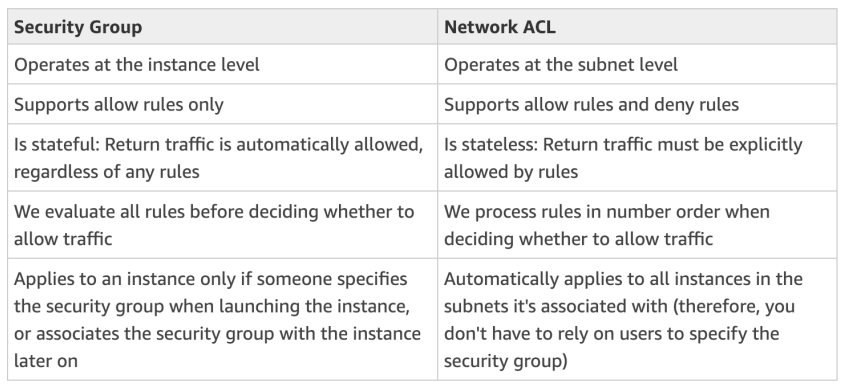

# AWS Certified Cloud Practitioner

## Deploying and Managing Infrastructure at Scale

### What is CloudFormation?
- Amazon CloudFront is a fast content delivery network (CDN) service that securely delivers data, videos, applications, and APIs to customers globally with low latency, high transfer speeds, all within a
developer-friendly environment

- It is a content delivery network (CDN) service that helps deliver content to users more quickly and securely.

- It does this by caching content at edge locations around the world, so that users can access it from the nearest location.

- This can significantly improve the performance of your website or application, especially for users who are located far away from your origin server.

- CloudFront can also help to protect your content from security threats, such as DDoS attacks.

- CloudFront is a pay-as-you-go service, so you only pay for the bandwidth that you use.

- CloudFormation is a declarative way of outlining your AWS Infrastructure, for any resources (most of them are supported)
- For example, within a CloudFormation template, you say:
    - I want a security group
    - I want two EC2 instances using this security group
    - I want an S3 bucket
    - I want a load balancer (ELB) in front of these machines
- Then CloudFormation creates those for you, in the right order, with the exact configuration that you specify.

#### Benefits of AWS CloudFormation
- Infrastructure as Code:
    - No resources are manually created, which is excellent for control
    - Changes to the infrastructure are reviewed through code
- Cost:
    - Each resources within the stack is tagged with an identifier so you can easily see how much a stack costs you
    - You can estimate the costs of your resources using the CloudFormation template
    - Savings strategy: In Dev, you could automation deletion of templates at 5 PM and recreated at 8 AM, safely.

- Productivity
    - Ability to destroy and re-create an infrastructure on the cloud on the fly
    - Automated generation of Diagram for your templates!
    - Declarative programming (no need to figure out ordering and orchestration)

- Don’t re-invent the wheel
    - Leverage existing templates on the web!
    - Leverage the documentation

- Supports (almost) all AWS resources:
    - Everything we’ll see in this course is supported
    - You can use “custom resources” for resources that are not supported

### CloudFormation Stack Designer
- Example: WordPress CloudFormation Stack
- We can see all the resources
- We can see the relations between the components

-------------

### AWS Cloud Development Kit (CDK)
- Define your cloud infrastructure using a familiar language:
    - JavaScript/TypeScript, Python, Java, and .NET
- The code is “compiled” into a CloudFormation template (JSON YAML)
- You can therefore deploy infrastructure and application runtime code together
    - Great for Lambda functions
    - Great for Docker containers in ECS / EKS
- Infrastructure as a Code

#### CDK Example

### Typical Architecture: Web App 3-Tier

-------------

### Developer Problems on AWS
- Managing infrastructure
- Deploying Code
- Configuring all the databases, load balancers, etc
- Scaling concerns
- Most web apps have the same architecture (ALB + ASG)
- All the developers want is for their code to run!
- Possibly, consistently across different applications and environments

### AWS Elastic Beanstalk Overview
- AWS Elastic Beanstalk is an easy-to-use service for deploying and scaling web applications and services
developed with Java, .NET, PHP, Node.js, Python, Ruby, Go, and Docker on familiar servers such as Apache, Nginx, Passenger, and Internet Information Services (IIS).

- You can simply upload your code, and AWS Elastic Beanstalk automatically handles the deployment,
from capacity provisioning, load balancing, and auto scaling to application health monitoring. 

- At the same time, you retain full control over the AWS resources powering your application and can access the
underlying resources at any time.

- Elastic Beanstalk is a developer centric view of deploying an application on AWS
- It uses all the component’s we’ve seen before:
EC2, ASG, ELB, RDS, etc… 
- But it’s all in one view that’s easy to make sense of!
- We still have full control over the configuration
- Beanstalk = Platform as a Service (PaaS) 
- Beanstalk is free but you pay for the underlying instances

#### Elastic Beanstalk
- Managed service 
    - Instance configuration / OS is handled by Beanstalk - Deployment strategy is configurable but performed by Elastic Beanstalk 
    - Capacity provisioning 
    - Load balancing & auto-scaling 
    - Application health-monitoring & responsiveness 
- Just the application code is the responsibility of the developer 
- Three architecture models: 
    - Single Instance deployment: good for dev 
    - LB + ASG: great for production or pre-production web applications 
    - ASG only: great for non-web apps in production (workers, etc..)

- Support for many platforms:
    - Go
    - Java SE
    - Java with Tomcat
    - .NET on Windows Server with IIS
    - Node.js
    - PHP
    - Python
    - Ruby
    - Packer Builder
    - Single Container Docker
    - Multi-Container Docker
    - Preconfigured Docker

- If not supported, you can write your custom platform (advanced)

#### Elastic Beanstalk - Health Monitoring

--------------------

### AWS CodeDeploy
- AWS CodeDeploy is a service that automates code deployments to any instance, including EC2 instances
and instances running on premises. 

- CodeDeploy makes it easier for you to rapidly release new features, helps you avoid downtime during application deployment, and handles the complexity of updating your
applications. 

- You can use CodeDeploy to automate software deployments, eliminating the need for error-prone manual operations. The service scales with your infrastructure so you can easily deploy to one instance or thousands.

- We want to deploy our application automatically
- Works with EC2 Instances
- Works with On-Premises Servers
- Hybrid Service
- Severs/Instances must be provisioned and configured ahead of time with the CodeDeploy/Agent

-------------------

### AWS CodeBuild
- AWS CodeBuild is a fully managed build service that compiles source code, runs tests, and produces
software packages that are ready to deploy. With CodeBuild, you don’t need to provision, manage, and
scale your own build servers. 

- CodeBuild scales continuously and processes multiple builds concurrently, so your builds are not left waiting in a queue. You can get started quickly by using prepackaged build environments, or you can create custom build environments that use your own build tools.

- Code building service in the cloud (name is obvious)
- Compiles source code, run tests, and produces packages that are ready to be deployed (by CodeDeploy for example)

- Benefits:
    - Fully managed, serverless
    - Continuously scalable & highly available
    - Secure
    - Pay-as-you-go pricing – only pay for the build time

----------------

### AWS CodePipeline
- AWS CodePipeline is a fully managed continuous delivery service that helps you automate your release
pipelines for fast and reliable application and infrastructure updates. 

- CodePipeline automates the build, test, and deploy phases of your release process every time there is a code change, based on the release model you define. This enables you to rapidly and reliably deliver features and updates. 

- You can easily integrate CodePipeline with third-party services such as GitHub or with your own custom plugin. 
- With AWS CodePipeline, you only pay for what you use. There are no upfront fees or long-term commitments.

- Orchestrate the different steps to have the code automatically pushed to production
    - Code => Build => Test => Provision => Deploy
    - Basis for CICD (Continuous Integration & Continuous Delivery
    
- Benefits:
    - Fully managed, compatible with CodeCommit, CodeBuild, CodeDeploy, Elastic Beanstalk, 
CloudFormation, GitHub, 3rd-party services (GitHub…) & custom plugins…
    - Fast delivery & rapid updates

----------------------

### AWS CodeArtifact
- AWS CodeArtifact is a fully managed artifact repository service that makes it easy for organizations of
any size to securely store, publish, and share software packages used in their software development process. 

- CodeArtifact can be configured to automatically fetch software packages and dependencies from public artifact repositories so developers have access to the latest versions. 

- CodeArtifact works with commonly used package managers and build tools like Maven, Gradle, npm, yarn, twine, pip, and NuGet making it easy to integrate into existing development workflows.

- Software packages depend on each other to be built (also called code 
dependencies), and new ones are created
- Storing and retrieving these dependencies is called artifact management
- Traditionally you need to setup your own artifact management system
- CodeArtifact is a secure, scalable, and cost-effective artifact management for 
software development
- Works with common dependency management tools such as Maven, Gradle, 
npm, yarn, twine, pip, and NuGet
- Developers and CodeBuild can then retrieve dependencies straight from 
CodeArtifact

### AWS CodeStar
- AWS CodeStart enables you to quickly develop, build, and deploy applications on AWS. 

- AWS CodeStar provides a unified user interface, enabling you to easily manage your software development activities
in one place. With AWS CodeStar, you can set up your entire continuous delivery toolchain in minutes,
allowing you to start releasing code faster. 

- AWS CodeStar makes it easy for your whole team to work
together securely, allowing you to easily manage access and add owners, contributors, and viewers to your projects. 

- Each AWS CodeStar project comes with a project management dashboard, including an integrated issue tracking capability powered by Atlassian JIRA Software. 

- With the AWS CodeStar project dashboard, you can easily track progress across your entire software development process, from your backlog of work items to teams’ recent code deployments. For more information, see AWS CodeStar
features

- Unified UI to easily manage software development activities in one place
- “Quick way” to get started to correctly set-up CodeCommit, CodePipeline, 
CodeBuild, CodeDeploy, Elastic Beanstalk, EC2, etc… 
- Can edit the code ”in-the-cloud” using AWS Cloud9

--------------------

### AWS Cloud9
- AWS Cloud9 is a cloud-based integrated development environment (IDE) that lets you write, run, and
debug your code with just a browser. 

- It includes a code editor, debugger, and terminal. Cloud9 comes prepackaged with essential tools for popular programming languages, including JavaScript, Python, PHP,
and more, so you don’t need to install files or configure your development machine to start new projects.

- Since your Cloud9 IDE is cloud-based, you can work on your projects from your office, home, or anywhere
using an internet-connected machine. 

- Cloud9 also provides a seamless experience for developing
serverless applications enabling you to easily define resources, debug, and switch between local and
remote execution of serverless applications. 

- With Cloud9, you can quickly share your development environment with your team, enabling you to pair program and track each other's inputs in real time.

- AWS Cloud9 is a cloud IDE (Integrated 
Development Environment) for writing, running 
and debugging code
- “Classic” IDE (like IntelliJ, Visual Studio Code…) 
are downloaded on a computer before being 
used
- A cloud IDE can be used within a web browser, 
meaning you can work on your projects from 
your office, home, or anywhere with internet 
with no setup necessary
- AWS Cloud9 also allows for code collaboration 
in real-time (pair programming)

------------------------

### AWS Systems Manager (SSM)
- Helps you manage your EC2 and On-Premises systems at scale
- Another Hybrid AWS service
- Get operational insights about the state of your infrastructure
- Suite of 10+ products
- Most important features are:
    - Patching automation for enhanced compliance
    - Run commands across an entire fleet of servers 
    - Store parameter configuration with the SSM Parameter Store
• Works for Linux, Windows, MacOS, and Raspberry Pi OS (Raspbian)

#### How System Manager Works?
- We need to install the SSM agent onto the systems we 
control
- Installed by default on Amazon Linux AMI & some Ubuntu AMI
- If an instance can’t be controlled with SSM, it’s 
probably an issue with the SSM agent!
- Thanks to the SSM agent, we can run commands, patch & 
configure our server

#### Systems Manager -- SM Session Manager
- Allows you to start a secure shell on your EC2 and 
on-premises servers
- No SSH access, bastion hosts, or SSH keys needed
- No port 22 needed (better security)
- Supports Linux, macOS, and Windows
- Send session log data to S3 or CloudWatch Logs

-----------------

### Systems Manager Parameter Store
- Secure storage for configuration and secrets
- API Keys, passwords, configurations…
• Serverless, scalable, durable, easy SDK
• Control access permissions using IAM
• Version tracking & encryption (optional)

-------------

### AWS OpsWorks
- AWS OpsWorks is a configuration management service that provides managed instances of Chef and Puppet. 

- Chef and Puppet are automation platforms that allow you to use code to automate the configurations of your servers. 

- OpsWorks lets you use Chef and Puppet to automate how servers are configured, deployed, and managed across your Amazon EC2 instances or on-premises compute environments.

- Chef & Puppet help you perform server configuration automatically, or repetitive actions
- They work great with EC2 & On-Premises VM
- AWS OpsWorks = Managed Chef & Puppet
- It’s an alternative to AWS SSM
- Only provision standard AWS resources:
    - EC2 Instances, Databases, Load Balancers, EBS volumes…
- In the exam: Chef or Puppet needed --> AWS OpsWorks

#### OpsWorks Architecture

---------------

### Summary
- **CloudFormation**: (AWS only)
    - Infrastructure as Code, works with almost all of AWS resources
    - Repeat across Regions & Accounts
- **Beanstalk**: (AWS only)
    - Platform as a Service (PaaS), limited to certain programming languages or Docker
    - Deploy code consistently with a known architecture: ex, ALB + EC2 + RDS 
- **CodeDeploy** (hybrid): deploy & upgrade any application onto servers
- **Systems Manager** (hybrid): patch, configure and run commands at scale
- **OpsWorks** (hybrid): managed Chef and Puppet in AWS
- **CodeCommit**: Store code in private git repository (version controlled)
- **CodeBuild**: Build & test code in AWS 
- **CodeDeploy**: Deploy code onto servers
- **CodePipeline**: Orchestration of pipeline (from code to build to deploy)
- **CodeArtifact**: Store software packages / dependencies on AWS
- **CodeStar**: Unified view for allowing developers to do CICD and code
- **Cloud9**: Cloud IDE (Integrated Development Environment) with collab
- **AWS CDK**: Define your cloud infrastructure using a programming language

------------------------------------------

## Global Infrastructure

### Why make a global application?
- A global application is an application deployed in multiple geographies
- On AWS: this could be Regions and / or Edge Locations
- **Decreased Latency**
    - Latency is the time it takes for a network packet to reach a server
    - It takes time for a packet from Asia to reach the US
    - Deploy your applications closer to your users to decrease latency, better experience
- **Disaster Recovery (DR)**
    - If an AWS region goes down (earthquake, storms, power shutdown, politics)…
    - You can fail-over to another region and have your application still working
    - A DR plan is important to increase the availability of your application 
- **Attack protection:** distributed global infrastructure is harder to attack

### Global AWS Infrastructure
- **Regions:** For deploying applications and 
infrastructure
- **Availability Zones:** Made of multiple data 
centers

- **Edge Locations (Points of Presence):** for 
content delivery as close as possible to users

### Global Applications in AWS
#### Global DNS: Route 53
- Great to route users to the closest deployment with least latency
- Great for disaster recovery strategies

#### Global Content Delivery Network (CDN): CloudFront
- Replicate part of your application to AWS Edge Locations : decrease latency
- Cache common requests – improved user experience and decreased latency
#### S3 Transfer Acceleration
- Accelerate global uploads & downloads into Amazon S3

#### AWS Global Accelerator
- Improve global application availability and performance using the AWS global network

---------------------------------

### Amazon Route 53 Overview
- Route53 is a Managed DNS (Domain Name System)
- It is designed to give developers and businesses an extremely reliable and cost-effective way to route end users to Internet applications by translating human readable names, such as www.example.com, into the
numeric IP addresses, such as 192.0.2.1, that computers use to connect to each other. Amazon Route 53
is fully compliant with IPv6 as well.

- Amazon Route 53 can be used to configure DNS health checks to route traffic to healthy endpoints or to independently monitor the health of your application and
its endpoints.

- DNS is a collection of rules and records which helps clients understand how to reach a server through URLs. 
- In AWS, the most common records are:
    - www.google.com => 12.34.56.78 == A record (IPv4)
    - www.google.com => 2001:0db8:85a3:0000:0000:8a2e:0370:7334 == AAAA IPv6
    - search.google.com => www.google.com == CNAME: hostname to hostname
    - example.com => AWS resource == Alias (ex: ELB, CloudFront, S3, RDS, etc…)

### Route 53 - Diagram for a Record

### Route 53 Routing Policies
Need to know them at a high-level for the Cloud Practitioner Exam

### Route 53 Routing Policies

### Amazon CloudFront
- Content Delivery Network (CDN)
- Improves read performance, content is cached at the edge
- Improves users experience
- 216 Point of Presence globally (edge locations)
- DDoS protection (because worldwide), integration with Shield, AWS Web Application Firewall

#### CloudFront - Origins
**S3 bucket**
- For distributing files and caching them at the edge
- Enhanced security with CloudFront Origin Access Control (OAC)
- OAC is replacing Origin Access Identity (OAI)
- CloudFront can be used as an ingress (to upload files to S3)

**Custom Origin (HTTP)**
- Application Load Balancer
- EC2 instance
- S3 website (must first enable the bucket as a static S3 website)
- Any HTTP backend you want

#### CloudFront at a high level

#### CloudFront - S3 as an Origin

#### CloudFront vs S3 Cross Region Replication
CloudFront:
- Global Edge network
- Files are cached for a TTL (maybe a day)
- Great for static content that must be available everywhere

S3 Cross Region Replication:
- Must be setup for each region you want replication to happen
- Files are updated in near real-time
- Read only
- Great for dynamic content that needs to be available at low-latency in few regions

### S3 Transfer Acceleration
Increase transfer speed by transferring file to an AWS edge location which will forward the data to the S3 bucket in the target region.

### AWS Global Accelerator
- Improve global application availability and performance using the AWS global network
- Leverage the AWS internal network to optimize the route to your application (60% improvement)
- 2 Anycast IP are created for your application and traffic is sent through Edge Locations
- The Edge locations send the traffic to your application

#### AWS Global Accelerator vs CloudFront
- They both use the AWS global network and its edge locations around the world
- Both services integrate with AWS Shield for DDoS protection.
- **CloudFront – Content Delivery Network**
    - Improves performance for your cacheable content (such as images and videos) 
    - Content is served at the edge

- **Global Accelerator**
    - No caching, proxying packets at the edge to applications running in one or more AWS Regions.
    - Improves performance for a wide range of applications over TCP or UDP 
    - Good for HTTP use cases that require static IP addresses 
    - Good for HTTP use cases that required deterministic, fast regional failove

### AWS Outposts
- Hybrid Cloud: businesses that keep an on-premises infrastructure alongside a cloud infrastructure
- Therefore, two ways of dealing with IT systems: • One for the AWS cloud (using the AWS console, CLI, and AWS APIs)

- One for their on-premises infrastructure 
- AWS Outposts are “server racks” that offers the same AWS infrastructure, services, APIs & tools to build your own applications on-premises just as in the cloud
- AWS will setup and manage “Outposts Racks” 
within your on-premises infrastructure and you can start leveraging AWS services on-premises
- You are responsible for the Outposts Rack 
physical security

#### Benefits
- Low-latency access to on-premises systems
- Local data processing
- Data residency
- Easier migration from on-premises to the cloud
- Fully managed service

#### Some services that work on Outposts

### AWS WaveLength
- WaveLength Zones are infrastructure deployments embedded within the telecommunications providers’ datacenters at the edge of the 5G networks
- Brings AWS services to the edge of the 5G networks
- Example: EC2, EBS, VPC…
- Ultra-low latency applications through 5G networks
- Traffic doesn’t leave the Communication Service 
Provider’s (CSP) network
- High-bandwidth and secure connection to the parent AWS Region
- No additional charges or service agreements
- Use cases: Smart Cities, ML-assisted diagnostics, Connected Vehicles, Interactive Live Video Streams, AR/VR, 
Real-time Gaming, …

### AWS Local Zones
- Places AWS compute, storage, database, and other selected AWS services closer to end users to run latency-sensitive applications
- Extend your VPC to more locations – “Extension of an AWS Region”
- Compatible with EC2, RDS, ECS, EBS, ElastiCache, Direct Connect … 
- Example:
    - AWS Region: N. Virginia (us-east-1)
    - AWS Local Zones: Boston, Chicago, Dallas, Houston, Miami, …

### Global Applications Architecture

-------------------------------------

## Cloud Integration
### Introduction
- When we start deploying multiple applications, they will inevitably need to communicate with one another
- There are two patterns of application communication

- Synchronous between applications can be problematic if there are sudden spikes of traffic
- What if you need to suddenly encode 1000 videos but usually it’s 10?
- In that case, it’s better to decouple your applications: 
    - using SQS: queue model
    - using SNS: pub/sub model
    - using Kinesis: real-time data streaming model
- These services can scale independently from our application

### Amazon SQS - Simple Queue Service

- Oldest AWS offering (over 10 years old)
- Fully managed service (~serverless), use to decouple applications
- Scales from 1 message per second to 10,000s per second
- Default retention of messages: 4 days, maximum of 14 days
- No limit to how many messages can be in the queue
- Messages are deleted after they’re read by consumers
- Low latency (<10 ms on publish and receive)
- Consumers share the work to read messages & scale horizontally
- Using SQS, you can send, store, and receive
messages between software components at any volume, without losing messages or requiring other
services to be available.

#### SQS to decouple between application tiers

#### Amazon SQS - FIFO Queue
Messages are produced in the order by the consumer

### Amazon Kinesis
- For the exam: Kinesis = real-time big data streaming
- Managed service to collect, process, and analyze real-time streaming data at any scale
- Too detailed for the Cloud Practitioner exam but good to know:
    - Kinesis Data Streams: low latency streaming to ingest data at scale from 
hundreds of thousands of sources
    - Kinesis Data Firehose: load streams into S3, Redshift, ElasticSearch, etc…
    - Kinesis Data Analytics: perform real-time analytics on streams using SQL
    - Kinesis Video Streams: monitor real-time video streams for analytics or ML

#### Kinsesis (High Level Overview)

### Amazon SNS
- Amazon SNS is a highly available, durable, secure, fully managed pub/sub messaging service that enables you to decouple microservices, distributed systems, and serverless applications. 

- Amazon SNS provides topics for high-throughput, push-based, many-to-many messaging. Using Amazon SNS topics, your publisher systems can fan out messages to a large number of subscriber endpoints for parallel processing, including Amazon SQS queues, AWS Lambda functions, and HTTP/S webhooks. 

- Additionally, SNS can be used to fan out notifications to end users using mobile push,
SMS, and email

What if you want to send one message to many receivers?

- The “event publishers” only sends message to one SNS topic
- As many “event subscribers” as we want to listen to the SNS topic notifications
- Each subscriber to the topic will get all the messages
- Up to 12,500,000 subscriptions per topic, 100,000 topics limit

### Amazon MQ
- SQS, SNS are “cloud-native” services: proprietary protocols from AWS
- Traditional applications running from on-premises may use open protocols such as: MQTT, AMQP, STOMP, Openwire, WSS
- When migrating to the cloud, instead of re-engineering the application to use SQS and SNS, we can use Amazon MQ 
- Amazon MQ is a managed message broker service for RabbitMQ and ActiveMQ
- Amazon MQ doesn’t “scale” as much as SQS / SNS
- Amazon MQ runs on servers, can run in Multi-AZ with failover
- Amazon MQ has both queue feature (~SQS) and topic features (~SNS)

### Summary
- **SQS**:
    - Queue service in AWS
    - Multiple Producers, messages are kept up to 14 days
    - Multiple Consumers share the read and delete messages when done
    - Used to decouple applications in AWS

- **SNS**: 
    - Notification service in AWS
    - Subscribers: Email, Lambda, SQS, HTTP, Mobile…
    - Multiple Subscribers, send all messages to all of them
    - No message retention
- **Kinesis**: real-time data streaming, persistence and analysis
- **Amazon MQ**: managed message broker for ActiveMQ and RabbitMQ in the cloud (MQTT, AMQP.. protocols)

-------------------------------

## Cloud Monitoring
### Amazon CloudWatch Metrics
- CloudWatch is a monitory and management service built for developers, system operators, sre and it managers.
- CloudWatch provides metrics for every services in AWS
- Metric is a variable to monitor (CPUUtilization, NetworkIn…)
- Metrics have timestamps
- Can create CloudWatch dashboards of metrics

#### Example

#### Important Metrics
- **EC2 instances:** CPU Utilization, Status Checks, Network (not RAM)
    - Default metrics every 5 minutes
    - Option for Detailed Monitoring ($$$): metrics every 1 minute
- **EBS volumes:** Disk Read/Writes
- **S3 buckets:** BucketSizeBytes, NumberOfObjects, AllRequests
- **Billing:** Total Estimated Charge (only in us-east-1)
- **Service Limits:** how much you’ve been using a service API
- **Custom metrics:** push your own metrics

#### Amazon CloudWatch Alarms
- Alarms are used to trigger notifications for any metric
- Alarms actions…
    - **Auto Scaling:** increase or decrease EC2 instances “desired” count
    - **EC2 Actions:** stop, terminate, reboot or recover an EC2 instance
    - **SNS notifications:** send a notification into an SNS topic
- Various options (sampling, %, max, min, etc…)
- Can choose the period on which to evaluate an alarm
- Example: create a billing alarm on the CloudWatch Billing metric
- Alarm States: OK. INSUFFICIENT_DATA, ALARM

#### Amazon CloudWatch Logs
- CloudWatch Logs can collect log from:
    - Elastic Beanstalk: collection of logs from application
    - ECS: collection from containers
    - AWS Lambda: collection from function logs
    - CloudTrail based on filter
    - CloudWatch log agents: on EC2 machines or on-premises servers
    - Route53: Log DNS queries
- Enables real-time monitoring of logs
- Adjustable CloudWatch Logs retention

#### CloudWatch Logs for EC2
- By default, no logs from your EC2 instance will go to CloudWatch
- You need to run a CloudWatch agent on EC2 to push the log files you want
- Make sure IAM permissions are correct
- The CloudWatch log agent can be setup on-premises too.

### Amazon EventBridge (formerly CloudWatch Events)
- Amazon EventBridge  is a serverless event bus that makes it easier to build event-driven applications at scale using events generated from your applications, integrated Software-as-a-Service (SaaS) applications, and AWS services. 

- EventBridge delivers a stream of real-time data from event sources such as Zendesk or Shopify to targets like AWS Lambda and other SaaS applications.

- Schedule Cron Jobs (Scheduled Scripts)
    
- Event Pattern: Event rules to react to a service doing something
    
- Trigger Lambda functions, send SQS/SNS messages.

#### Amazon EventBridge Rules

#### Amazon EventBridge

- Schema Registry: model event schema
- You can archive events (all/filter) sent to an event bus (indefinitely or set period)
- Ability to replay archived events

### AWS CloudTrail
- AWS CloudTrail is a web service that records AWS API calls for your account and delivers log files to you. The recorded information includes the identity of the API caller, the time of the API call, the source IP address of the API caller, the request parameters, and the response elements returned by the AWS service.
- Provides governance, compliance and audit for your AWS Account

- CloudTrail is enabled by default!
- Get an history of events / API calls made within your AWS Account by:
    - Console
    - SDK
    - CLI
    - AWS Services
- Can put logs from CloudTrail into CloudWatch Logs or S3
- A trail can be applied to All Regions (default) or a single Region.
- If a resource is deleted in AWS, investigate CloudTrail first!

#### CloudTrail Diagram

### AWS X-Ray
- AWS X-Ray helps developers analyze and debug distributed applications in production or under
development, such as those built using a microservices architecture.

- With X-Ray, you can understand how your application and its underlying services are performing so you can identify and troubleshoot the root cause of performance issues and errors.

- Debugging in Production, the good old way:
    - Test locally
    - Add log statements everywhere
    - Re-deploy in production
- Log formats differ across applications and log analysis is hard. 
- Debugging: one big monolith “easy”, distributed services “hard”
- No common views of your entire architecture
- Enter… AWS X-Ray!

#### AWS X-Ray: Visual analysis of our applications

#### AWS X-Ray Advantages
- Troubleshooting performance (bottlenecks) 
- Understand dependencies in a microservice architecture 
- Pinpoint service issues 
- Review request behavior 
- Find errors and exceptions 
- Are we meeting time SLA? 
- Where I am throttled? 
- Identify users that are impacted

### Amazon CodeGuru
- Amazon CodeGuru is a developer tool that provides intelligent recommendations to improve code quality and identify an application’s most expensive lines of code. 

- Integrate CodeGuru into your existing software development workflow to automate code reviews during application development and continuously monitor application's performance in production and provide recommendations and visual clues on how to improve code quality, application performance, and reduce overall cost.

- An ML-powered service for automated code reviews and application performance recommendations 
- Provides two functionalities
    - CodeGuru Reviewer: automated code reviews for static code analysis (development)
    - CodeGuru Profiler: visibility/recommendations about application performance during runtime (production)

#### Amazon CodeGuru Reviewer
- Identify critical issues, security 
vulnerabilities, and hard-to-find bugs
- Example: common coding best practices, 
resource leaks, security detection, input validation
- Uses Machine Learning and automated reasoning
- Hard-learned lessons across millions of code reviews on 1000s of open-source and Amazon repositories
- Supports Java and Python
- Integrates with GitHub, Bitbucket, and 
AWS CodeCommit

#### Amazon CodeGuru Profiler
- Helps understand the runtime behavior of your 
application
- Example: identify if your application is consuming 
excessive CPU capacity on a logging routine
- Features:
    - Identify and remove code inefficiencies
    - Improve application performance (e.g., reduce CPU utilization)
    - Decrease compute costs
    - Provides heap summary (identify which objects using up memory)
    - Anomaly Detection
- Support applications running on AWS or on- premise
- Minimal overhead on application

### AWS Health Dashboard - Service History
- Shows all regions, all services health
- Shows historical information for each day
- Has an RSS feed you can subscribe to
- Previously called AWS Service Health Dashboard

#### AWS Health Dashboard -  Your Account
- Previously called AWS Personal Health Dashboard (PHD)
- AWS Account Health Dashboard provides alerts and remediation guidance when AWS is experiencing events that may impact you.

- While the Service Health Dashboard displays the general status of AWS services, Account Health Dashboard gives you a personalized view into the performance and availability of the AWS services underlying your AWS resources.

- The dashboard displays relevant and timely information to help you manage events in progress and provides proactive notification to help you plan for scheduled activities. 

- Can aggregate data from an entire AWS Organization

- Global service
- Shows how AWS outages directly impact you & your AWS resources.
- Alert, remediation, proactive, scheduled activites

### Summary
- CloudWatch:
    - Metrics: monitor the performance of AWS services and billing metrics
    - Alarms: automate notification, perform EC2 action, notify to SNS based on metric
    - Logs: collect log files from EC2 instances, servers, Lambda functions…
    - Events (or EventBridge): react to events in AWS, or trigger a rule on a schedule
- CloudTrail: audit API calls made within your AWS account
- CloudTrail Insights: automated analysis of your CloudTrail Events
- X-Ray: trace requests made through your distributed applications
- AWS Health Dashboard: status of all AWS services across all regions
- AWS Account Health Dashboard: AWS events that impact your infrastructure
- Amazon CodeGuru: automated code reviews and application performance

-----------------

## VPC 

### IP Addresses in AWS
- IPv4 – Internet Protocol version 4 (4.3 Billion Addresses)
    - Public IPv4 – can be used on the Internet
    - EC2 instance gets a new a public IP address every time you stop then start it (default)
    - Private IPv4 – can be used on private networks (LAN) such as internal AWS networking (e.g., 192.168.1.1)
    - Private IPv4 is fixed for EC2 Instances even if you start/stop them
- Elastic IP – allows you to attach a fixed public IPv4 address to EC2 instance
    - Note: has ongoing cost if not attached to EC2 instance or if the EC2 instance is stopped
- IPv6 – Internet Protocol version 6 (3.4 × 10!" Addresses)
    - Every IP address is public (no private range)
    - Example: 2001:db8:3333:4444:cccc:dddd:eeee:ffff

### VPC & Subnets Primer
- VPC - Virtual Private Cloud: private network to deploy your resources (regional resource)
- Subnets allow you to partition your network inside your VPC (Availability Zone resource)
- A public subnet is a subnet that is accessible from the internet
- A private subnet is a subnet that is not  accessible from the internet
- To define access to the internet and between subnets, we use Route Tables.

### VPC Diagram

### Internet Gateway & NAT Gateways
- **Internet Gateways** helps our VPC instances connect with the internet.
- Public Subnets have a route to the internet gateway.
- **NAT Gateways** (AWS-managed) & **NAT Instances** (self-managed) allow your instances in your Private Subnets to access the internet while remaining private

### Network ACL & Security Groups
#### NACL (Network ACL)
- A firewall which controls traffic from and to 
subnet
- Can have ALLOW and DENY rules
- Are attached at the Subnet level
- Rules only include IP addresses

#### Security Groups
- A firewall that controls traffic to and from an 
ENI / an EC2 Instance
- Can have only ALLOW rules
- Rules include IP addresses and other security 
groups

#### Network ACLs vs Security Groups

### VPC Flow Logs

-----------------------------

