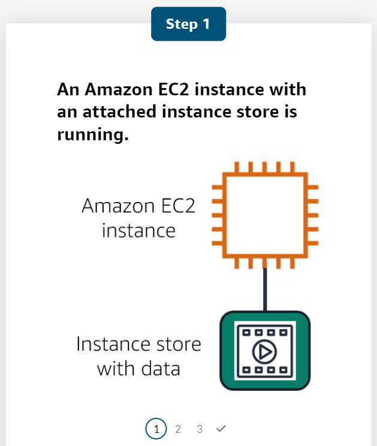
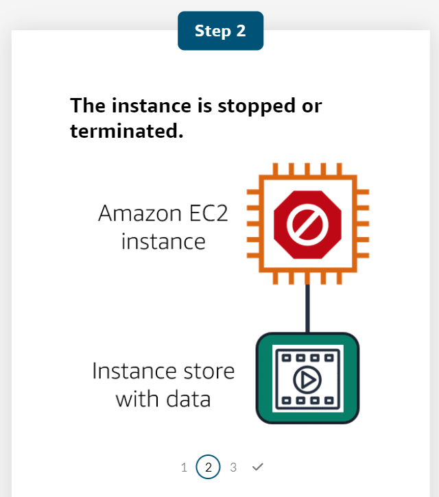
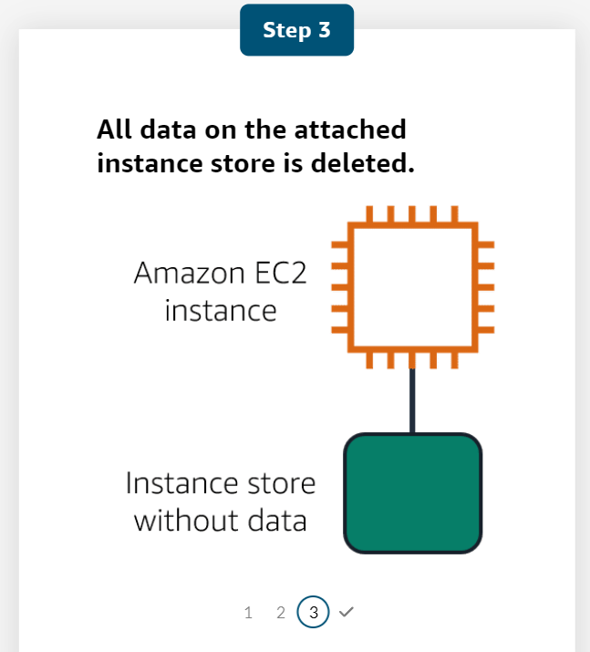
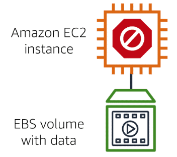
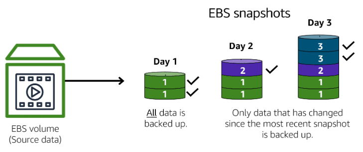
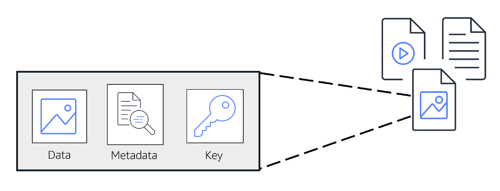
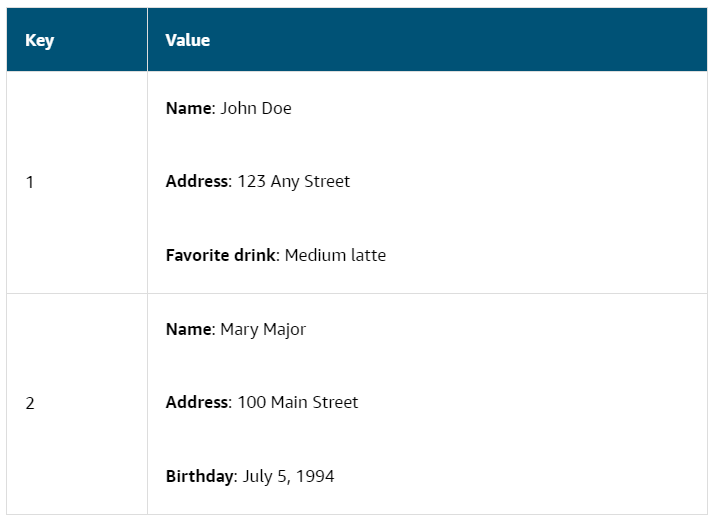

# AWS Cloud Practitioner Essentials

# Module 5 : Storage and Databases

## Instance Stores and Amazon Elastic Block Store (Amazon EBS)

### Instance Stores
- Block-level storage volumes behave like physical hard drives.
- An instance store(opens in a new tab) provides temporary block-level storage for an Amazon EC2 instance. 
- An instance store is disk storage that is physically attached to the host computer for an EC2 instance, and therefore has the same lifespan as the instance.
- When the instance is terminated, you lose any data in the instance store.

#### Summary
- Amazon EC2 instances are virtual servers. 
- If you start an instance from a stopped state, the instance might start on another host, where the previously used instance store volume does not exist. 
- Therefore, AWS recommends instance stores for use cases that involve temporary data that you do not need in the long term.

### Amazon Elastic Block Store (EBS)
- Amazon Elastic Block Store (Amazon EBS)(opens in a new tab) is a service that provides block-level storage volumes that you can use with Amazon EC2 instances. 
- If you stop or terminate an Amazon EC2 instance, all the data on the attached EBS volume remains available.

- To create an EBS volume, you define the configuration (such as volume size and type) and provision it. 
- After you create an EBS volume, it can attach to an Amazon EC2 instance.

- Because EBS volumes are for data that needs to persist, it’s important to back up the data. 
- You can take incremental backups of EBS volumes by creating Amazon EBS snapshots.

### Amazon EBS Snapshots

*Incremental backups of EBS volumes with Amazon EBS snapshots. On Day 1, two volumes are backed up. Day 2 adds one new volume and the new volume is backed up. Day 3 adds two more volumes for a total of five volumes. Only the two new volumes are backed up.*

- An EBS snapshot(opens in a new tab) is an incremental backup.
- This means that the first backup taken of a volume copies all the data. 
- For subsequent backups, only the blocks of data that have changed since the most recent snapshot are saved. 

- Incremental backups are different from full backups, in which all the data in a storage volume copies each time a backup occurs. 
- The full backup includes data that has not changed since the most recent backup.

#### Quesn - Ans
1. Which of the following are characteristics of the Amazon EBS service?  
    👉 Best for data that requires retention
    👉 Physically attached to the host computer of an EC2 instance

## Amazon Simple Storage Service (Amazon S3)
- Store data as objects.
- Store objects in buckets.
- Upload a maximum object size of 5 TB.
- Version Objects
- Create multiple buckets

### Object Storage
- In object storage, each object consists of data, metadata, and a key.
- The data might be an image, video, text document, or any other type of file. 
- Metadata contains information about what the data is, how it is used, the object size, and so on. - An object’s key is its unique identifier.

### Amazon Simple Storage Service (Amazon S3)
- Amazon Simple Storage Service (Amazon S3) is a service that provides object-level storage. Amazon S3 stores data as objects in buckets.

You can upload any type of file to Amazon S3, such as images, videos, text files, and so on. For example, you might use Amazon S3 to store backup files, media files for a website, or archived documents. Amazon S3 offers unlimited storage space. The maximum file size for an object in Amazon S3 is 5 TB.

When you upload a file to Amazon S3, you can set permissions to control visibility and access to it. You can also use the Amazon S3 versioning feature to track changes to your objects over time.

### Amazon S3 Storage Classes
With Amazon S3, you pay only for what you use. You can choose from a range of storage classes(opens in a new tab) to select a fit for your business and cost needs. When selecting an Amazon S3 storage class, consider these two factors:
- How often you plan to retrieve your data
- How available you need your data to be

#### S3 Standard
- Designed for frequently accessed data
- Stores data in a minimum of three Availability Zones

Amazon S3 Standard provides high availability for objects. This makes it a good choice for a wide range of use cases, such as websites, content distribution, and data analytics. Amazon S3 Standard has a higher cost than other storage classes intended for infrequently accessed data and archival storage.

#### S3 Standard-Infrequent Access (S3 Standard-IA)
- Ideal for infrequently accessed data
- Similar to Amazon S3 Standard but has a lower storage price and higher retrieval price

Amazon S3 Standard-IA is ideal for data infrequently accessed but requires high availability when needed. Both Amazon S3 Standard and Amazon S3 Standard-IA store data in a minimum of three Availability Zones. Amazon S3 Standard-IA provides the same level of availability as Amazon S3 Standard but with a lower storage price and a higher retrieval price.

#### S3 One Zone-Infrequent Access (S3 One Zone-IA)
- Stores data in a single Availability Zone
- Has a lower storage price than Amazon S3 Standard-IA

Compared to S3 Standard and S3 Standard-IA, which store data in a minimum of three Availability Zones, S3 One Zone-IA stores data in a single Availability Zone. This makes it a good storage class to consider if the following conditions apply:
- You want to save costs on storage.
- You can easily reproduce your data in the event of an Availability Zone failure.

#### S3 Intelligent-Tiering
- Ideal for data with unknown or changing access patterns
- Requires a small monthly monitoring and automation fee per object

In the S3 Intelligent-Tiering storage class, Amazon S3 monitors objects’ access patterns. If you haven’t accessed an object for 30 consecutive days, Amazon S3 automatically moves it to the infrequent access tier, S3 Standard-IA. If you access an object in the infrequent access tier, Amazon S3 automatically moves it to the frequent access tier, S3 Standard.

#### S3 Glacier Instant Retrieval
- Works well for archived data that requires immediate access

- Can retrieve objects within a few milliseconds

When you decide between the options for archival storage, consider how quickly you must retrieve the archived objects. You can retrieve objects stored in the S3 Glacier Instant Retrieval storage class within milliseconds, with the same performance as S3 Standard.

#### S3 Glacier Flexible Retrieval
- Low-cost storage designed for data archiving
- Able to retrieve objects within a few minutes to hours

S3 Glacier Flexible Retrieval is a low-cost storage class that is ideal for data archiving. For example, you might use this storage class to store archived customer records or older photos and video files. You can retrieve your data from S3 Glacier Flexible Retrieval from 1 minute to 12 hours.

#### S3 Glacier Deep Archive
- Lowest-cost object storage class ideal for archiving
- Able to retrieve objects within 12 hours

S3 Deep Archive supports long-term retention and digital preservation for data that might be accessed once or twice in a year. This storage class is the lowest-cost storage in the AWS Cloud, with data retrieval from 12 to 48 hours. All objects from this storage class are replicated and stored across at least three geographically dispersed Availability Zones.

#### S3 Outposts
- Creates S3 buckets on Amazon S3 Outposts

- Makes it easier to retrieve, store, and access data on AWS Outposts

Amazon S3 Outposts delivers object storage to your on-premises AWS Outposts environment. Amazon S3 Outposts is designed to store data durably and redundantly across multiple devices and servers on your Outposts. It works well for workloads with local data residency requirements that must satisfy demanding performance needs by keeping data close to on-premises applications.

#### Quesn - Ans
1. You want to store data that is infrequently accessed but must be immediately available when needed. Which Amazon S3 storage class should you use? 👉 **S3 Standard-IA**

### Comparing Amazon EBS and Amazon S3
| Amazon EBS | Amazon S3 |
| ---------- | --------- |
| Sizes up to 16 TiB | Unlimited storage |
| Survive termination of their EC2 instance | Individual objects up to 5 TBs |
| Solid state by default | Write once/read many |
| HDD options | 99.999999999% durability |

#### Use Cases of Amazon S3
- Web enabled
- Regionally distributed
- Offers cost savings
- Serverless

Object Storage treat any file like a complete concrete object.

Block Storage breaks those file into small compartments or blocks.

## Amazon Elastic File System (Amazon EFS)
- Multiple Instances can access the data in EFS at the same time.

#### Amazon EBS vs Amazon EFS
| Amazon EBS | Amazon EFS |
| ---------- | ---------- |
| Volumes attach to EC2 instances | Multiple instances reading and writing simultaneously |
| Availability Zone Level Resource | Linux File System, Regional Resource, Automatically Scales |
| Need to be in the same Availability Zone to attach EC2 instances. | |
| Volumes do not automatically scale | |

### File Storage
In file storage, multiple clients (such as users, applications, servers, and so on) can access data that is stored in shared file folders. In this approach, a storage server uses block storage with a local file system to organize files. Clients access data through file paths.

Compared to block storage and object storage, file storage is ideal for use cases in which a large number of services and resources need to access the same data at the same time.

Amazon Elastic File System (Amazon EFS)(opens in a new tab) is a scalable file system used with AWS Cloud services and on-premises resources. As you add and remove files, Amazon EFS grows and shrinks automatically. It can scale on demand to petabytes without disrupting applications. 

#### Comparing Amazon EBS and Amazon EFS
- **Amazon EBS:**
    - An Amazon EBS volume stores data in a single Availability Zone. 

    - To attach an Amazon EC2 instance to an EBS volume, both the Amazon EC2 instance and the EBS volume must reside within the same Availability Zone.

- **Amazon EFS:**
    - Amazon EFS is a regional service. It stores data in and across multiple Availability Zones. 

    - The duplicate storage enables you to access data concurrently from all the Availability Zones in the Region where a file system is located. Additionally, on-premises servers can access Amazon EFS using AWS Direct Connect.

## Amazon Relational Database Service (Amazon RDS)
- Automated patching
- Backups
- Redundancy
- Failover
- Disaster Recovery

### Amazon Aurora
- MySQL
- PostgreSQL
- 1/10th of commercial databases
- Data replication
- Up to 15 read replicas
- Continuous backup to Amszon S3

### Relational Databases
In a relational database, data is stored in a way that relates it to other pieces of data. 

An example of a relational database might be the coffee shop’s inventory management system. Each record in the database would include data for a single item, such as product name, size, price, and so on.

Relational databases use structured query language (SQL) to store and query data. This approach allows data to be stored in an easily understandable, consistent, and scalable way. For example, the coffee shop owners can write a SQL query to identify all the customers whose most frequently purchased drink is a medium latte.

| **ID** | **Product Name** | **Size** | **Price** |
| ------ | ---------------- | -------- | --------- |
| 1 | Medium roast ground coffee | 12 oz. | $5.30 |
| 2 | Dark roast ground coffee | 20 oz. | $9.27 |

### Amazon Relational Database Service
Amazon Relational Database Service (Amazon RDS)(opens in a new tab) is a service that enables you to run relational databases in the AWS Cloud.

Amazon RDS is a managed service that automates tasks such as hardware provisioning, database setup, patching, and backups. With these capabilities, you can spend less time completing administrative tasks and more time using data to innovate your applications. You can integrate Amazon RDS with other services to fulfill your business and operational needs, such as using AWS Lambda to query your database from a serverless application.

Amazon RDS provides a number of different security options. Many Amazon RDS database engines offer encryption at rest (protecting data while it is stored) and encryption in transit (protecting data while it is being sent and received).

#### Amazon RDS Database Engines
Amazon RDS is available on six database engines, which optimize for memory, performance, or input/output (I/O). 

Supported database engines include:
- Amazon Aurora
- PostgreSQL
- MySQL
- MariaDB
- Oracle Database
- Microsoft SQL Server

### Amazon Aurora
Amazon Aurora(opens in a new tab) is an enterprise-class relational database. It is compatible with MySQL and PostgreSQL relational databases. It is up to five times faster than standard MySQL databases and up to three times faster than standard PostgreSQL databases.

Amazon Aurora helps to reduce your database costs by reducing unnecessary input/output (I/O) operations, while ensuring that your database resources remain reliable and available. 

Consider Amazon Aurora if your workloads require high availability. It replicates six copies of your data across three Availability Zones and continuously backs up your data to Amazon S3.

## Amazon DynamoDB
- A serverless database

### Nonrelational Databases
In a nonrelational database, you create tables. A table is a place where you can store and query data.

Nonrelational databases are sometimes referred to as “NoSQL databases” because they use structures other than rows and columns to organize data. One type of structural approach for nonrelational databases is key-value pairs. With key-value pairs, data is organized into items (keys), and items have attributes (values). You can think of attributes as being different features of your data.

In a key-value database, you can add or remove attributes from items in the table at any time. Additionally, not every item in the table has to have the same attributes. 

Example of data in a nonrelational database:

### Amazon DynamoDB
Amazon DynamoDB(opens in a new tab) is a key-value database service. It delivers single-digit millisecond performance at any scale.

Features of Amazon DynamoDB:
- **Serverless** :
    - DynamoDB is serverless, which means that you do not have to provision, patch, or manage servers. 
    
    - You also do not have to install, maintain, or operate software.

- **Automatic Scaling** :
    - As the size of your database shrinks or grows, DynamoDB automatically scales to adjust for changes in capacity while maintaining consistent performance. 

    - This makes it a suitable choice for use cases that require high performance while scaling.

#### Comparing Amazon RDS with Amazon DynamoDB
| Amazon RDS | Amazon DyanamoDB |
| ---------- | ---------------- |
| Automatic high availability; recovery provided | Key-value |
| Customer ownership of data | Massive througput capabilities |
| Customer ownership of schema | PB size potential |
| Customer control of network | Granular API Access |

#### Quesn - Ans
1. What are the scenarios in which you should use Amazon Relational Database Service (Amazon RDS) 
    - Using SQL to organize data
    - Storing data in an Amazon Aurora database

## Amazon Redshift
Amazon Redshift is a data warehousing service that you can use for big data analytics. It offers the ability to collect data from many sources and helps you to understand relationships and trends across your data.

## AWS Database Migration Service
AWS Database Migration Service (AWS DMS)(opens in a new tab) enables you to migrate relational databases, nonrelational databases, and other types of data stores.

With AWS DMS, you move data between a source database and a target database. The source and target databases(opens in a new tab) can be of the same type or different types. During the migration, your source database remains operational, reducing downtime for any applications that rely on the database. 

For example, suppose that you have a MySQL database that is stored on premises in an Amazon EC2 instance or in Amazon RDS. Consider the MySQL database to be your source database. Using AWS DMS, you could migrate your data to a target database, such as an Amazon Aurora database.

### Other use cases for AWS DMS
- Development and test database migrations:
    - Enabling developers to test applications against production data without affecting production users

- Database consolidation:
    - Combining several databases into a single database
- Continuous replication
    - Sending ongoing copies of your data to other target sources instead of doing a one-time migration

## Additional Database Services
### Amazon DocumentDB
Amazon DocumentDB is a document database service that supports MongoDB workloads. (MongoDB is a document database program.)

### Amazon Neptune
Amazon Neptune is a graph database service.
You can use Amazon Neptune to build and run applications that work with highly connected datasets, such as recommendation engines, fraud detection, and knowledge graphs.

### Amazon Quantum Ledger Database (QLDB)
Amazon Quantum Ledger Database (Amazon QLDB)(opens in a new tab) is a ledger database service. 

You can use Amazon QLDB to review a complete history of all the changes that have been made to your application data.

### Amazon Managed Blockchain
Amazon Managed Blockchain(opens in a new tab) is a service that you can use to create and manage blockchain networks with open-source frameworks. 

Blockchain is a distributed ledger system that lets multiple parties run transactions and share data without a central authority.

### Amazon ElastiCache
Amazon ElastiCache(opens in a new tab) is a service that adds caching layers on top of your databases to help improve the read times of common requests. 

It supports two types of data stores: Redis and Memcached.

### Amazon DynamoDB Accelrator:
Amazon DynamoDB Accelerator (DAX)(opens in a new tab) is an in-memory cache for DynamoDB.

## Module 5 Summary
