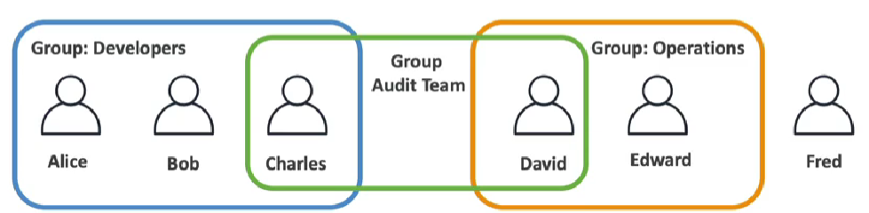
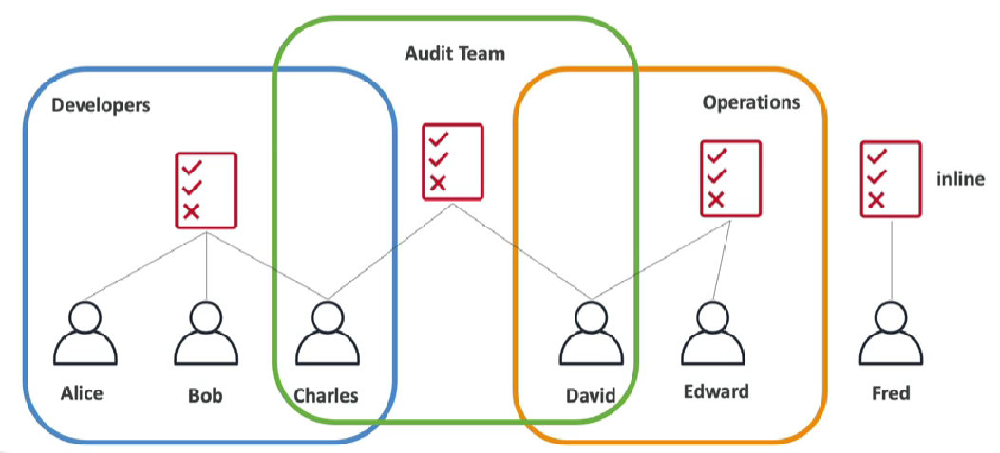
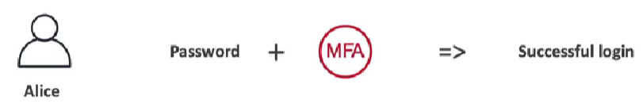
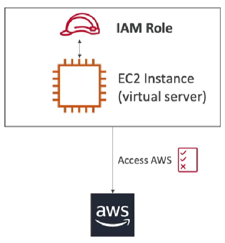

# IAM (Identity and Access Management)

## IAM Introduction: Users, Groups, Policies
### IAM: Users & Groups 
- **IAM:** Identity and Access Management, Global Service 
- **Root account** created by default, shouldn't be user or shared 
- **Users** are people within your organization, and can be ignored 
- **Groups** only contain users, not other groups 
- Users don't have to belong to a group, and user can belong to multiple groups 



### IAM: Permissions 
- Users or Groups can be assigned JSON documents called **policies** 
- These policies define the **permissions** of the users 
- In AWS you apply the least privilege principle; don't give more permissions than a user needs. 

## IAM Users & Groups Hands On 
- IAM is a Global Service 
- Never use root user


## IAM Policies 
### IAM Policies Inheritance


### IAM Policies Structure
- Consists of: 
    - Version: policy language version, always include "2012-10-17" 
    - Id: an identifier for the policy (optional) 
    - Statement: one or more individual statements (required) 
- Statement consists of 
    - Sid: an identifier for the statement (optional) 
    - Effect: whether the statement allows or denies access (Allow, Deny) 
    - Principal: account/user/role to which this play applied to 
    - Action: list of actions this policy allow or denies 
    - Resource: list of resources to which the actions applied to 
    - Condition: conditions for when this policy is in effect (optional) JSON Code: 
    
    ```json
    { 
        "Version": "2012-10-17", 
        "Id": "S3-Account-Permissions", "Statement": [ 
            {
            "Sid": "1", 
            "Effect": "Allow", 
            },
            "Principal": { 
                "AWS": ["arn:aws:iam::1233456789012:root"] 
            }, 
            "Action": [ 
                "s3:GetObject", "s3:PutObject" 
            ], 
            "Resource": ["arn:aws:s3::mybucket/] 
            }
        ] 
    }
    ```
    
## IAM Policies Hands On 
- If the user is removed (permission), access will be denied, will have to give the permission again to the user. 
- Since, the user is given only the read-access, they will not be able to create (write) any group. 
- Get means anything that starts with Get You can also create your own policy 

## IAM MFA Overview 
### IAM: Password Policy 
- Strong passwords = higher security for your account 
- In AWS, you can setup a password policy: 
    - Set a minimum password length 
    - Require specific character types:
        - including uppercase letters
        - lowercase letters 
        - numbers
        - non-alphanumeric characters
    - Allow all IAM users to change their own passwords 
    - Require users to change their password after some time (password expiration)     
    - Prevent password re-use 
    
### Multi Factor Authentication: MFA
- Users have access to your account and can possibly change configurations or delete resources in your AWS account 
- You want to protect your Root Accounts and IAM users 
- MFA: password you know + security device you own 

    

- Main benefit of MFA: If a password is stolen or hacked, the account is not compromised. 

### MFA Devices Options in AWS 
- **Virtual MFA Device**: 
    - Google Authenticator (phone only)
    - Authy (multi-device): Support for multiple tokens on a single device. 
- **Universal 2nd Factor (U2F) Security Key**: 
    - YubiKey by Yubico (3rd party): Support for multiple root and IAM users using a single security key
    
- **Hardware Key Fob MFA Device**
    - Provided by Gemalto (3rd party
    
- **Hardware Key Fob MFA Device for AWS GovCloud (US)** 
    - Provided by SurePassID (3rd party) 
    
### IAM MFA Hands On 
- Account Settings ↓ 
- Password Policy ↓ 
- Edit Click on Account Name ↓ 
- Security Credentials (No access, if not logged in via root user)
-  Assign MFA ↓ 
- Add MFA 

## AWS Access Keys, CLI and SDK 
### How can users access AWS? ↓
- To access AWS, you have three options:    
    - AWS Management Console (protected by password + MFA) 
    - AWS Command Line Interface (CLI): protected by access keys 
    - AWS Software Developer Kit (SDK): for code: protected by access keys
    
- Access Keys are generated through the AWS Console 
- Users manage their own access keys 
- Access Keys are secret, just like a password. Don't share them. 
- Access Key ID ~= username Secret Access Key ~= password 

## What's the AWS CLI? 
- A tool that enables you to interact with AWS services using commands in your command-line shell. 
- `aws` is the default word in the cli
- Direct access to the public APIs of AWS Services 
- You can develop https://github.com/aws/cli 
- Alternative to using AWS Management Console 

## What's AWS SDK? 
- AWS Software Development Kit (AWS SDK) - Language-specific APIs (set of libraries) 
- Enables you to access and manage AWS services programmatically 
- Embedded with your application 
- Supports 
    - SDKs (JavaScript, Python, PHP, .NET, Ruby, Java, Go, Node.js, C++) 
    - Mobile SDKs (Android, iOS,..)
    - IoT Device SDKs (Embedded C, Arduino)
- Example: AWS CLI is built on AWS SDK for Python 
    
    
## AWS CLI Setup on Windows? 

## AWS Cloud Shell 
- In cloud shell, the default region is the region in which you are currently working. echo "test" > demo.txt 
- You can also download and upload files in AWS Cloud Shell 

## IAM Roles for AWS Services 
### IAM Roles for Services 
- Some AWS service will need to perform actions on your behalf 
- To do so, we will assign permissions to AWS services with IAM Roles. 
- Common roles: 
    - EC2 Instance Roles 
    - Lambda Function Roles 
    - Roles for CloudFormation 

    

### IAM Roles Hands On 
Role → Create role 👉 AWS Service 👉 Use case 👉 Select use case 👉 Next 👉 Select Policy in Add Permissions) 👉 Next 👉 RoleName 👉 Create Role IAM Security Tools IAM Credentials Report (Account-Level) A report that lists all your account's users and the status of their various credentials IAM Access Advisor (User-Level) Access advisor shows the service permissions granted to a user and when those services were last accessed. You can use this information to revise your policies. IAM Security Tools Hands On Generate reports by downloading .csv files. User 👉 Access Advisor Access Advisor is a feature within the IAM console that provides you with insights into the access patterns for your IAM users and roles. It shows you which resources are most frequently accessed by each user or role, as well as which actions are performed on those resources. IAM Guidelines & Best Practices Don't use the root except for AWS account setup One physical user = One AWS user Assign users to groups and assign permissions to groups Create a strong password policy Use and enforce the use of Multi Factor Authentication (MFA) Create and use Roles for giving permissions to AWS services Use Access Keys for Programmatic Access (CLI/SDK) Audit permissions of your account using IAM Credentials Report & IAM Access Advisor Never share IAM users & Access Keys Shared Responsibility Model for IAM AWS: Infrastructure (global network security) Configuration and Vulnerability Analysis Compliance Validation You: Users, Groups, Roles, Policies management and monitoring. Enable MFA on all accounts Rotate all your keys often Use IAM tools to apply appropriate permissions Analyze access patterns & review permissions IAM Section : Summary Users: mapped to a physical user; has a password for AWS Console Groups: contains users only Policies: JSON document that outlines permissions for users or groups Roles: for EC2 instances or AWS services Security: MFA + Password Policy AWS CLI: manage your AWS services using the command-line AWS SDK: manage your AWS services using a programming language Access Keys: access AWS using the CLI or SDK Audit: IAM Credential Reports & IAM Access Advisor