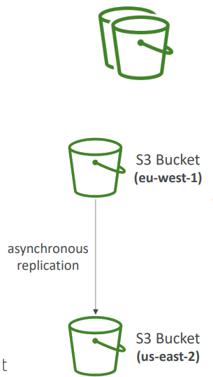
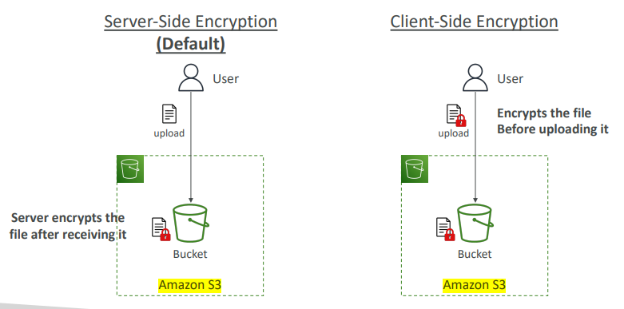
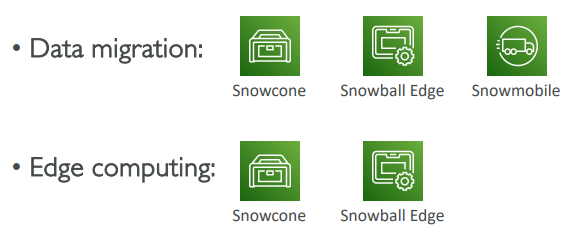
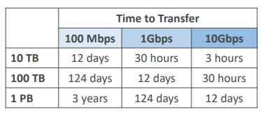
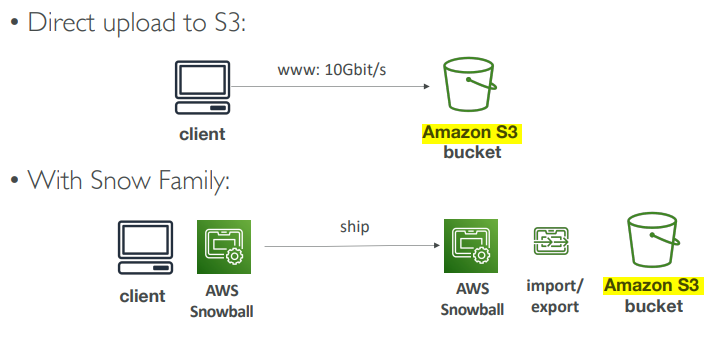
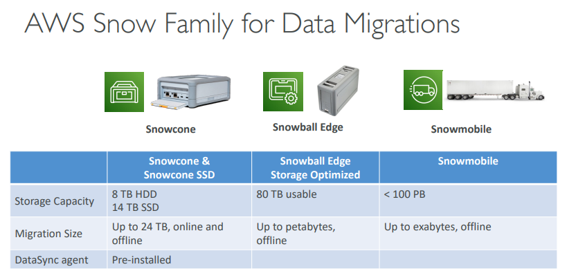
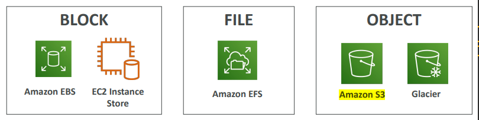
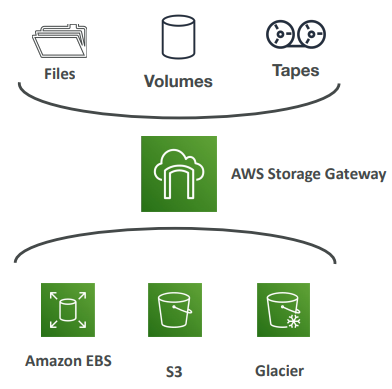

# Amazon S3

## S3 Replication Overview
### Amazon S3 - Replication (CRR & SRR)
- Must enable versioning in source and destination buckets
- CRR : Cross Region Application
- SRR : Same Region Application
- Buckets can be in different AWS accounts
- Copying is asynchronous
- Must give proper IAM permissions to S3

 

- Use Cases:
    - CRR : Compliance, Low Latency Access, Replication Across Accounts
    - SRR : Low Aggregation, Live Replication between Production and Test Accounts

## S3 Storage Classes Overview
### S3 Storage Classes
- Amazon S3 Standard : General Purpose
- Amazon S3 Standard-Infrequesnt Access (IA)
- Amazon S3 One Zone-Infrequent Access
- Amazon S3 Glacier Instant Retrieval
- Amazon S3 Glacier Flexible Retrieval
- Amazon S3 Glacier Deep Archive
- Amazon S3 Intelligent Tiering

 
- Can move between classes manually or using S3 Lifecycle configurations

### S3 Durability and Ability
- Durability
    - High Durability (99.999999999, 11 9's) of objects across multiple AZ
    - If you store 10,000,000 objects with Amazon S3, you can on average expect to incur a loss of a single object once every 10,000 years.
    - Same for all storage classes
- Availability
    - Measures how much readily available a service is
    - Varies depending on storage class
    - Example: S3 standard has 99.99% availability = not available 53 minuted a year.

### S3 Standard : General Purpose
- 99.99% Availability
- Used for frequently accessed data
- Low latency and high throughput
- Sustain 2 concurrent facility failures
- Use CasesL Big Data Analytics, Mobile & Gaming Applications, Content Distribution..

### S3 Storage Classes : Infrequent Access
- For data that is less frequently accessed, but required rapid access when needed
- Lower cost than S3 standard
- Amazon S3 Standard-Infrequent Access (S3 Standard-IA)
    - 99.9% Availability
    - Use cases; Disaster Recovery, backups
- Amazon S3 One Zone-Infrequent Access (S3 One Zone-IA)
    - High durability (99.999999999%) in a single AZ; data lost when AZ is destroyed
    - 99.5% Availability
    - Use Cases: Storing secondary backup copies of on-premise data, or data you can recreate

### Amazon S3 Glacier Storage Classes
- Low-cost object storage meant for archiving / backup
- Pricing: price for storage + object retrieval cost
- Amazon S3 Glacier Instant Retrieval
    - Millisecond retrieval, great for data accessed once a quarter 
    - Minimum storage duration of 90 days
- Amazon S3 Glacier Flexible Retrieval (formerly Amazon S3 Glacier):
    - Expedited (1 to 5 minutes), Standard (3 to 5 hours), Bulk (5 to 12 hours) – free
    - Minimum storage duration of 90 days
- Amazon S3 Glacier Deep Archive – for long term storage:
    - Standard (12 hours), Bulk (48 hours)
    - Minimum storage duration of 180 days

### S3 Intelligent - Tiering
- Small monthly monitoring and auto-tiering fee
- Moves objects automatically between Access Tiers based on usage
- There are no retrieval charges in S3 Intelligent-Tiering
- *Frequent Access tier (automatic):* default tier
- *Infrequent Access tier (automatic):* objects not accessed for 30 days
- *Archive Instant Access tier (automatic):* objects not accessed for 90 days
- *Archive Access tier (optional):* configurable from 90 days to 700+ days
- *Deep Archive Access tier (optional):* config. from 180 days to 700+ days

### S3 Storage Classes Comparison
|  | Standard | Intelligent-Tiering | Standard-IA | One Zone-IA | Glacier Instant Retrieval | Glacier Flexible Retrieval | Glacier Deep Archive |
| - | -------- | ------------------- | ----------- | ------- | -------------------------- | ------------- | ----------------- |
| Durability | 99.999999999% == (11 9's) |
| Availability | 99.9% | 99.9% | 99.9% | 99.5% | 99.9% | 99.9% | 99.9% | 
| Availability SLA | 99.9% | 99% | 99% | 99% | 99% | 99.9% | 99.9% | 
| Availability Zones | >=3 | >=3 | >=3 | 1 | >=3 | >=3 | >=3 |
| Min. Storage Duration Charge | None | None | 30 Days | 30 Days | 90 Days | 90 Days | 180 Days |
| Min. Billable Object Size | None | None | 128 Kb | 128 Kb | 128 Kb | 40 Kb | 40 Kb |
| Retrieval Fee | None | None | Per GB retrieved | Per GB retrieved | Per GB retrieved | Per GB retrieved | Per GB retrieved |

### S3 Storage Classes - Price Comparision (Example: us-east-1)
|  | Standard | Intelligent-Tiering | Standard-IA | One Zone-IA | Glacier Instant Retrieval | Glacier Flexible Retrieval | Glacier Deep Archive |
| - | -------- | ------------------- | ----------- | ------- | -------------------------- | ------------- | ----------------- |
| Storage Cost (per GB per month) | $0.023 | $0.0025 - $0.023 | %0.0125 | $0.01 | $0.04 | $0.0036 | $0.00099 |
| Retrieval Cost (per 100 request) | **GET:** $0.0004, **POST:** $0.005 | **GET:** $0.0004, **POST:** $0.005 | **GET:** $0.001, **POST:** $0.01 | **GET:** $0.001, **POST:** $0.01 | **GET:** $0.01, **POST:** $0.02 | **GET:** $0.004, **POST:** $0.03, **Expideted:** $10, **Standard:** %0.05, **Bulk:** Free | **GET:** $0.004, **POST:** $0.05, **Standard:** %0.10, **Bulk:** $0.025 |
| Retrieval Time | Instantaneous | Instantaneous | Instantaneous | Instantaneous | Instantaneous | **Expedited** (1-5 mins), **Standard** (3-5 hours), **Bulk** (5-12 hours) | **Standard** (12 hours), **Bulk** (48 hours) |
| Monitoring Cost (per 1000 objects) | | $0.025 | | | | | |

## S3 Encryption

## IAM Access Analyzer for S3
- Ensures that only intended people have access to your S3 buckets
- Example: publicly accessible bucket, bucket shared with other AWS account
- Evaluates S3 Bucket Policies, S3 ACLs, S3 Access Point Policies

## Shared Responsibility Model for S3
### AWS 
- Infrastructure (global security, durability, availability, sustain concurrent loss of data in two facilities)
- Configuration and vulnerability analysis
- Compliance validation

### User
- S3 Versioning
- S3 Bucket Policies
- S3 Replication Setup
- Logging and Monitoring
- S3 Storage Classes
- Data Encryption at rest and in transit

## AWS Snow Family Overview
### AWS Snow Family
- Highly-secure, portable devices to **collect and process data at the edge**, and **migrate data into and out of AWS**

### Data Migrations with AWS Snow Family
#### Challenges
- Limited connectivity
- Limited bandwidth
- High network cost
- Shared bandwidth (can't maximize the line)
- Connection stability

AWS Snow Family: offline devices to perform data migrations: If it takes more than a week to transfer over the network, use Snowball devices!

### Diagrams

### Snowball Edge (for data transfers)
- Physical data transport solution: move TBs or PBs of data in or out 
of AWS
- Alternative to moving data over the network (and paying network 
fees)
- Pay per data transfer job • Provide block storage and Amazon S3 compatible object storage
- **Snowball Edge Storage Optimized**
    - 80 TB of HDD capacity for block volume and S3 compatible object storage
- **Snowball Edge Compute Optimized**
    - 42 TB of HDD or 28TB NVMe capacity for block volume and S3 compatible object storage
- Use cases: large data cloud migrations, DC decommission, disaster recovery

### AWS Snowcone & Snowcone SSD
- Small, portable computing, anywhere, rugged & 
secure, withstands harsh environments
- Light (4.5 pounds, 2.1 kg) • Device used for edge computing, storage, and data transfer
- Snowcone : 8 TB of HDD Storage
- Snowcone SSD : 14 TB of SSD Storage
- Use Snowcone where Snowball does not fit (space constrained environment)
- Must provide your own battery / cables
- Can be sent back to AWS offline, or connect it to  internet and use AWS DataSync to send data

### AWS Snowmobile
- Transfer exabytes of data (1 EB = 1,000 PB = 1,000,000 TBs)
- Each Snowmobile has 100 PB of capacity (use multiple in parallel)
- High security: temperature controlled, GPS, 24/7 video surveillance
- Better than Snowball if you transfer more than 10 PB

### AWS Snow Family for Data Migrations

### Snow Family - Usage Process
1. Request Snowball devices from the AWS console for delivery
2. Install the snowball client / AWS OpsHub on your servers
3. Connect the snowball to your servers and copy files using the client
4. Ship back the device when you’re done (goes to the right AWS 
facility)
5. Data will be loaded into an S3 bucket
6. Snowball is completely wiped

### What is Edge Computing?
- Process data while it’s being created on an edge location
    - A truck on the road, a ship on the sea, a mining station underground... 
- These locations may have 
    - Limited / no internet access
    - Limited / no easy access to computing power
- We setup a Snowball Edge / Snowcone device to do edge computing
- Use cases of Edge Computing:
    - Preprocess data
    - Machine learning at the edge
    - Transcoding media streams
- Eventually (if need be) we can ship back the device to AWS (for transferring data for example)

### Snow Family - Edge Computing
- Snowcone & Snowcone SSD (smaller)
    - 2 CPUs, 4 GB of memory, wired or wireless access
    - USB-C power using a cord or the optional battery
- Snowball Edge – Compute Optimized
    - 104 vCPUs, 416 GiB of RAM
    - Optional GPU (useful for video processing or machine learning)
    - 28TB NVMe or 42TB HDD usable storage
    - Storage Clustering available (up to 16 nodes)
- Snowball Edge – Storage Optimized
    - Up to 40 vCPUs, 80 GiB of RAM, 80 TB storage
- All: Can run EC2 Instances & AWS Lambda functions (using AWS IoT Greengrass)
- Long-term deployment options: 1 and 3 years discounted pricing

### AWS OpsHub
- Historically, to use Snow Family devices, you 
needed a CLI (Command Line Interface tool)
- Today, you can use AWS OpsHub (a software you install on your computer / laptop) to manage your Snow Family Device
    - Unlocking and configuring single or clustered devices
    - Transferring files
    - Launching and managing instances running on Snow Family Devices
    - Monitor device metrics (storage capacity, active 
instances on your device)
    - Launch compatible AWS services on your devices (ex: Amazon EC2 instances, AWS DataSync, Network File System (NFS))

### Snowball Edge Pricing
- You pay for device usage and data transfer out of AWS
- Data transfer IN to Amazon S3 is $0.00 per GB
- On-Demand
    - Includes a one-time service fee per job, which includes:
        - 10 days of usage for Snowball Edge Storage Optimized 80TB
        - 15 days of usage for Snowball Edge Storage Optimized 210TB
    - Shipping days are NOT counted towards the included 10 or 15 days
    - Pay per day for any additional days
- Committed Upfront
    - Pay in advance for monthly, 1-year, and 3-years of usage (Edge Computing)
    - Up to 62% discounted pricing

## Storage Gateway Overview
### Hybrid Cloud for Storage
- AWS is pushing for "hybrid cloud"
    - Part of your infrastructure is on-premises
    - Part of your infrastructure is on the cloud 
- This can be due to 
    - Long cloud migrations
    - Security requirements
    - Compliance requirements
    - IT strategy
- S3 is a proprietary storage technology (unlike EFS / NFS), so how do you expose the S3 data on-premise? 
- AWS Storage Gateway

## AWS Storage Cloud Native Options

### AWS Storage Gateway
- Bridge between on-premise data and cloud data in S3
- Hybrid storage service to allow on- premises to seamlessly use the AWS 
Cloud 
- Use cases: disaster recovery, backup & 
restore, tiered storage
- Types of Storage Gateway:
    - File Gateway 
    - Volume Gateway
    - Tape Gateway
- No need to know the types at the exam

## S3 Summary
- **Buckets vs Objects:** global unique name, tied to a region
- **S3 Security:** IAM policy, S3 Bucket Policy (public access), S3 Encryption
- **S3 Website:** host a static website on Amazon S3
- **S3 Versioning:** multiple versions for files, prevent accidental deletes
- **S3 Replication:** same-region or cross-region, must enable versioning
- **S3 Storage Classes:** Standard, IA, IZ-IA, Intelligent, Glacier (Instant, Flexible, Deep)
- **Snow Family:** Import data onto S3 through a physcial device, edge computing
- **OpsHub:** desktop application to manage Snow Family devices
- **Storage Gateway:** hybrid solution to extend on-premises storage to S3

## Quiz : S3 Quiz