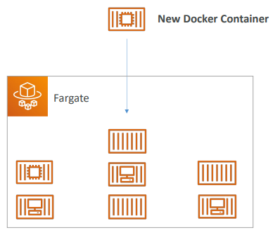

# Other Compute Services: ECS, Lambda, Batch, Lightsail

## What is Docker?
- Docker is a software development platform to deploy apps
- Apps are packaged in containers that can be run on any OS
- Apps run the same, regardless of where they’re run 
    - Any machine
    - No compatibility issues
    - Predictable behavior
    - Less work
    - Easier to maintain and deploy
    - Works with any language, any OS, any technology
- Scale containers up and down very quickly (seconds)

### Docker on an OS

### Where Docker Images are stored?
- Docker images are stored in Docker Repositories
- Public: Docker Hub https://hub.docker.com/ 
    - Find base images for many technologies or OS:
    - Ubuntu 
    - MySQL 
    - NodeJS, Java…
- Private: Amazon ECR (Elastic Container Registry)

### Docker versus Virtual Machines
- Docker is ”sort of” a virtualization technology, but not exactly
- Resources are shared with the host => many containers on one server

## ECS, Fargate & ECR Overview
### ECS
- ECS = Elastic Container Service
- Launch Docker containers on 
AWS
- You must provision & maintain 
the infrastructure (the EC2 
instances)
- AWS takes care of starting / 
stopping containers
- Has integrations with the 
Application Load Balancer

### Fargate
- Launch Docker containers on 
AWS
- You do not provision the infrastructure (no EC2 
instances to manage) – simpler!
- Serverless offering 
- AWS just runs containers for you based on the CPU / RAM 
you need.

### ECR
- Elastic Container Registry 
- Private Docker Registry on AWS
- This is where you store your Docker images so they can 
be run by ECS or Fargate

## Serverless Introduction
### What's serverless?
- Serverless is a new paradigm in which the developers don’t have to manage servers anymore… 
- They just deploy code
- They just deploy… functions !
- Initially... Serverless == FaaS (Function as a Service)
- Serverless was pioneered by AWS Lambda but now also includes anything that’s managed: “databases, messaging, storage, etc.”
- Serverless does not mean there are no servers…
it means you just don’t manage / provision / see them

## Lambda Overview
### Why AWS Lambda?

### Benefits of AWS Lambda
- Easy Pricing:
- Pay per request and compute time
- Free tier of 1,000,000 AWS Lambda requests and 400,000 GBs of compute time
- Integrated with the whole AWS suite of services
- Event-Driven: functions get invoked by AWS when needed
- Integrated with many programming languages
- Easy monitoring through AWS CloudWatch
- Easy to get more resources per functions (up to 10GB of RAM!)
- Increasing RAM will also improve CPU and network!

### AWS Lambda Language Support
- Node.js (JavaScript) 
- Python 
- Java (Java 8 compatible) 
- C# (.NET Core) 
- Golang 
- C# / Powershell 
- Ruby 
- Custom Runtime API (community supported, example Rust) 
- Lambda Container Image 
    - The container image must implement the Lambda Runtime API 
    - ECS / Fargate is preferred for running arbitrary Docker images

### Example: Serverless Thumbnail Creation

### Example: Serverless CRON Job

### AWS Lambda Pricing : Example
- You can find overall pricing information here: https://aws.amazon.com/lambda/pricing/
- Pay per calls:
    - First 1,000,000 requests are free 
    - $0.20 per 1 million requests thereafter ($0.0000002 per request)

- Pay per duration: (in increment of 1 ms)
    - 400,000 GB-seconds of compute time per month for FREE
    - == 400,000 seconds if function is 1GB RAM 
    - == 3,200,000 seconds if function is 128 MB RAM • 
    - After that $1.00 for 600,000 GB-seconds
- It is usually very cheap to run AWS Lambda so it’s very popula

## Lambda Hands On

## API Gateway Overview
### Amazon API Gateway
- Example: building a serverless API

- Fully managed service for developers to easily create, publish, maintain, 
monitor, and secure APIs
- Serverless and scalable
- Supports RESTful APIs and WebSocket APIs
- Support for security, user authentication, API throttling, API keys, monitoring... 

## Batch Overview
### AWS Batch
- Fully managed batch processing at any scale
- Efficiently run 100,000s of computing batch jobs on AWS
- A “batch” job is a job with a start and an end (opposed to continuous)
- Batch will dynamically launch EC2 instances or Spot Instances
- AWS Batch provisions the right amount of compute / memory
- You submit or schedule batch jobs and AWS Batch does the rest!
- Batch jobs are defined as Docker images and run on ECS
- Helpful for cost optimizations and focusing less on the infrastructure

### AWS Batcch - Simplified Example

### Batch vs Lambda

## Lightsail Overview
### Amazon Lightsail
- Virtual servers, storage, databases, and networking 
- Low & predictable pricing
- Simpler alternative to using EC2, RDS, ELB, EBS, Route 53…
- Great for people with little cloud experience!
- Can setup notifications and monitoring of your Lightsail resources
- Use cases:
    - Simple web applications (has templates for LAMP, Nginx, MEAN, Node.js…)
    - Websites (templates for WordPress, Magento, Plesk, Joomla)
    - Dev / Test environment 
- Has high availability but no auto-scaling, limited AWS integrations

### Other Compute - Summary
- Docker: container technology to run applications
- ECS: run Docker containers on EC2 instances
- Fargate: 
- Run Docker containers without provisioning the infrastructure
- Serverless offering (no EC2 instances)
- ECR: Private Docker Images Repository
- Batch: run batch jobs on AWS across managed EC2 instances
- Lightsail: predictable & low pricing for simple application & DB stacks

### Lambda Summary
- Lambda is Serverless, Function as a Service, seamless scaling, reactive
- Lambda Billing:
- By the time run x by the RAM provisioned
- By the number of invocations
- Language Support: many programming languages except (arbitrary) Docker
- Invocation time: up to 15 minutes
- Use cases:
- Create Thumbnails for images uploaded onto S3
- Run a Serverless cron job
- API Gateway: expose Lambda functions as HTTP AP

## Lightsail Hands On

## Other Compute - Summary

