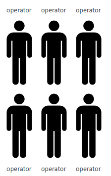
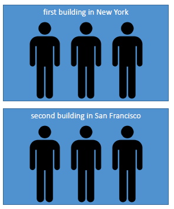
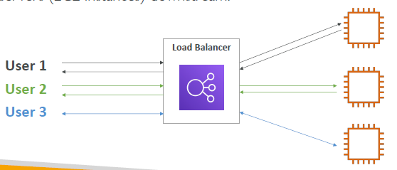
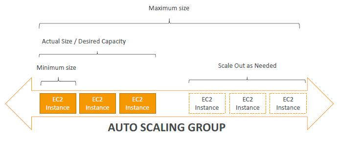
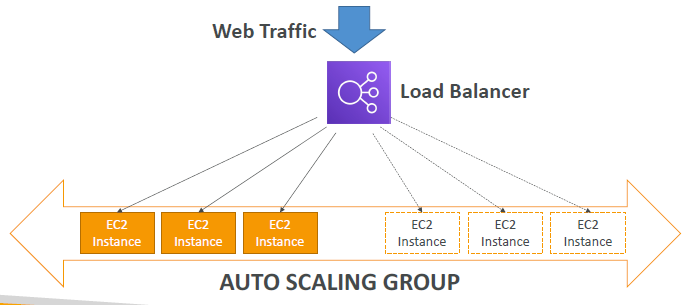
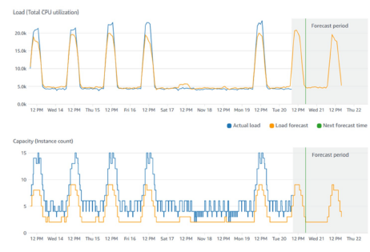

https://home.pearsonvue.com/onvue-tips

------------------------

# Elastic Load Balancing & Auto Scaling Group
## Scalability & High Availability
- **Scalability** means that an application / system can handle greater loads by adapting.
- There are two kinds of scalability:
    - Vertical Scalability
    - Horizontal Scalability (= elasticity)
- Scalability is linked but different to High Availability

## Vertical Scalability
- **Vertical Scalability** means *increasing the size of the instance*
- For example, your application runs on a *t2.micro*
- Scaling that application vertically means running it on a *t2.large*
- Vertical scalability is very *common for non-distributed systems*, such as a **database**.
- There’s usually a limit to how much you can vertically scale (hardware limit)
    

## Horizontal Scalability
- **Horizontal Scalability** means *increasing the number of instances / systems for your application*
- Horizontal scaling implies *distributed systems*.
- This is very *common for web applications / modern applications*
• It’s easy to horizontally scale thanks the cloud offerings such as Amazon EC2
    

## High Availability
- High Availability usually goes 🤝 with horizontal scaling
- High availability means *running your application / system in at least 2 Availability Zones*
• The **goal** of high availability is to *survive a data center loss (disaster)*
    

## High Availability & Scalability for EC2
- **Vertical Scaling**: *Increase instance size (= scale up / down)*
    - From: t2.nano - 0.5G of RAM, 1 vCPU
    - To: u-12tb1.metal – 12.3 TB of RAM, 448 vCPUs
- **Horizontal Scaling**: *Increase number of instances (= scale out / in)*
    - Auto Scaling Group
    - Load Balancer
- **High Availability**: *Run instances for the same application across multi AZ*
    - Auto Scaling Group multi AZ
    - Load Balancer multi AZ

## Scalability vs Elasticity (vs Agility)
- **Scalability** : ability to *accommodate a larger load* by making the hardware stronger *(scale up)*, or by adding nodes *(scale out)*

- **Elasticity** : once a system is scalable, elasticity means that there will be some *“auto-scaling”* so that the system can scale based on the load. This is cloud-friendly”: pay-per-use, match demand, optimize costs

- **Agility**: *(not related to scalability - distractor)* new IT resources are only a click away, which means that you *reduce the time to make those resources available* to your developers *from weeks to just minutes.*

## What is Load Balancing?
Load balancers are servers that *forward internet traffic to multiple servers* (EC2 Instances) downstream.
    

### Why use a Load Balancer?
- *Spread load* across multiple *downstream* instances
• Expose a *single point of access (DNS)* to your application
• Seamlessly *handle failures* of downstream instances
• Do *regular health checks* to your instances
• Provide *SSL termination (HTTPS)* for your websites
• *High availability* across zones

### Why use an Elastic Load Balancer?
- An ELB (Elastic Load Balancer) is a **managed load balancer**
- AWS guarantees that it will be working
- AWS takes care of *upgrades, maintenance, high availability*
- AWS provides only a few configuration knobs
- It costs less to setup your own load balancer but it will be a lot more effort on your end (maintenance, integrations)
- **4 kinds of load balancers** offered by AWS:
    - **Application Load Balancer**
        - HTTP / HTTPS / gRPC only (Layer 7)
        - HTTP Routing features
        - Static DNS (URL) 
        
    - **Network Load Balancer** 
        - TCP / UDP protocols (Layer 4) 
        - ultra-high performance, millions of request per seconds
        - Static IP through Elastic IP

    - **Gateway Load Balancer** – Layer 3
        - GENEVE Protocol on IP Packets (Layer 3)
        - **Route Traffic to Firewalls** that you manage on EC2 Instances
        - Intrusion detection

    - **Classic Load Balancer (retired in 2023)** – Layer 4 & 7

## What's an Auto Scaling Group?
- In real-life, the load on your websites and application can change
- In the cloud, you can create and get rid of servers very quickly
- The **goal of an Auto Scaling Group (ASG)** is to:
    - **Scale out** *(add EC2 instances)* to match an increased load
    - **Scale in** *(remove EC2 instances)* to match a decreased load
    - Ensure we have a minimum and a maximum number of machines running
    - Automatically *register new instances to a load balancer*
    - *Replace unhealthy instances*
- **Cost Savings**: only run at an optimal capacity *(principle of the cloud)*

### Auto Scaling Group in AWS

### Auto Scaling Group in AWS with Load Balancer

### Auto Scaling Group -- Scaling Strategies
- **Manual Scaling**: Update the size of an ASG manually
- **Dynamic Scaling**: Respond to changing demand
    - **Simple / Step Scaling**
        - When a CloudWatch alarm is triggered (example **CPU > 70%**), then *add 2 units*
        - When a CloudWatch alarm is triggered (example **CPU < 30%**), then *remove 1*
    - **Target Tracking Scaling**
        - Example: I want the average ASG CPU to stay at around 40%
    - **Scheduled Scaling**
        - Anticipate a scaling based on *known usage patterns*
        - Example: increase the min. capacity to 10 at 5 pm on Fridays

    - **Predictive Scaling**
        - Uses *Machine Learning* to predict future traffic ahead of time
        - Automatically provisions the right number of EC2 instances in advance

- Useful when your load has predictable time-based patterns
    

## Summary
- **High Availability** vs **Scalability** (vertical and horizontal) vs **Elasticity** vs **Agility** in the Cloud
- **Elastic Load Balancers (ELB)**
    - Distribute traffic across backend EC2 instances, can be Multi-AZ
    - Supports health checks
    - 4 types: Classic (old), Application (HTTP – L7), Network (TCP – L4), Gateway (L3)
- **Auto Scaling Groups (ASG)**
    - Implement Elasticity for your application, across multiple AZ
    - Scale EC2 instances based on the demand on your system, replace unhealthy
    - Integrated with the ELB

# Amazon S3
# Databases & Analytics 
# Other Compute Services
# Other AWS Services

# AWS Services by Category
## Topics
- Accessing AWS services
- Analytics
- Application integration
- Blockchain
- Business applications
- Cloud Financial Management
- Compute services
- Customer enablement
- Containers
- Databases
- Developer tools
- End user computing
- Front-end web and mobile services
- Game tech
- Internet of Things (IoT)
- Machine Learning (ML) and Artificial Intelligence (AI)
- Management and governance
- Media
- Migration and transfer
- Networking and content delivery
- Quantum technologies
- Robotics
- Satellite
- Security, identity, and compliance
- Storage

------------------------

## Accessing AWS Services
1. **AWS Management Console** :
    - simple and intitutive user interface
    - you can also use the AWS Management Console Application to quickly view resources on the go
2. **AWS Command Line Interface (AWS CLI**)
    - **AWS CLI** is a unified tool to manage your AWS services. You can control multiple AWS services from the command line and automate them through scripts.
    - **AWS CloudShell** provides a *browser-based* shell that is pre-authenticated with your console credentials. Using CloudShell, you can quickly run AWS commands and scripts without leaving your web browser.
3. **Software Development Kits (SDKs)** : simplify using AWS services in your applications with an Application Program Interface (API) tailored to your programming language or platform

-----------

# Analytics

## Amazon Athena
- Amazon Athena is an interactive query service that makes it easy to **analyze data in Amazon S3** using *standard SQL*.
- Athena is **serverless**; *no infrastructure to manage, pay only for the queries you run*
- Easy to Use: 
    1. Simply point to your data in Amazon S3
    2. Define the schema, and start querying using standard SQL.
- With Athena, there’s no need for complex extract, transform, and load (ETL) jobs to prepare your data for analysis
- Athena is out-of-the-box integrated with **AWS Glue Data Catalog**
- Allowing you to create a unified metadata repository across various services, crawl data sources to discover schemas and populate your Catalog with new and modified table and partition definitions, and maintain schema versioning.

## Amazon CloudSearch
- Amazon CloudSearch is a **managed service**.
- makes it simple and cost-effective to set up, manage, and scale a search solution for your website or application.
- Amazon CloudSearch supports 34 languages and popular search features such as highlighting, autocomplete, and geospatial search.

## Amazon DataZone

## Amazon EMR
- Amazon EMR is the industry-leading cloud **big data platform** for **processing** **vast amounts of data using open source tools** such as *Apache Spark, Apache Hive, Apache HBase, Apache Flink,Apache Hudi, and Presto.*

- Amazon EMR makes it easy to set up, operate, and scale your big data environments by *automating time-consuming tasks* such as **provisioning capacity** and **tuning clusters**.

- With Amazon EMR, you can run **petabyte-scale analysis** at *less than half of the cost of traditional on-premises solutions* and over **3x faster** than standard *Apache Spark*

- You can run workloads on Amazon EC2 instances, on Amazon Elastic Kubernetes Service (Amazon EKS) clusters, or on-premises using Amazon EMR on AWS Outposts.

## Amazon FinSpace

## Amazon Kinesis
- Amazon Kinesis makes it easy to collect, process, and analyze **real-time, streaming data** so you can get timely insights and react quickly to new information.

- With Amazon Kinesis, you can ingest real-time data such as video, audio, application logs, website clickstreams, and IoT telemetry data for machine learning (ML), analytics, and other applications.

- Amazon Kinesis enables you to process and analyze data as it arrives and *respond instantly instead of having to wait* until all your data is collected before the processing can begin.

- Amazon Kinesis currently offers four services: 
    - Firehose, Managed Service for Apache Flink
    - Kinesis Data Streams
    - Kinesis Video Streams

## Amazon OpenSearch Service
## Amazon OpenSearch Serverless

## Amazon Redshift
- Amazon Redshift is the most widely used cloud **data warehouse**.

- It makes it fast, simple and cost-effective to *analyze all your data using standard SQL* and your existing *Business Intelligence (BI) tools*.

- It allows you to *run complex analytic queries against terabytes to petabytes of structured and semi-structured data*, using sophisticated **query optimization**, **columnar storage** on high-performance storage, and massively **parallel query completion**

- You can start small for just $0.25 per hour with no commitments and scale out to petabytes of data for $1,000 per terabyte per year, less than a tenth the cost of traditional on-premises solutions.

## Amazon Redshift Serverless
- Amazon Redshift Serverless makes it easier to run and scale analytics **without having to manage your data warehouse infrastructure**.

- Developers, data scientists, and analysts can work across databases, data warehouses, and data lakes to build reporting and dashboarding applications, perform near real-time analytics, share and collaborate on data, and build and train machine learning (ML) models.

- Go from large amounts of data to insights in seconds

- Amazon Redshift Serverless **automatically provisions and intelligently scales data warehouse capacity** to *deliver fast performance* for even the most demanding and unpredictable workloads, and you pay only for what you use.

- Just load data and start querying right away in Amazon Redshift Query Editor or in your favorite business intelligence (BI) tool.

enjoy the best price performance and familiar SQL features in an easy-to-use, **zero administration environment**.

## Amazon QuickSight
## AWS Data Exchange
## AWS Glue
## Amazon Managed Streaming for Apache Kafka (Amazon MSK)

--------------------------

# Application Integration
## AWS Step Functions
- 

## AWS B2B Data Interchange
## Amazon EventBridge
## Amazon MQ
## Amazon SNS
- Amazon Simple Notification Service (Amazon SNS) is a highly available, durable, secure, fully managed pub/sub messaging service that enables you to decouple microservices, distributed systems, and serverless applications.

- Amazon SNS provides topics for high-throughput, push-based, many-to-many messaging. 

- Using Amazon SNS topics, your publisher systems can fan out messages to a large number of subscriber endpoints for parallel processing, including Amazon SQS queues, AWS Lambda functions, and HTTP/S webhooks. 

- Additionally, SNS can be used to fan out notifications to end users using mobile push, SMS, and email.

## Amazon SQS
- Amazon Simple Queue Service (Amazon SQS) is a fully managed message queuing service that enables you to decouple and scale microservices, distributed systems, and serverless applications.

- Using Amazon SQS, you can send, store, and receive messages between software components at any volume, without losing messages or requiring other services to be available.

- Get started with Amazon SQS in minutes using the AWS Management Console, AWS CLI, or SDK of your choice, and three simple commands.

- Amazon SQS offers two types of message queues. 
    - Standard queues offer maximum throughput, best-effort ordering, and at-least-once delivery. 
    - Amazon SQS FIFO queues are designed to guarantee that messages are processed exactly once, in the exact order that they are sent.

## Amazon Simple Workflow Service

---------------

# Blockchain

# Business Applications
## Amazon Connect
## Amazon SES

-------------------------------------

# Cloud Financial Management
## AWS Billing Conductor
## AWS Budgets
## AWS Cost and Usage Report
## AWS Cost Explorer
## AWS Marketplace

-------------------------------------

# Compute Services
## Compare AWS Compute Services
| Category | AWS Service | Description |
| -------- | ----------- | ----------- |
| Instances (Virtual Machines) | Amazon EC2 | Secure and resizable compute capacity (virtual servers) in the cloud |
| Instances (Virtual Machines) | Amazon EC2 Spot Instances | Run fault-tolerant workloads for up to 90% off |
| Instances (Virtual Machines) | Amazon EC2 Auto Scaling | Automatically add or remove compute capacity to meet changes in demand |
| Instances (Virtual Machines) | Amazon Lightsail | Easy to use cloud platform that offers you everything you need to build an application or website |
| Instances (Virtual Machines) | AWS Batch | Fully managed batch processing at any scale |
| Containers | Amazon ECS | Highly secure, reliable, and scalable way to run containers |
| Containers | Amazon ECS Anywhere | Run containers on customer managed infrastructure |
| Containers | Amazon ECR | Easily store, manage, and deploy container images |
| Containers | Amazon EKS | Fully managed kubernetes service |
| Containers | Amazon EKS Anywhere | Create and operate Kubernetes clusters on your own infrastructure |
| Containers | AWS Fargate | Serverless compute for containers |
| Containers | AWS App Runner | Build and run containerized applications on a fully managed servoce |
| Serverless | AWS Lambda | Run code without thinking about servers. Pay only for the compute time you consume |
| Edge and Hybrid | AWS Outposts | Run AWS Infrastructure and services on premises for a truly consistent hybrid experience |
| Edge and Hybrid | AWS Snow Family | Collect and process data in a rugged or disconeected edge |
| Edge and Hybrid | AWS Wavelength | Deliver ultra-low latency applications for 5G devices
| Edge and Hybrid | VMware Cloud on AWS | Preferred service for all vSphere workloads to rapidly extend and migrate to the cloud | 

| Cost and Capacity Management | 

## Amazon EC2
- Amazon Elastic Compute Cloud (Amazon EC2) is a web service that provides secure, resizable compute capacity in the cloud. 

- It provides you with complete control of your computing resources and lets you run on Amazon’s proven computing environment. 

- Amazon EC2 reduces the time required to obtain and boot new server instances (called Amazon EC2 instances) to minutes, allowing you to quickly scale capacity, both up and down.

- Amazon EC2 changes the economics of computing by allowing you to pay only for capacity that you actually use

### Instance Types
1. **On-Demand Instances**
2. **Spot Instances**:
    - Spot Instances are available at up to a **90% discount** compared to On-Demand prices and let you take advantage of unused Amazon EC2 capacity in the AWS Cloud.

    - Spot Instances are recommended for:
        - Applications that have flexible start and end times
        - Applications that are only feasible at very loy compute prices
        - Users with urgent computing needs for large amounds of additional capacity

3. **Reserved Instances**:
    - Reserved Instances provide you with a significant **discount (up to 72%**) compared to On-Demand Instance pricing. 
    - You have the flexibility to change families, operating system types, and tenancies while benefiting from Reserved Instance pricing when you use Convertible Reserved Instances.
4. **Savings Plan**":
    - Savings Plans are a flexible pricing model that offer low prices on EC2 and Fargate usage, in exchange for a commitment to a consistent amount of usage (measured in $/hour) **for a one or three year term**.

5. **Dedicated Hosts**: 
    - A Dedicated Host is a physical EC2 server dedicated for your use
    - Dedicated Hosts can help you reduce costs by allowing you to use your existing server-bound software licenses, including Windows Server, Microsoft SQL Server, and SUSE, and can also help you meet compliance requirements.

## Amazon EC2 Auto Scaling
## Amazon EC2 Image Builder
## Amazon Lightsail
## AWS Batch
## AWS Elastic Beanstalk
## AWS Fargate
## AWS Lambda
## AWS Local Zones
## AWS Outposts
## AWS Wavelength

------------------------------

------------------------------

# Containers
## Amazon ECR
- Amazon ECR is a **fully-managed Docker container registry** that makes it easy for developers to *store, manage, and deploy Docker container images.*

- Amazon ECR is integrated with Amazon ECS

- Amazon ECR **eliminates** the need to *operate your own container repositories* or worry about scaling the underlying infrastructure.

- Amazon ECR hosts your images in a highly available and scalable architecture, allowing you to reliably deploy containers for your applications.

- Integration with AWS IAM provides resource-level control of each repository.

- With Amazon ECR, there are **no upfront fees or commitments**. You pay only for the amount of data you store in your repositories and data transferred to the internet.

## Amazon ECS
- Amazon ECS is a highly scalable, high-performance **container orchestration service** that supports *Docker containers* and allows you to easily *run and scale containerized applications* on AWS. 

- Amazon ECS **eliminates** the need for you to *install and operate your own container orchestration software*, manage and scale a cluster of virtual machines (VMs), or schedule containers on those VMs.

- With simple API calls, you can launch and stop Docker-enabled applications, query the complete state of your application, and access many familiar features such as IAM roles, security groups, load balancers, Amazon CloudWatch Events, AWS CloudFormation templates, and AWS CloudTrail logs.

## Amazon EKS
- Amazon EKS makes it easy to deploy, manage, and **scale containerized applications using Kubernetes on AWS**.

- Amazon EKS runs the Kubernetes management infrastructure for you across multiple AWS Availability Zones to eliminate a single point of failure. 

- Amazon EKS is certified Kubernetes conformant so you can use existing tooling and plugins from partners and the Kubernetes community. 

- Applications running on any standard Kubernetes environment are fully compatible and can be easily migrated to Amazon EKS.