# Cloud Concepts

## What is Cloud Computing?
The practice of using a network of remote servers hosted on the Internet to store, manage and process data, rather than a local server or a personal computer.

### On-Premise
- You own the servers
- You hire the IT people
- You pay or rent the real-estate
- You take all the risk

### Cloud Providers
- Someone else owns the servers
- Someone else hires the IT people
- Someone else pays or rents the real-estate
- You are responsible for your configuring cloud services and code, someone else takes care of the rest.

## Evolution of Cloud Computing
- **Dedicated Server** : 
    - One physical machine dedicated to a single business.
    - Runs a single web-app/site.
    - Very Expensive, High Maintenance, *High Security
    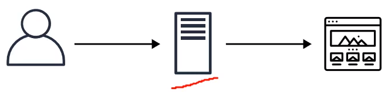
     

- **Virtual Private Server (VPS)**
    - One physical machine dedicated to a single business.
    - They physical machine is virtualized into sub-machines
    - Runs multiple web-apps/sites
    - Better Utilization and Isolation of Resources
    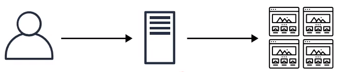
    
     

- **Shared Hosting**
    - One physical machine, shared by hundred of businesses
    - Relies on most tenants under-utilizing their resources.
    - Very Cheap, Limited Functionality, Poor Isolation
    

     

- **Cloud Hosting**
    - Multiple physical machines that act as one system.
    - The system is abstracted into multiple cloud services.
    - Flexible, Scalable, Secure, Cost-Effective, High Configurability
    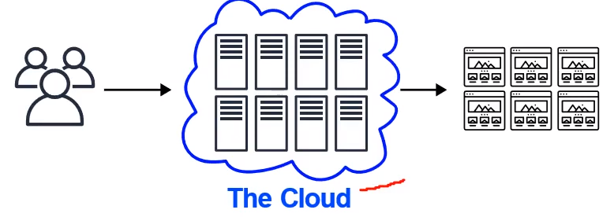

## What is Amazon Web Services (AWS)
- AWS was launched in *2006 is the leading cloud service provider in the world.

### Timeline of AWS Services
- **Simple Queue Service (SQS)** was the first AWS service launched for public use in 2004
- **Simple Storage Service (S3)** was launched in March of 2006
- **Elastic Compute Cloud (EC2)** was launched in August of 2006

In November 2010, it was reported that all of Amazon.com's retail sites had migrated to AWS

To support industry-wide training and skills standardization, AWS began offering a certification program for computer engineers, on April, 2013.

## What is a Cloud Service Provider (CSP) ?
A **Cloud Service Provider (CSP)** is a company which :
- provides multiple Cloud Services e.g. tens to hundreds of services
- those Cloud Services **can be chained together** to create cloud architectures
- those Cloud Services are accessible **via Single Unified API** e.g. AWS API
- those Cloud Services utilized **metered billing** based on usage e.g. per second, per hour
- those Cloud Services have rich monitoring built in eg. AWS CloudTrail
- those Cloud Services have an Infrastructure as a Service (IaaS) offering
- those Cloud Services offers **automation** via Infrastructure as Code (IaC)
    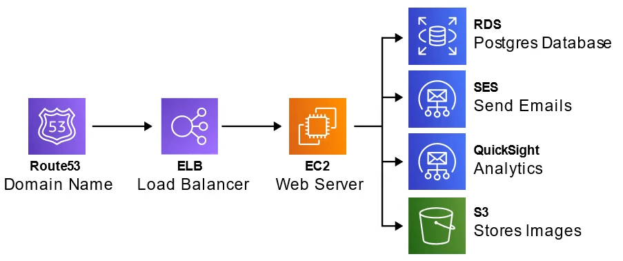

If a company offers multiple cloud services under a single UI but do not meet most of or all of these requirements, it would be referred to as a Cloud Platform e.g. Twilio, HashiCorp, Databricks

## Landscape of CSPs
### Tier - 1 (Top Tier)
Early to market, wide offering, strong synergies between services, well recognized in the industry
1. Amazon Web Services (AWS)
2. Microsoft Azure
3. Google Cloud Platform (GCP)
4. Alibaba Cloud

### Tier - 2 (Mid Tier)
Backed by well-known tech companies, slow to innovate and turned to specialization
1. IBM Cloud
2. Oracle Cloud
3. Rackspace (OpenStack)

### Tier - 3 (Light Tier)
Virtual Private Servers (VPS) turned to offer core IaaS offering. Simple, cost-effective
1. Vultr
2. Digital Ocean
3. Linode

## Gartner Magic Quadrant for Cloud
**Magic Quadrants (MQ)** is a series of market research reports published by IT consulting firm Gartner that rely on proprietary qualitative data analysis methods to demonstrate market trends, such as direction, maturity and participants.

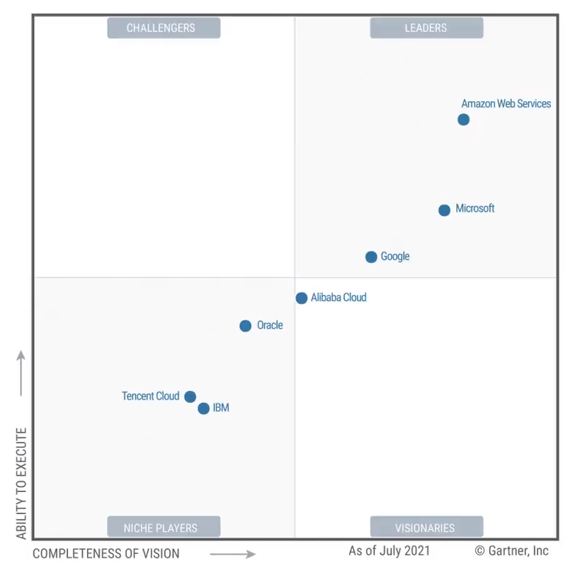

## Common Cloud Services
The four most common types of cloud services *(the 4 core)* for Infrastructure as a Service (IaaS) would be : 
- **Compute** : Imagine having a virtual computer that can run application, programs and code.
- **Networking** : Imagine having virtual network defining internet connections or network isolations between services or outbound to the internet
- **Storage** : Imagine having a virtual hard-drive that can store files
- **Databases** : Imagine a virtual database for storing reporting data or a database for general purpose web-application

AWS has over 200+ cloud services

## AWS Technology Overview
Cloud Service Provider (CSPs) that are Infrastructure as a Service (IaaS) will always have 4 core cloud service offerings:
- **Compute** : EC2 Virtual Machines
- **Storage** : EBS Virtual Hard Drives
- **Database** : RDS SQL Databases
- **Networking and Content Delivery** : VPC Private Cloud Network

### Other Categories
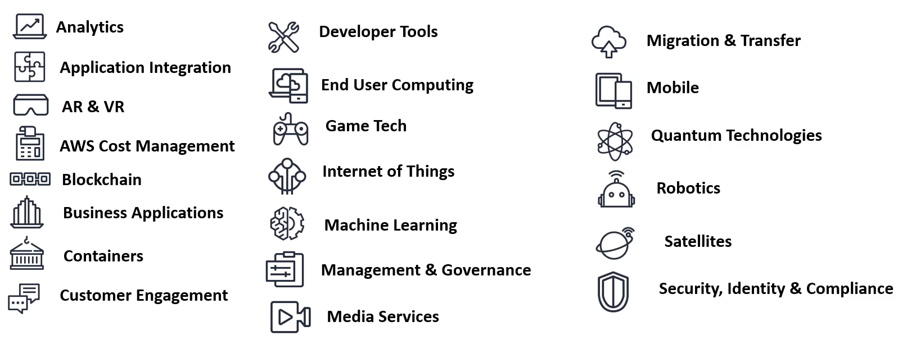

## Evolution of Computing

### 1. Dedicated
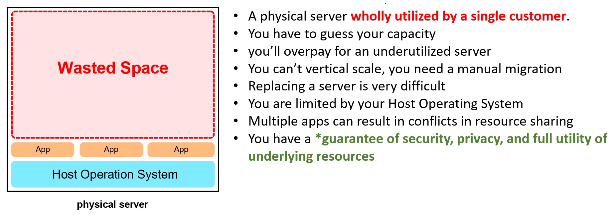

### 2. VMs
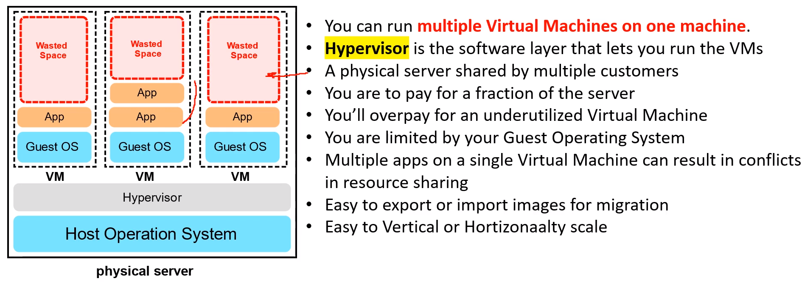

### 3. Containers
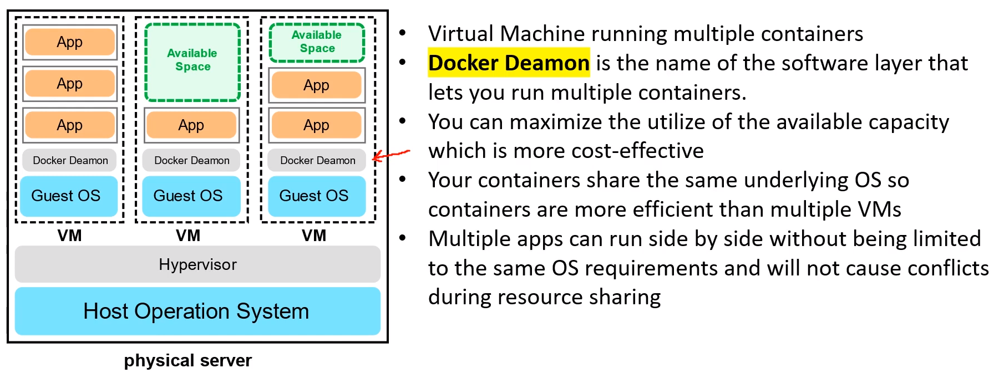

### 4. Functions

## Types of Cloud Computing
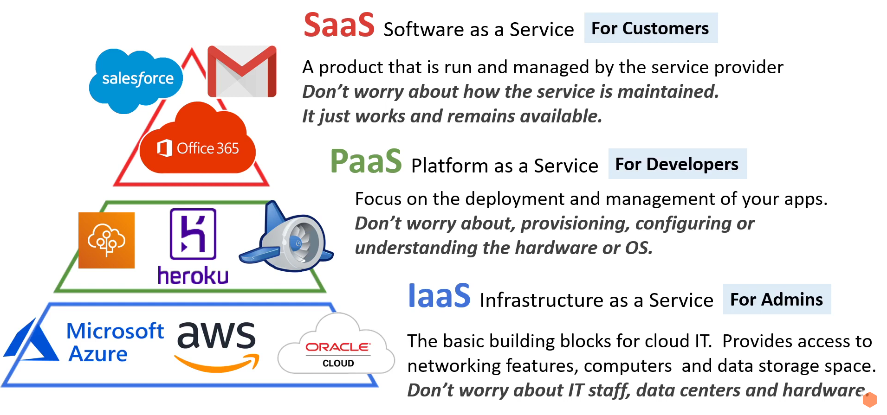

## Cloud Computing Deployment Models
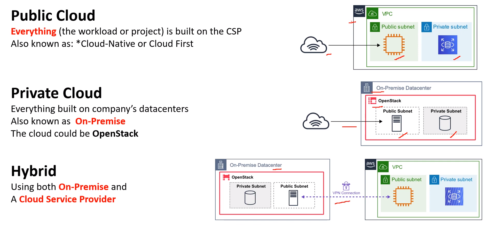

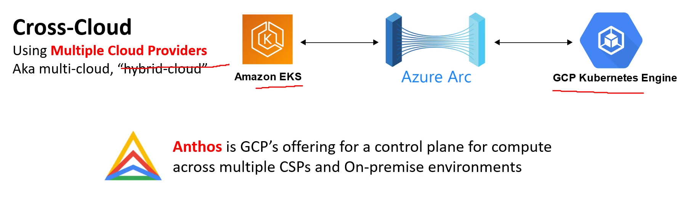

## Deployment Model Use Cases
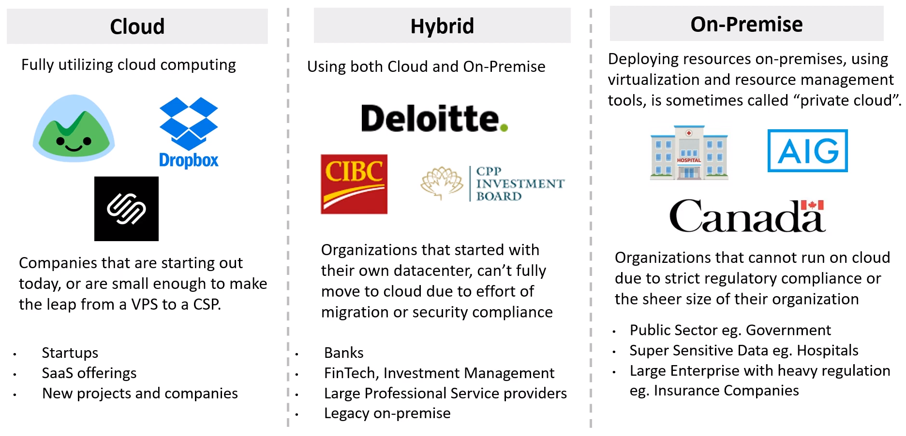

