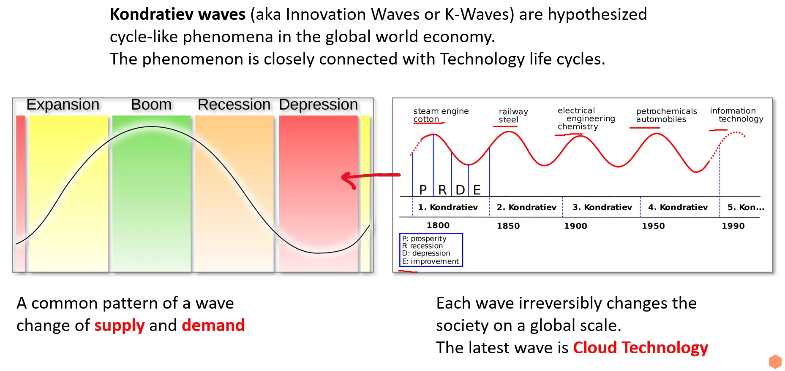
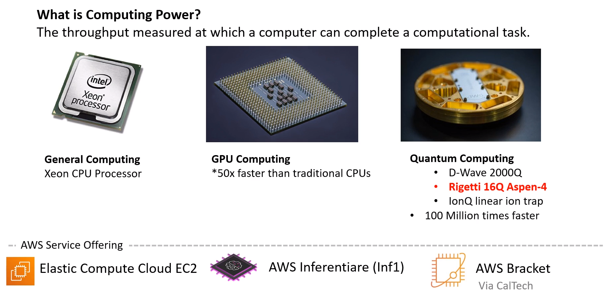

# Digital Transformation

## Innovation Waves

## Burning Platform
Burning Platform is a term used when a company abandons old technology for new technology with the *uncertainty of success and can be motivated by fear* that the organization future survival hinges on its digital transformation.

## Digital Transformation Chechklist

## Evolution of Computing Power

## Amazon Bracket 👨‍💻
Amazon Braket is a fully managed Amazon Web Services (AWS) service that helps researchers, scientists, and developers get started with quantum computing. It provides access to different types of quantum computers, as well as tools and resources for developing and running quantum algorithms.

With Amazon Braket, you can:
- Explore and design quantum and hybrid algorithms.
- Test algorithms on different quantum circuit simulators.
- Run algorithms on different types of quantum computers.
- Create proof of concept applications.

Amazon Braket supports a variety of quantum computing hardware platforms, including:
- IonQ trapped-ion quantum computers
- Rigetti superconducting quantum computers
- Google Sycamore quantum computer
- D-Wave 2000Q quantum annealing computer

Amazon Braket also provides a variety of tools and resources for developing and running quantum algorithms, including:
- Quantum circuit simulators
- Quantum programming languages
- Quantum machine learning frameworks

Amazon Braket is a powerful tool for researchers, scientists, and developers who want to explore the potential of quantum computing. It provides a simple and convenient way to access quantum computers and develop quantum algorithms.

Here are some specific examples of what you can do with Amazon Braket:
- You can use Amazon Braket to simulate the performance of quantum algorithms on different hardware platforms. This can help you to choose the right hardware for your application.
- You can use Amazon Braket to run quantum algorithms on real quantum computers. This can help you to test your algorithms and get results.
- You can use Amazon Braket to develop quantum machine learning models. These models can be used to solve a variety of problems, such as drug discovery and financial forecasting.

Amazon Braket is a rapidly evolving service, and new features are being added all the time. If you are interested in learning more about quantum computing, Amazon Braket is a great place to start.