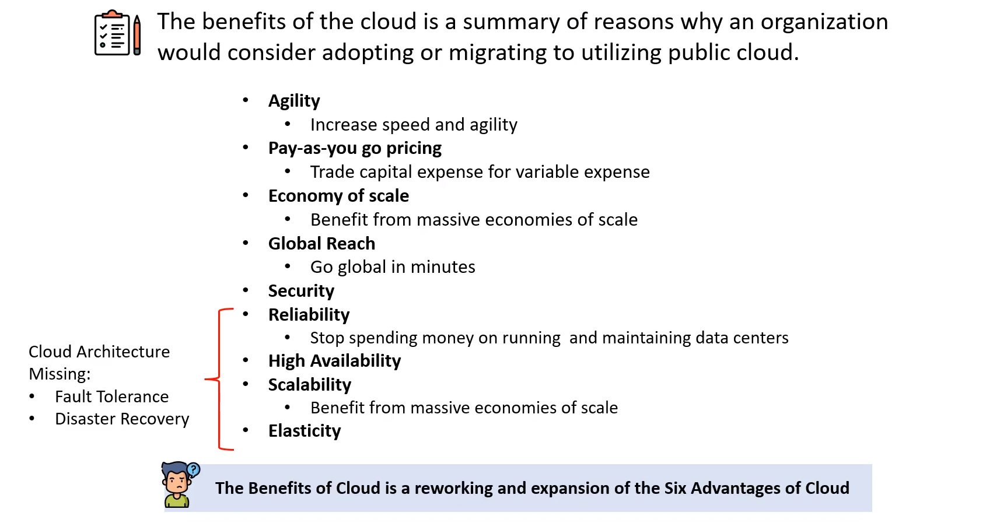

# The Benefits of Cloud

## The Benefits of the Cloud

## The Six Advantage of Cloud

## The Six Advantage of Cloud Doc Ref

## The Seven Adavantage of Cloud
- **Cost-Effective** : You **pay for what you consume**, *no up-front cost*. On-demand pricing or Pay-as-you-go (PAYG) with thousands of customers sharing the cost of the resources
- **Global** : Launch workloads **anywhere in the world**, Just choose a region
- **Secure** : Cloud provider takes care of physical security. *Cloud services can be secure by default* or you have the ability to configure access down to a granular level.
- **Reliable** : Data backup, disaster recovery, data replication, and fault tolerance.
- **Scalable** : Increase or decrease resources and services based on demand
- **Elastic** : Automate scaling during spikes and drop in demand
- **Current** : The underlying hardware and managed software is patched, upgraded and replaced by the cloud provider without interruption to you.

