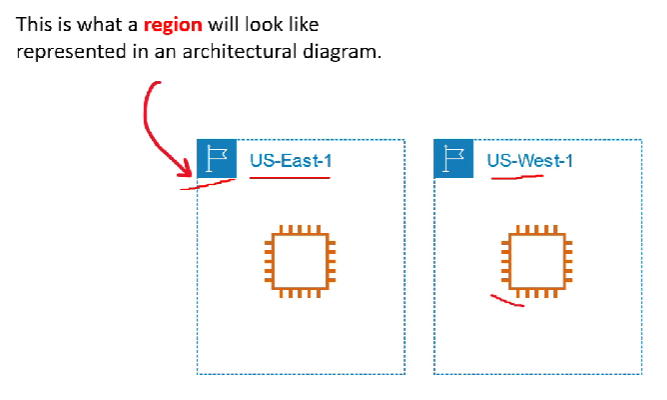

# AWS Global Infrastructure

## AWS Global Infrastructure Overview
The AWS Global Infrastructure is **globally distributed hardware and datacenters** that *are physically networked together* to act as one large resource for the end customer.

The AWS Global Infrastructure is made up of the following resources :
    - 25 Launched Regions
    - 81 Availability Zones
    - 108 Direct Connection Locations
    - 275+ Points of Presence
    - 11 Local Zone
    - 17 Wavelength Zones

AWS has millions of active customers and tens of thousands of partners globally.

## AWS Global Infrastructure Follow Along 👨‍💻

## Regions
Regions are geographically distinct locations consisting of one or more Availability Zones

Every region is physically isolated from and independent of every other region in terms of location, power, water supply

AWS First Region *2006* **US-East 1** (Northern Virginia)

Each regio has three Availability Zones
- Some new users are limited to two eg. US-West
- New services almost always become available first in the US-EACT
- Not all AWS Services are available in all regions
- All your billing information appears in US-EAST-1 (North Virginia)
- The cost of AWS services vary per region

## Regional vs Global Services

## Availability Zones (AZs)

## Regions and AZ Visualized

## Selecting Regions and Azs Follow Along 👨‍💻

## Fault Tolerance

## AWS Global Network

## Points of Presence (PoP)

## Tier 1

## AWS Services using PoPs

## AWS Direct Connect

## Direct Connect Locations

## AWS Local Zones

## Wavelength Zones

## Data Residency

## AWS for Government

## GovCloud

## AWS in China

## AWS in China Follow Along 👨‍💻

## Sustainability

## Sustainability Follow Along 👨‍💻

## AWS Ground Station

## AWS Outposts